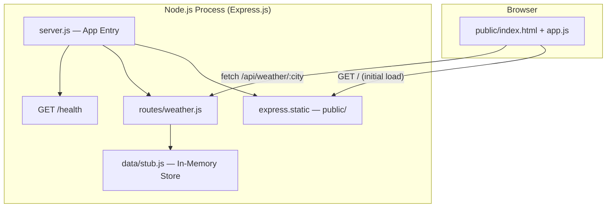
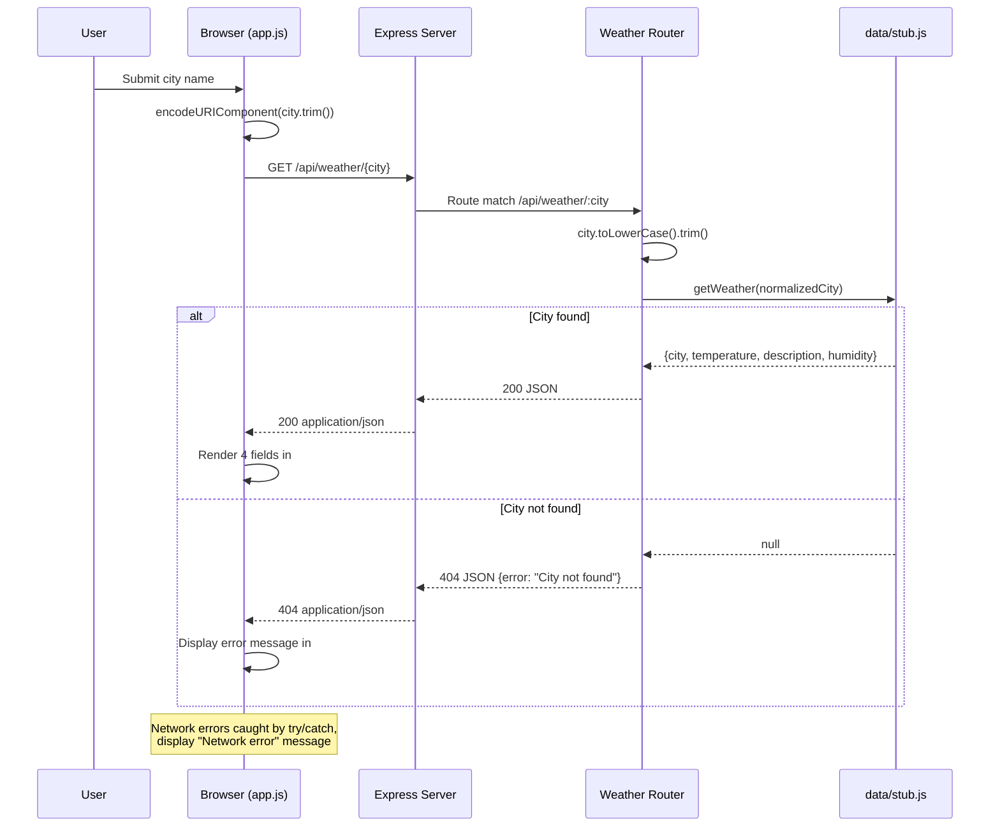

# Core Context — Weather App

_Auto-generated by /sync-context 2026-06-01T20:57:59Z. Re-run to update._

## BRD
---
type: prd
status: accepted
---

# Business Requirements Document — Weather App

**Project:** Weather App (WA)
**Version:** 1.0.0
**Date:** 2026-03-26
**Status:** Accepted

---

## 1. Executive Summary

Weather App is a full-stack web application that provides users with current weather conditions and forecasts for any location. The application consists of an Express.js REST API backend serving weather data and a plain HTML/CSS/JavaScript frontend for the user interface.

---

## 2. Problem Statement

Users need a simple, accessible way to check current weather conditions and multi-day forecasts for any location without installing an app or navigating complex interfaces. Existing solutions are often ad-heavy, slow, or require account registration.

---

## 3. Business Objectives

| #   | Objective                                                          | Metric                          |
| --- | ------------------------------------------------------------------ | ------------------------------- |
| 1   | Deliver real-time weather data for any searched location           | API response < 500ms            |
| 2   | Provide a clean, accessible web interface usable on any device     | Passes basic a11y check         |
| 3   | Maintain a reliable, stateless backend with no database dependency | 99% uptime, zero data loss risk |

---

## 4. Target Users

**Primary:** General users who want to quickly check current weather and short-term forecasts via a web browser, with no account or installation required.

**Characteristics:**

- Non-technical end users
- Mobile and desktop browser users
- Need quick, at-a-glance weather information

---

## 5. Scope

### In Scope

- Current weather conditions display (temperature, humidity, wind speed)
- Location search by city name
- 5-day forecast view
- Celsius/Fahrenheit unit toggle
- Express.js REST API with in-memory stub data (phase 1)
- Real weather API integration (phase 2)
- Plain HTML/CSS/JS frontend (no framework dependency)

### Out of Scope

- User accounts or authentication
- Weather alerts or push notifications
- Historical weather data
- Native mobile applications
- Map-based location selection (MVP)

---

## 6. Constraints

| Constraint     | Detail                                            |
| -------------- | ------------------------------------------------- |
| Technology     | Node.js 22, Express.js, plain HTML/CSS/JS         |
| Database       | None — stateless API, in-memory stub data for MVP |
| Authentication | None required for MVP                             |
| Deployment     | Single-process Express monolith                   |

---

## 7. Success Criteria

- Users can search for any city and retrieve weather data within 500ms
- Frontend renders correctly on modern browsers (Chrome, Firefox, Safari)
- All quality gates pass: `node --test`, `npm run lint`, `npm run typecheck`
- Code is maintainable and well-tested with Node.js built-in test runner

---

## 8. Stakeholders

| Role          | Name            |
| ------------- | --------------- |
| Project Owner | Jeremy Newhouse |
| Developer     | TBD             |

---

## 9. Timeline

| Phase   | Deliverable                                                       |
| ------- | ----------------------------------------------------------------- |
| MVP     | Location search + current conditions + 5-day forecast (stub data) |
| Phase 2 | Real weather API integration                                      |

---

## PRD
---
type: prd
status: accepted
---

# Product Requirements Document — Weather App

**Project:** Weather App (WA)
**Version:** 1.1.0
**Date:** 2026-05-14
**Status:** Accepted

---

## 1. Overview

Weather App is a full-stack Express.js application with a plain HTML/CSS/JS frontend. The backend provides a REST API that serves weather data (in-memory stub data for MVP, real API integration in a later phase). The frontend provides a clean, accessible single-page interface for searching locations and viewing weather.

---

## 2. Architecture

```
Browser (HTML/CSS/JS)
        │
        ▼
Express.js Server (Node.js 22)
  ├── GET /api/weather/:city           → current conditions (path-param; see ADR-003)
  ├── GET /api/forecast/:city          → 5-day forecast (planned; not yet implemented)
  ├── GET /health                      → liveness probe
  └── GET /                            → serves index.html
```

**Pattern:** Express monolith — API routes and static file serving in a single process.
**Data:** In-memory stub data keyed by city name (MVP). No database.

> **Note (2026-05-14):** The original query-param style (`?city=`) shown in earlier revisions of this document has been superseded. Path-param style (`/:city`) is canonical per [ADR-003](../adrs/ADR-003-path-param-api-style-for-city-lookup.md). All API contracts in this document use path-param style.

---

## 3. Features

### WA-1: Location Search (P1 — S)

Users can enter a city name to retrieve weather data.

**Acceptance Criteria:**

- Search input accepts free-text city name
- Submitting triggers `GET /api/weather/:city`
- Results display within 500ms for stub data
- Invalid/unknown cities return a user-friendly error message

---

### WA-2: Current Weather Conditions (P1 — M)

Display current conditions for the searched location.

**Acceptance Criteria:**

- Shows: temperature, humidity, wind speed, weather description
- Displays city name and country
- Data sourced from in-memory stub (MVP)
- Renders correctly on mobile and desktop

---

### WA-3: 5-Day Forecast (P2 — M)

Show a multi-day forecast view below current conditions.

**Acceptance Criteria:**

- Displays 5 daily entries with: date, high/low temperature, description
- Stub data provides realistic variation across days
- Forecast section is visually distinct from current conditions

---

### WA-4: Unit Toggle (P2 — S)

Users can switch between Celsius and Fahrenheit.

**Acceptance Criteria:**

- Toggle button/switch visible on the weather display page
- All temperatures on the page update instantly (no API re-fetch)
- Selected unit persists within the session (e.g., localStorage)

---

### WA-5: Real Weather API Integration (P3 — L)

Replace in-memory stub data with a live weather API.

**Acceptance Criteria:**

- API key configured via environment variable (`WEATHER_API_KEY`)
- Integration with OpenWeatherMap API (or equivalent)
- Graceful error handling for API failures (fallback message)
- Rate limiting considered

---

## 4. API Contracts

> Path-param style is canonical per ADR-003. Query-param style (`?city=`) is not supported.

### `GET /api/weather/:city` (implemented — WA-2/WA-3)

**Response (200):**

```json
{
  "city": "London",
  "temperature": 12,
  "description": "Partly cloudy",
  "humidity": 78
}
```

**Response (404):**

```json
{ "error": "City not found" }
```

> City lookup is case-insensitive. Stub data covers: london, miami, tokyo.
> Full contract: `docs/WA-3-weather-lookup/SPECS.md`

---

### `GET /health` (implemented — WA-3)

**Response (200):**

```json
{ "status": "ok" }
```

> Liveness probe. Always returns 200 while the server is running.

---

### `GET /api/forecast/:city` (planned — WA-5 / Phase 2)

**Response (200) — planned shape:**

```json
{
  "city": "London",
  "forecast": [
    { "date": "2026-03-27", "high": { "celsius": 14 }, "low": { "celsius": 8 }, "description": "Sunny" },
    ...
  ]
}
```

---

## 5. Non-Functional Requirements

| Requirement       | Target                                        |
| ----------------- | --------------------------------------------- |
| API response time | < 500ms (stub data)                           |
| Browser support   | Chrome 120+, Firefox 120+, Safari 17+         |
| Accessibility     | WCAG 2.1 AA (colour contrast, keyboard nav)   |
| Test coverage     | All API routes tested with `node --test`      |
| No build step     | Frontend uses vanilla JS; no bundler required |

---

## 6. Quality Gates

| Gate  | Command             |
| ----- | ------------------- |
| Tests | `node --test`       |
| Lint  | `npm run lint`      |
| Types | `npm run typecheck` |

All gates must pass before any PR is merged.

---

## 7. Project Structure

```
weather-app/
├── server.js          # Express entry point
├── routes/
│   └── weather.js     # /api/weather and /api/forecast routes
├── data/
│   └── stub.js        # In-memory weather stub data
├── public/
│   ├── index.html     # Single-page UI
│   ├── style.css
│   └── app.js         # Frontend JS
└── test/
    └── weather.test.js
```

---

## Architecture (WA-3)
# Architecture: WA-3 — Weather Lookup (Full-Stack)

**Feature:** WA-3  
**Date:** 2026-05-14  
**Status:** Accepted  
**Style:** Same-origin monolith (Express.js serves API + static frontend on port 3000)

---

## 1. Architecture Overview

WA-3 is a single-process Node.js monolith using Express.js 4.18. One HTTP server handles three concerns:

1. **REST API** — JSON endpoints under `/api/` for weather data retrieval
2. **Health probe** — Top-level `/health` endpoint for operational readiness
3. **Static asset serving** — `express.static` delivers the HTML/CSS/JS frontend from `public/`

There is no reverse proxy, no container orchestration, and no external service dependency. The application runs as `node server.js` binding to port 3000.

**Deployment model:** Single process, single port, no clustering. Suitable for development and demo purposes. Production hardening (process manager, reverse proxy, container) is deferred to future infrastructure work.

---

## 2. Component Diagram

```
+------------------+          HTTP (port 3000)          +---------------------------+
|                  | -------------------------------------> |                           |
|    Browser       |                                     |     Express Application   |
|  (public/*.html) | <------------------------------------- |       (server.js)         |
+------------------+                                     +---------------------------+
                                                                      |
                                    +------------------+--------------+--------------+
                                    |                  |                             |
                              +-----v-----+    +------v--------+           +--------v--------+
                              |   Health   |    |  Weather      |           |   Static        |
                              |   Route    |    |  Router       |           |   Middleware    |
                              | GET /health|    | /api/weather/ |           | express.static  |
                              +-----+-----+    +------+--------+           +--------+--------+
                                    |                  |                             |
                                    |           +------v--------+           +--------v--------+
                                    |           |  Data Layer   |           |   public/       |
                                    |           |  (stub.js)    |           | index.html      |
                                    |           | getWeather()  |           | app.js          |
                                    |           +---------------+           | style.css       |
                                    |                                       +-----------------+
                                    v
                           { "status": "ok" }
```

**Request routing precedence** (Express middleware order in `server.js`):

1. `GET /health` — explicit route, handled first
2. `/api/*` — delegated to `routes/weather.js` router
3. `/*` — falls through to `express.static(public/)` for file matching

---

## 3. Component Responsibilities

| Component          | File                 | Responsibility                                                                             |
| ------------------ | -------------------- | ------------------------------------------------------------------------------------------ |
| **App entry**      | `server.js`          | Wire middleware, mount routes, export `app` for testing, conditionally listen on port 3000 |
| **Health route**   | `server.js` (inline) | Return `{"status":"ok"}` with HTTP 200 — no dependencies                                   |
| **Weather router** | `routes/weather.js`  | Parse `:city` param, normalize input, call data layer, return JSON 200 or JSON 404         |
| **Data layer**     | `data/stub.js`       | Own the weather data set, expose `getWeather(city)` function, return data or null          |
| **Frontend**       | `public/index.html`  | Provide UI structure: form with city input, results container                              |
| **Frontend logic** | `public/app.js`      | Handle form submit, call API via `fetch`, render response or error                         |
| **Frontend style** | `public/style.css`   | Minimal presentation styling                                                               |

---

## 4. Data Flow

### 4.1 Weather Lookup (happy path)

```
Browser                    Express                   Router                  Data Layer
  |                          |                         |                        |
  |-- POST form submit ----->|                         |                        |
  |   (app.js: fetch GET)    |                         |                        |
  |                          |-- route match /api/* --->|                        |
  |                          |                         |-- normalize city ------>|
  |                          |                         |   .toLowerCase().trim() |
  |                          |                         |                        |
  |                          |                         |-- getWeather(city) ---->|
  |                          |                         |                        |
  |                          |                         |<-- { city, temp, ... } -|
  |                          |<-- res.json(data) ------|                        |
  |<-- HTTP 200 + JSON ------|                         |                        |
  |                          |                         |                        |
  |   (app.js: render DOM)   |                         |                        |
```

**Database queries per request:** 0 (in-memory O(1) object lookup)

### 4.2 Weather Lookup (404 path)

Same flow as 4.1, except `getWeather(city)` returns `null`, and the router responds with `res.status(404).json({ error: "City not found" })`.

### 4.3 Health Check

```
Client --> GET /health --> Express inline handler --> { "status": "ok" } (HTTP 200)
```

No downstream dependencies. Always succeeds if the process is alive.

### 4.4 Frontend Serve

```
Browser --> GET / --> express.static --> public/index.html (HTTP 200, text/html)
Browser --> GET /app.js --> express.static --> public/app.js (HTTP 200, application/javascript)
Browser --> GET /style.css --> express.static --> public/style.css (HTTP 200, text/css)
```

---

## 5. Layer Boundaries

| Layer                           | Owns                                                           | Does NOT Own                          |
| ------------------------------- | -------------------------------------------------------------- | ------------------------------------- |
| **Transport** (`server.js`)     | HTTP binding, middleware ordering, route delegation            | Business logic, data format           |
| **Route** (`routes/weather.js`) | Input normalization, HTTP status selection, JSON serialization | Data storage, data shape definition   |
| **Data** (`data/stub.js`)       | Data shape, lookup logic, extensibility contract               | HTTP concerns, input parsing          |
| **Frontend** (`public/`)        | UI rendering, user interaction, API consumption                | Data validation, error classification |

**Invariant:** The route layer never accesses the raw data map directly. It always goes through the `getWeather()` function interface.

---

## 6. Extensibility Points

### 6.1 Primary Seam: `data/stub.js` -> Real API Adapter

The `getWeather(city)` function is the designated Phase 2 extensibility seam (Decision D8). To integrate a real weather API:

1. Create `data/openweather.js` (or similar) implementing the same interface: `getWeather(city) -> {city, temperature, description, humidity} | null`
2. Swap the import in `routes/weather.js` from `../data/stub` to `../data/openweather`
3. No route-layer or test-layer changes required (tests mock at the data boundary)

**Why this works:** The route layer depends on an interface contract (function signature + return shape), not on the implementation detail of in-memory lookup.

### 6.2 Secondary Seam: Router Mount

Additional API resources (e.g., `/api/forecast/:city`) can be added as separate router modules and mounted in `server.js` without touching existing code.

### 6.3 Future Considerations

| Extension              | Approach                                                                   |
| ---------------------- | -------------------------------------------------------------------------- |
| Caching (Redis/memory) | Wrap `getWeather()` with cache-aside pattern inside data layer             |
| Rate limiting          | Add Express middleware before router mount in `server.js`                  |
| Authentication         | Add auth middleware before `/api` mount point                              |
| Multiple data sources  | Strategy pattern in data layer; `getWeather()` delegates to provider chain |

---

## 7. Security Architecture

### 7.1 Attack Surface

| Vector                           | Mitigation                                                                                    | Risk Level       |
| -------------------------------- | --------------------------------------------------------------------------------------------- | ---------------- |
| Path traversal via `:city` param | Express route param is a single path segment (no `/` allowed); used only as object key lookup | Negligible       |
| Injection (SQL, NoSQL, command)  | No database, no shell exec, no eval; stub is a frozen object map                              | None             |
| XSS via API response             | API returns JSON with `Content-Type: application/json`; no HTML rendering server-side         | Negligible       |
| CORS bypass                      | Same-origin monolith; no CORS headers configured; browser same-origin policy applies          | None             |
| Denial of service                | No rate limiting (acceptable for stub-data scope; revisit for Phase 2)                        | Low (stub scope) |

### 7.2 Input Validation

- **Server-side:** `.toLowerCase().trim()` applied in route handler before data lookup
- **Client-side:** `encodeURIComponent()` applied before fetch URL construction
- **No PII, no secrets, no user data stored**

### 7.3 Assumptions for Phase 2 Review

- Input sanitization (A1 from Discovery) must be revisited when real API integration introduces network calls
- Rate limiting must be added before exposing to public traffic
- API key management (for external weather provider) will require `SECRET_MANAGEMENT: environment-variables` pattern

---

## 8. Testing Architecture

### 8.1 Strategy

All tests are **integration tests** that exercise the full HTTP stack (Express routing, middleware, handler, data layer) without mocking internal components.

### 8.2 Ephemeral Port Pattern

```javascript
// test/weather.test.js
before(() => {
  server = app.listen(0, () => {
    // OS assigns random available port
    port = server.address().port; // Capture assigned port
  });
});
after(() => server.close()); // Clean shutdown
```

**Benefits:**

- No port conflicts in CI or parallel test runs
- Tests import `app` (the Express instance) without starting the production listener
- `server.js` uses `if (require.main === module)` guard to prevent double-listen

### 8.3 Test Coverage Map

| Test Group                    | Count  | Validates                               |
| ----------------------------- | ------ | --------------------------------------- |
| Weather endpoint (happy path) | 3      | Each city returns correct data          |
| Case insensitivity            | 2      | LONDON, London resolve to london        |
| Error responses               | 2      | Unknown city 404, missing segment 404   |
| Response shape                | 4      | Field count, types, Content-Type header |
| Health check                  | 2      | Status body, Content-Type header        |
| Frontend serve                | 1      | HTML 200, required DOM IDs present      |
| **Total**                     | **15** |                                         |

### 8.4 Test Pyramid Position

```
        /  E2E  \         <- Not present (no browser automation)
       /----------\
      / Integration \     <- ALL 15 TESTS (HTTP-level)
     /----------------\
    /    Unit Tests     \  <- Not present (no isolated unit tests)
   /--------------------\
```

This is appropriate for the current scope: the data layer is trivial (O(1) lookup) and routes are thin. Integration tests provide maximum confidence with minimal test code.

---

## 9. Non-Functional Requirements

### 9.1 Performance

| Metric      | Target  | Actual (stub scope)      | Notes                                          |
| ----------- | ------- | ------------------------ | ---------------------------------------------- |
| p50 latency | < 100ms | < 5ms                    | In-memory O(1) lookup, no I/O                  |
| p95 latency | < 200ms | < 10ms                   | No network calls, no disk reads after startup  |
| Throughput  | N/A     | ~10k req/s (single core) | Limited by Node.js event loop, not data access |

Performance targets are trivially met with stub data. Phase 2 real API integration will introduce network latency requiring caching strategy.

### 9.2 Reliability

| Aspect            | Current State                                      | Phase 2 Consideration              |
| ----------------- | -------------------------------------------------- | ---------------------------------- |
| Health check      | Always passes if process is alive                  | Add downstream dependency checks   |
| Error handling    | Synchronous code; no unhandled rejections possible | Add try/catch for async API calls  |
| Graceful shutdown | `server.close()` in tests                          | Add SIGTERM handler for production |
| Circuit breaker   | Not needed (no external calls)                     | Required for external weather API  |

### 9.3 Maintainability

- **Single responsibility:** Each file has one clear purpose (see Section 3)
- **Minimal coupling:** Route depends on data layer interface only, not implementation
- **Zero configuration:** No environment variables, no config files, no `.env`
- **Test isolation:** Ephemeral ports prevent environment-specific failures

### 9.4 Scalability

Not a concern for WA-3 scope (3 cities, stub data, single user). If scaling becomes relevant:

- **Horizontal:** Stateless process allows multiple instances behind load balancer
- **Vertical:** Single-threaded Node.js; use `cluster` module or container replicas
- **Data:** Replace in-memory map with external cache (Redis) for shared state across instances

---

## Architectural Decisions Summary

| Decision                            | Rationale                                                                                    | Trade-off                                                                 |
| ----------------------------------- | -------------------------------------------------------------------------------------------- | ------------------------------------------------------------------------- |
| Same-origin monolith                | Eliminates CORS complexity; single deployment unit; simplest possible architecture for scope | Cannot scale frontend and backend independently                           |
| Path-param over query-param         | RESTful convention; cleaner URLs; Express native routing                                     | Less flexible for multi-param queries (acceptable for single-city lookup) |
| Double normalization (route + data) | Defense in depth; data layer is self-contained and testable independently                    | Redundant `.toLowerCase()` call (negligible cost)                         |
| Integration tests only              | Maximum confidence per test; thin layers make unit tests low-value                           | Slower than unit tests (HTTP overhead ~2ms per test)                      |
| `getWeather()` as extension seam    | Clean interface boundary; swap implementations without route changes                         | Requires discipline to not bypass the function                            |

---

**Version:** 1.0 | **Author:** Architecture review (automated) | **Refs:** WA-3, DISCOVERY.md, FRD.md

---

## Architecture (WA-2)
# Architecture Document

## Feature: Weather Lookup — Full-Stack

**Feature ID:** WA-2
**Status:** As-Built
**Date:** 2026-05-14

---

## System Overview

The Weather App is a monolithic full-stack application built on Node.js 22 and Express.js 4.x. It serves both a REST API and a static HTML/CSS/JS frontend from a single process. The architecture prioritizes simplicity: no database, no external API calls, no authentication, and no build tooling. All weather data is served from an in-memory stub module.

**Architecture style:** Single-process monolith with same-origin static serving
**Component count:** 5 source modules + 1 test module

---

## Service Architecture



---

## Services and Responsibilities

| Module              | Responsibility                                                                                                                                | Notes                                        |
| ------------------- | --------------------------------------------------------------------------------------------------------------------------------------------- | -------------------------------------------- |
| `server.js`         | Application entry point; mounts middleware in order: health, API, static. Exports `app` for testing; starts listener when run directly.       | `app.listen(0)` in tests for port isolation  |
| `routes/weather.js` | Express Router handling `GET /api/weather/:city`. Normalizes city input (lowercase + trim), delegates to data layer, returns JSON 200 or 404. | Single route, single responsibility          |
| `data/stub.js`      | Pure data access module. Exports `getWeather(city)` which performs a dictionary lookup against `WEATHER_MAP`. Returns object or `null`.       | O(1) lookup, 3 cities (london, miami, tokyo) |
| `public/index.html` | Frontend shell: form with `#search-form`, input `#city-input`, results container `#result`.                                                   | No framework, no bundler                     |
| `public/app.js`     | Frontend logic: form submit handler, `fetch` to API, DOM rendering of weather fields or error messages.                                       | Uses `encodeURIComponent` for URL safety     |
| `public/style.css`  | Basic layout styles. Max-width container, flexbox form, button styling.                                                                       | Minimal, functional only                     |

---

## Data Flow



---

## Security Architecture

| Concern              | Status             | Rationale                                                                    |
| -------------------- | ------------------ | ---------------------------------------------------------------------------- |
| Authentication       | Not required       | Public mock data, no user accounts                                           |
| Authorization        | Not required       | No protected resources                                                       |
| CORS                 | Not configured     | Same-origin only (frontend served by same Express instance)                  |
| Input validation     | Minimal            | City param normalized (lowercase, trim); `encodeURIComponent` on client side |
| PII / Sensitive data | None               | All data is public mock weather information                                  |
| Rate limiting        | None               | Out of scope for stub application                                            |
| HTTPS                | Deployment concern | Not enforced at application level                                            |

**Attack surface:** Extremely low. The only user input is the `:city` URL path parameter, which is used solely as a dictionary key lookup. No database queries, no shell commands, no file system access based on user input.

---

## Infrastructure

### Deployment Topology

```
Single Node.js process
  - Listens on port 3000 (configurable via code change)
  - Serves API + static assets
  - No reverse proxy required for development
  - No database connection
  - No external service dependencies
  - No environment variables consumed
```

### Observability

| Capability      | Implementation                                    |
| --------------- | ------------------------------------------------- |
| Health check    | `GET /health` returns `{"status": "ok"}` with 200 |
| Logging         | `console.log` on startup only                     |
| Metrics         | None                                              |
| Tracing         | None                                              |
| Error reporting | None (errors returned as JSON to client)          |

### Scaling Characteristics

- **Stateless:** No session state, no in-process cache that would cause inconsistency across instances
- **Read-only data:** `WEATHER_MAP` is immutable after module load
- **Horizontally scalable:** Any number of instances can run behind a load balancer (data is identical across all)
- **Memory footprint:** Negligible (3 stub entries)

---

## Technology Decisions

| Decision               | Choice                             | Alternatives Considered             | Rationale                                                                     |
| ---------------------- | ---------------------------------- | ----------------------------------- | ----------------------------------------------------------------------------- |
| Runtime                | Node.js 22                         | Deno, Bun                           | LTS stability, broad ecosystem, team familiarity                              |
| Framework              | Express.js 4.x                     | Fastify, Koa, Hapi                  | Mature, minimal, well-documented; sufficient for stub app                     |
| Module system          | CommonJS (`require`)               | ESM (`import`)                      | Simpler toolchain for project without bundler; Express 4.x conventional style |
| Data layer             | In-memory JS object                | SQLite, JSON file, environment vars | Zero dependencies, instant lookup, appropriate for 3-city stub                |
| Frontend approach      | Plain HTML/CSS/JS                  | React, Vue, Svelte                  | No build step required; minimal complexity for simple form + display          |
| Testing                | `node:test` + native `http` client | Jest, Mocha, Vitest                 | Zero-dependency test runner; ships with Node.js 22                            |
| Linting                | ESLint v9 (flat config)            | Biome, Standard                     | Industry standard; flat config is forward-looking                             |
| Static serving         | `express.static` middleware        | Separate nginx, CDN                 | Same-process simplicity; no deployment complexity for dev/demo                |
| Port isolation (tests) | `app.listen(0)`                    | Fixed port, Docker                  | OS assigns ephemeral port; avoids port conflicts in CI                        |

---

## ADR Candidates

Decisions that warrant formal Architecture Decision Records if the project evolves:

| #   | Decision                                                        | Trigger for ADR                                                                 |
| --- | --------------------------------------------------------------- | ------------------------------------------------------------------------------- |
| 1   | **In-memory stub vs. external weather API**                     | When real data integration is considered (latency, caching, API key management) |
| 2   | **CommonJS vs. ESM**                                            | If the project adds a bundler, TypeScript, or needs top-level await             |
| 3   | **No input length/character validation on city param**          | If the app is exposed to the public internet (DoS via long URLs)                |
| 4   | **Same-origin static serving vs. separate frontend deployment** | If frontend needs CDN, caching headers, or independent scaling                  |
| 5   | **No structured logging or request correlation**                | If production deployment requires observability (APM, log aggregation)          |

---

## Open Questions

| #   | Question                                                                                                              | Impact                 | Priority |
| --- | --------------------------------------------------------------------------------------------------------------------- | ---------------------- | -------- |
| 1   | Should the server port be configurable via `PORT` environment variable?                                               | Deployment flexibility | Low      |
| 2   | Should the stub data source be replaceable (strategy pattern) to allow future API integration without router changes? | Extensibility          | Medium   |
| 3   | Is there a maximum expected response time SLA for the weather endpoint? (Currently sub-1ms due to in-memory lookup)   | Performance monitoring | Low      |
| 4   | Should `GET /api/weather/` (missing city) return a structured 404 rather than Express default?                        | API consistency        | Low      |

---

## Appendix: Route Registration Order

The middleware mount order in `server.js` is intentional:

1. `GET /health` — health check (highest priority, no prefix collision)
2. `app.use("/api", ...)` — API routes (matched before static)
3. `express.static(public/)` — frontend assets (catch-all for unmatched paths)

This ensures API routes are never shadowed by static file resolution.
