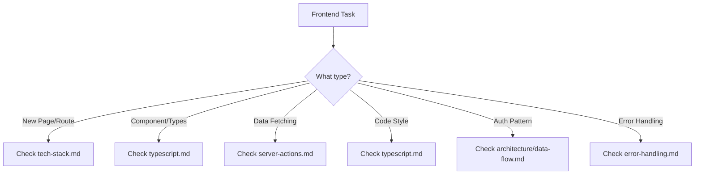

# Frontend Standards

> Frontend development standards: React, TypeScript, components, server actions, forms, accessibility, API client, i18n, observability

**Compiled**: 2026-06-01 20:55
**Source**: evolv-coder-standards
**Domain Version**: 2.0.1

---

## Contents

- [Readme](#readme)
- [Typescript](#typescript)
- [Typescript React](#typescript-react)
- [Typescript Advanced](#typescript-advanced)
- [Components](#components)
- [Server Actions](#server-actions)
- [Testing](#testing)
- [Testing E2E](#testing-e2e)
- [Forms Validation](#forms-validation)
- [Forms Validation Advanced](#forms-validation-advanced)
- [Tech Stack](#tech-stack)
- [Tech Stack Nextjs](#tech-stack-nextjs)
- [Tech Stack Ui Libs](#tech-stack-ui-libs)
- [Tech Stack Performance](#tech-stack-performance)
- [Error Handling](#error-handling)
- [Accessibility](#accessibility)
- [Api Client](#api-client)
- [Observability](#observability)
- [I18N](#i18n)
- [Data Visualization](#data-visualization)
- [Markdown Rendering](#markdown-rendering)

---

<!-- Source: standards/frontend/README.md (v1.0.2) -->

# Frontend Standards

**Status**: Active

## Overview

This directory contains all standards related to frontend development using React, Next.js, TypeScript, and associated technologies.

## Stack Components

- **Framework**: Next.js 16+ (App Router)
- **Language**: TypeScript (strict mode)
- **UI Library**: Shadcn/ui
- **Styling**: Tailwind CSS
- **State Management**: React hooks, Server state via server actions
- **Authentication**: Clerk

## Standards in This Section

### 📄 [tech-stack.md](./tech-stack.md)

Complete Next.js and React technology stack specifications, including:

- Next.js 16 configuration and App Router patterns
- React 19 best practices
- Package dependencies and versions
- Build optimization and performance guidelines

### 📄 [typescript.md](./typescript.md)

TypeScript coding conventions and strict type safety:

- **No `any` types** - Use `unknown` instead
- **Explicit return types** for all functions
- **Discriminated unions** for state management
- Naming conventions and file organization
- ESLint/Prettier configuration
- Type guards and narrowing patterns

### 📄 [server-actions.md](./server-actions.md)

Server actions implementation patterns:

- File organization and structure
- Error handling with ActionResult pattern
- Type safety across frontend-backend boundary
- API communication and revalidation
- Loading states and optimistic updates

### 📄 [testing.md](./testing.md)

Frontend testing patterns:

- Vitest configuration and setup
- React Testing Library patterns
- Server action testing
- E2E testing with Playwright
- MSW for API mocking

### 📄 [components.md](./components.md)

React component standards:

- Component architecture
- Shadcn/ui patterns
- Compound components
- Props patterns and composition
- Accessibility standards

### 📄 [forms-validation.md](./forms-validation.md)

Forms and validation patterns:

- React Hook Form setup
- Zod schema validation
- Multi-step forms
- File uploads
- Form state persistence

### 📄 [error-handling.md](./error-handling.md)

Error handling patterns (v2 — RFC 9457):

- React error boundaries
- RFC 9457 Problem Details API error handling
- Server action error handling
- Network error and retry strategies
- User-friendly error messaging

### 📄 [api-client.md](./api-client.md)

Frontend API client standard:

- ProblemDetail interface and ApiError class
- apiFetch with RFC 9457 parsing and fallback
- DELETE 204 handling
- Typed pagination and filter parameters
- Error handling utilities (handleApiError, handleApiFormError)

### 📄 [accessibility.md](./accessibility.md)

Web accessibility standards (WCAG 2.2 AA):

- Semantic HTML and ARIA patterns
- Keyboard navigation and focus management
- Color contrast and visual accessibility
- Screen reader support
- Accessible form patterns
- Testing with axe and Playwright

### 📄 [markdown-rendering.md](./markdown-rendering.md)

Safe markdown/HTML rendering (OWASP A05 Injection):

- Render with react-markdown, never `marked()` → `dangerouslySetInnerHTML`
- DOMPurify mandatory on any HTML sink; allow-list tags and URL schemes
- LLM- / user-supplied markdown treated as untrusted

### 📄 [data-visualization.md](./data-visualization.md)

Runtime visualization libraries:

- bpmn-js, mermaid (runtime render), d3-hierarchy
- Dynamic import + client-only; lifecycle cleanup
- Untrusted XML/diagram input; React owns the DOM; a11y fallback

## Quick Decision Guide



## Key Principles

### 1. Server-Side First

- Use SSR/SSG where possible
- Server actions for all mutations
- Client components only when necessary

### 2. Type Safety

```typescript
// Always define types
interface Props {
  id: string;
  data: UserData;
}

// Never use 'any'
const process = (input: unknown): Result => {
  // Type narrow properly
};
```

### 3. Component Hierarchy

```
app/
├── (routes)/          # Route groups
├── components/
│   ├── ui/           # Shadcn components
│   ├── features/     # Feature-specific
│   └── common/       # Shared components
└── actions/          # Server actions
```

## Common Patterns

### Server Action Pattern

```typescript
// app/actions/user.ts
"use server";

export async function updateUser(data: UpdateUserInput) {
  const session = await auth();
  if (!session) throw new Error("Unauthorized");

  const response = await fetch(`${API_URL}/users`, {
    method: "POST",
    body: JSON.stringify(data),
  });

  return response.json();
}
```

### Component Pattern

```typescript
// components/features/UserCard.tsx
import { Card } from "@/components/ui/card";

interface UserCardProps {
  user: User;
  onUpdate: (id: string) => Promise<void>;
}

export function UserCard({ user, onUpdate }: UserCardProps) {
  // Component logic
}
```

## File Naming Conventions

| Type           | Convention | Example                 |
| -------------- | ---------- | ----------------------- |
| Components     | PascalCase | `UserProfile.tsx`       |
| Utilities      | camelCase  | `formatDate.ts`         |
| Types          | PascalCase | `UserTypes.ts`          |
| Server Actions | camelCase  | `userActions.ts`        |
| Routes         | kebab-case | `user-profile/page.tsx` |

## Performance Checklist

- [ ] Minimize client-side JavaScript
- [ ] Use `loading.tsx` for route transitions
- [ ] Implement proper error boundaries
- [ ] Optimize images with `next/image`
- [ ] Use dynamic imports for large components
- [ ] Cache server action results when appropriate

---

_For backend integration, see [Architecture/data-flow.md](../architecture/data-flow.md)_

---

<!-- Source: standards/frontend/typescript.md (v1.4.0) -->

# TypeScript Coding Standards

**Status**: Active

## Overview
This document establishes TypeScript coding standards for React/NextJS applications, ensuring type safety, maintainability, and consistency across the codebase.

## Core Principles

1. **Type Safety First** - Leverage TypeScript's type system to catch errors at compile time
2. **Explicit over Implicit** - Prefer explicit type annotations for clarity
3. **Functional Programming** - Favor functional components and immutable patterns
4. **Consistent Naming** - Follow established conventions throughout the codebase
5. **Code Reusability** - DRY (Don't Repeat Yourself) with typed utilities and components

## Strict Type Safety Rules

### The Three Pillars of Type Safety

These rules are **mandatory** for all code in this codebase:

#### 1. No `any` Types

Never use `any`. It defeats the purpose of TypeScript.

```typescript
// ❌ BAD - Using any
function processData(data: any) {
  return data.value;
}

// ❌ BAD - Implicit any
function processData(data) {
  return data.value;
}

// ✅ GOOD - Use unknown for truly unknown types
function processData(data: unknown): string {
  if (typeof data === 'object' && data !== null && 'value' in data) {
    return String((data as { value: unknown }).value);
  }
  throw new Error('Invalid data');
}

// ✅ GOOD - Define proper types
interface DataShape {
  value: string;
}

function processData(data: DataShape): string {
  return data.value;
}
```

#### 2. Explicit Return Types for All Functions

All functions must have explicit return types. This catches errors at definition time, not call time.

```typescript
// ❌ BAD - No return type
function calculateTotal(items: Item[]) {
  return items.reduce((sum, item) => sum + item.price, 0);
}

// ❌ BAD - Arrow function without return type
const calculateTotal = (items: Item[]) => {
  return items.reduce((sum, item) => sum + item.price, 0);
};

// ✅ GOOD - Explicit return type
function calculateTotal(items: Item[]): number {
  return items.reduce((sum, item) => sum + item.price, 0);
}

// ✅ GOOD - Async function with explicit return type
async function fetchUser(id: string): Promise<User> {
  const response = await fetch(`/api/users/${id}`);
  return response.json();
}

// ✅ GOOD - Arrow function with explicit return type
const calculateTotal = (items: Item[]): number => {
  return items.reduce((sum, item) => sum + item.price, 0);
};

// ✅ GOOD - Void return type for side effects
function logMessage(message: string): void {
  console.log(message);
}
```

#### 3. Discriminated Unions for State Management

Use discriminated unions to model states that have different shapes. This enables exhaustive type checking.

```typescript
// ❌ BAD - Separate boolean flags
interface ApiState {
  isLoading: boolean;
  isError: boolean;
  data: User | null;
  error: Error | null;
}

// Problem: Can have invalid states like isLoading: true AND isError: true

// ✅ GOOD - Discriminated union
type ApiState =
  | { status: 'idle' }
  | { status: 'loading' }
  | { status: 'success'; data: User }
  | { status: 'error'; error: Error };

// Usage with exhaustive checking
function renderState(state: ApiState): React.ReactNode {
  switch (state.status) {
    case 'idle':
      return <div>Ready to load</div>;
    case 'loading':
      return <Spinner />;
    case 'success':
      return <UserCard user={state.data} />;
    case 'error':
      return <ErrorMessage error={state.error} />;
    default:
      // TypeScript will error if a case is missing
      const _exhaustiveCheck: never = state;
      throw new Error(`Unhandled state: ${_exhaustiveCheck}`);
  }
}
```

### Discriminated Unions Examples

#### Form State
```typescript
type FormState =
  | { status: 'pristine' }
  | { status: 'dirty'; hasErrors: boolean }
  | { status: 'submitting' }
  | { status: 'submitted'; result: SubmitResult }
  | { status: 'error'; errors: ValidationError[] };

function FormStatus({ state }: { state: FormState }): React.ReactNode {
  switch (state.status) {
    case 'pristine':
      return null;
    case 'dirty':
      return state.hasErrors ? <span>Fix errors before submitting</span> : null;
    case 'submitting':
      return <Spinner />;
    case 'submitted':
      return <SuccessMessage result={state.result} />;
    case 'error':
      return <ErrorList errors={state.errors} />;
  }
}
```

#### Action Types (for Zustand/Redux)
```typescript
type UserAction =
  | { type: 'SET_USER'; payload: User }
  | { type: 'UPDATE_USER'; payload: Partial<User> }
  | { type: 'CLEAR_USER' }
  | { type: 'SET_ERROR'; payload: Error };

function userReducer(state: UserState, action: UserAction): UserState {
  switch (action.type) {
    case 'SET_USER':
      return { ...state, user: action.payload, error: null };
    case 'UPDATE_USER':
      return { ...state, user: { ...state.user!, ...action.payload } };
    case 'CLEAR_USER':
      return { ...state, user: null };
    case 'SET_ERROR':
      return { ...state, error: action.payload };
  }
}
```

#### API Response
```typescript
type ApiResponse<T> =
  | { success: true; data: T }
  | { success: false; error: { code: string; message: string } };

async function handleResponse<T>(response: ApiResponse<T>): Promise<T> {
  if (response.success) {
    return response.data;
  }
  throw new Error(`${response.error.code}: ${response.error.message}`);
}
```

### The `satisfies` Operator

Use `satisfies` to validate a value against a type while preserving the narrowest type inference:

```typescript
// Without satisfies - loses literal type info
const routes: Record<string, string> = {
  home: '/',
  users: '/users',
  orders: '/orders',
};
// routes.home is type `string`, not '/'

// ✅ With satisfies - preserves literal types
const routes = {
  home: '/',
  users: '/users',
  orders: '/orders',
} satisfies Record<string, string>;
// routes.home is type '/', and we get autocomplete!

// Great for configuration objects
interface Config {
  apiUrl: string;
  timeout: number;
  features: Record<string, boolean>;
}

const config = {
  apiUrl: 'https://api.example.com',
  timeout: 5000,
  features: {
    darkMode: true,
    betaFeatures: false,
  },
} satisfies Config;
// Type is preserved as the literal object type
// But still validated against Config interface
```

### Type Narrowing Patterns

```typescript
// Type guard function
function isUser(value: unknown): value is User {
  return (
    typeof value === 'object' &&
    value !== null &&
    'id' in value &&
    'email' in value
  );
}

// In-line type narrowing
function processValue(value: string | number): string {
  if (typeof value === 'string') {
    return value.toUpperCase(); // TypeScript knows it's string here
  }
  return value.toFixed(2); // TypeScript knows it's number here
}

// Nullish narrowing
function getLength(value: string | null | undefined): number {
  if (value == null) {
    return 0;
  }
  return value.length; // TypeScript knows it's string here
}

// Discriminated union narrowing
function handleResult(result: ApiResponse<User>): void {
  if (result.success) {
    console.log(result.data.email); // TypeScript knows data exists
  } else {
    console.error(result.error.message); // TypeScript knows error exists
  }
}
```

### ESLint Rules for Type Safety

Add these rules to enforce type safety. ESLint 9+ uses flat config
(`eslint.config.mjs`); the legacy `.eslintrc.json` format is removed.

```js
import js from '@eslint/js';
import tseslint from 'typescript-eslint';
import nextPlugin from '@next/eslint-plugin-next';

export default tseslint.config(
  js.configs.recommended,
  ...tseslint.configs.strictTypeChecked,
  ...tseslint.configs.stylisticTypeChecked,
  {
    plugins: { '@next/next': nextPlugin },
    rules: {
      ...nextPlugin.configs['core-web-vitals'].rules,
    },
  },
  {
    languageOptions: {
      parserOptions: {
        project: './tsconfig.json',
        tsconfigRootDir: import.meta.dirname,
      },
    },
    rules: {
      '@typescript-eslint/no-explicit-any': 'error',
      '@typescript-eslint/explicit-function-return-type': [
        'error',
        {
          allowExpressions: true,
          allowTypedFunctionExpressions: true,
          allowHigherOrderFunctions: true,
        },
      ],
      '@typescript-eslint/no-non-null-assertion': 'error',
      '@typescript-eslint/strict-boolean-expressions': 'error',
      '@typescript-eslint/no-unnecessary-condition': 'error',
      '@typescript-eslint/prefer-nullish-coalescing': 'error',
      '@typescript-eslint/prefer-optional-chain': 'error',
      '@typescript-eslint/no-floating-promises': 'error',
      '@typescript-eslint/no-misused-promises': 'error',
      '@typescript-eslint/await-thenable': 'error',
      '@typescript-eslint/no-unsafe-assignment': 'error',
      '@typescript-eslint/no-unsafe-member-access': 'error',
      '@typescript-eslint/no-unsafe-call': 'error',
      '@typescript-eslint/no-unsafe-return': 'error',
    },
  },
);
```

## General TypeScript Rules

### Strict Mode Configuration
Always use strict TypeScript configuration in `tsconfig.json`:

```json
{
  "compilerOptions": {
    "strict": true,
    "noUncheckedIndexedAccess": true,
    "noImplicitAny": true,
    "strictNullChecks": true,
    "strictFunctionTypes": true,
    "strictBindCallApply": true,
    "strictPropertyInitialization": true,
    "noImplicitThis": true,
    "alwaysStrict": true,
    "noUnusedLocals": true,
    "noUnusedParameters": true,
    "noImplicitReturns": true,
    "noFallthroughCasesInSwitch": true
  }
}
```

### Type Inference vs Explicit Types
Let TypeScript infer simple types, but be explicit for complex types:

```typescript
// Good - inference for simple cases
const count = 5;
const name = "John";
const isActive = true;

// Good - explicit for complex types
const user: User = {
  id: 1,
  email: "user@example.com",
  role: "admin"
};

// Good - explicit function return types
function getUser(id: number): Promise<User> {
  return fetch(`/api/users/${id}`).then(res => res.json());
}

// Avoid - unnecessary explicit simple types
const count: number = 5; // Type is obvious
```

### Avoid `any` Type
Never use `any` unless absolutely necessary. Use `unknown` for truly unknown types:

```typescript
// Bad
function processData(data: any) {
  return data.value;
}

// Good - use unknown and type guards
function processData(data: unknown) {
  if (typeof data === 'object' && data !== null && 'value' in data) {
    return (data as { value: string }).value;
  }
  throw new Error('Invalid data');
}

// Good - define proper types
interface DataShape {
  value: string;
}

function processData(data: DataShape) {
  return data.value;
}
```

## Naming Conventions

### Files and Folders

| Type | Convention | Example |
|------|------------|---------|
| Components | kebab-case.tsx | `user-profile.tsx`, `order-list.tsx` |
| Hooks | camelCase.ts/tsx | `useAuth.ts`, `useDebounce.tsx` |
| Utilities | camelCase.ts | `formatDate.ts`, `validateEmail.ts` |
| Types/Interfaces | PascalCase.ts | `User.ts`, `ApiResponse.ts` |
| Constants | camelCase.ts or UPPER_SNAKE_CASE | `config.ts`, `API_ENDPOINTS.ts` |
| Server Actions | camelCase.ts | `createUser.ts`, `updateOrder.ts` |
| API Routes | camelCase folder | `app/api/users/route.ts` |

### TypeScript Identifiers

```typescript
// Interfaces - PascalCase with 'I' prefix (optional, but consistent if used)
interface User {
  id: number;
  email: string;
}

// Or without prefix (more common in modern TS)
interface User {
  id: number;
  email: string;
}

// Type Aliases - PascalCase
type UserRole = 'admin' | 'user' | 'guest';
type ApiResponse<T> = {
  data: T;
  error?: string;
};

// Enums - PascalCase
enum OrderStatus {
  Pending = 'PENDING',
  Processing = 'PROCESSING',
  Shipped = 'SHIPPED',
  Delivered = 'DELIVERED'
}

// Constants - UPPER_SNAKE_CASE
const MAX_RETRY_ATTEMPTS = 3;
const API_BASE_URL = process.env.NEXT_PUBLIC_API_URL;

// Variables and Functions - camelCase
const userName = "John";
function getUserById(id: number): User | null {
  // ...
}

// React Components - PascalCase
function UserProfile({ userId }: { userId: number }) {
  // ...
}

// Generic Types - Single uppercase letter or PascalCase
type Box<T> = { value: T };
type Result<TData, TError = Error> =
  | { success: true; data: TData }
  | { success: false; error: TError };
```

## Type Definitions

### Interfaces vs Types

**Use Interfaces for:**
- Object shapes that may be extended
- API contracts
- React component props

**Use Types for:**
- Unions and intersections
- Mapped types
- Function types
- Primitive types

```typescript
// Good - Interface for object shapes
interface User {
  id: number;
  email: string;
  name: string;
}

// Good - Interface can be extended
interface AdminUser extends User {
  permissions: string[];
}

// Good - Type for unions
type UserRole = 'admin' | 'user' | 'guest';

// Good - Type for complex combinations
type ApiUser = User & {
  createdAt: Date;
  updatedAt: Date;
};

// Good - Type for function signatures
type EventHandler = (event: Event) => void;
```

### Props Interfaces

Always define explicit prop interfaces for React components:

```typescript
// Good - Explicit props interface
interface UserCardProps {
  user: User;
  onEdit?: (id: number) => void;
  className?: string;
}

function UserCard({ user, onEdit, className }: UserCardProps) {
  return (
    <div className={className}>
      <h3>{user.name}</h3>
      {onEdit && <button onClick={() => onEdit(user.id)}>Edit</button>}
    </div>
  );
}

// Good - With children
interface LayoutProps {
  children: React.ReactNode;
  sidebar?: React.ReactNode;
}

function Layout({ children, sidebar }: LayoutProps) {
  return (
    <div>
      {sidebar}
      <main>{children}</main>
    </div>
  );
}
```

### Utility Types

Leverage TypeScript's built-in utility types:

```typescript
// Partial - makes all properties optional
type PartialUser = Partial<User>;

// Required - makes all properties required
type RequiredUser = Required<User>;

// Pick - select specific properties
type UserPreview = Pick<User, 'id' | 'name'>;

// Omit - exclude specific properties
type UserWithoutId = Omit<User, 'id'>;

// Record - create object type with specific keys
type UserRoles = Record<string, UserRole>;

// Readonly - make properties immutable
type ImmutableUser = Readonly<User>;

// Extract - extract types from union
type AdminRole = Extract<UserRole, 'admin'>;

// Exclude - exclude types from union
type NonAdminRoles = Exclude<UserRole, 'admin'>;

// ReturnType - extract return type from function
type UserResult = ReturnType<typeof getUserById>;

// Parameters - extract parameter types
type GetUserParams = Parameters<typeof getUserById>;
```

// items.push('d'); // Error
```

### 5. Leverage Template Literal Types
```typescript
type EventName = 'click' | 'focus' | 'blur';
type EventHandler = `on${Capitalize<EventName>}`; // 'onClick' | 'onFocus' | 'onBlur'
```

## Code Organization

### File Structure
```
src/
├── app/                    # NextJS app directory
│   ├── (auth)/            # Route groups
│   │   ├── login/
│   │   └── register/
│   ├── api/               # API routes
│   │   └── users/
│   │       └── route.ts
│   ├── users/             # Feature routes
│   │   ├── [id]/
│   │   │   └── page.tsx
│   │   └── page.tsx
│   └── layout.tsx
├── components/            # Shared components
│   ├── ui/               # ShadCN components
│   └── user-card.tsx
├── lib/                   # Utilities
│   ├── api.ts
│   ├── utils.ts
│   └── env.ts
│   └── useAuth.ts
├── types/                 # Type definitions
│   ├── user.ts
│   └── api.ts
├── actions/              # Server actions
│   └── users.ts
└── constants/            # Constants
    └── config.ts
```

### Barrel Exports
```typescript
// types/index.ts
export type { User, UserRole } from './user';
export type { Order, OrderStatus } from './order';
export type { ApiResponse, ApiError } from './api';

// Usage
import { User, Order, ApiResponse } from '@/types';
```

## Code Quality Tools

### ESLint Configuration

ESLint 9+ uses flat config (`eslint.config.mjs`):

```js
import js from '@eslint/js';
import tseslint from 'typescript-eslint';
import nextPlugin from '@next/eslint-plugin-next';

export default tseslint.config(
  js.configs.recommended,
  ...tseslint.configs.recommendedTypeChecked,
  {
    plugins: { '@next/next': nextPlugin },
    rules: {
      ...nextPlugin.configs['core-web-vitals'].rules,
    },
  },
  {
    rules: {
      '@typescript-eslint/no-unused-vars': 'error',
      '@typescript-eslint/no-explicit-any': 'error',
      '@typescript-eslint/explicit-function-return-type': 'warn',
      '@typescript-eslint/no-non-null-assertion': 'error',
    },
  },
);
- [ ] Avoid using `any` type
- [ ] Define explicit prop interfaces
- [ ] Use type guards for runtime checks
- [ ] Leverage utility types (Partial, Pick, Omit, etc.)
- [ ] Type all useState calls explicitly
- [ ] Use proper event types for handlers
- [ ] Create discriminated unions for complex states
- [ ] Export types alongside components
- [ ] Use const assertions for literal types
- [ ] Test with type-safe mocks
- [ ] Document complex types with JSDoc comments

## Related Patterns

For implementation approaches and code examples:

- [TypeScript Patterns](../../patterns/frontend/typescript-patterns.md) - Components, hooks, context, forms, generics
- [Frontend Examples](../../examples/frontend/) - Filled implementations

## References

- [TypeScript Handbook](https://www.typescriptlang.org/docs/handbook/intro.html)
- [React TypeScript Cheatsheet](https://react-typescript-cheatsheet.netlify.app/)
- [NextJS TypeScript Documentation](https://nextjs.org/docs/app/building-your-application/configuring/typescript)
- [Total TypeScript](https://www.totaltypescript.com/)

---

*Last updated: December 2025*

## Quick Reference Checklist

- [ ] Enable strict mode in tsconfig.json
- [ ] Avoid using `any` type
- [ ] Define explicit prop interfaces
- [ ] Use type guards for runtime checks
- [ ] Leverage utility types (Partial, Pick, Omit, etc.)
- [ ] Type all useState calls explicitly
- [ ] Use proper event types for handlers
- [ ] Create discriminated unions for complex states
- [ ] Export types alongside components
- [ ] Use const assertions for literal types
- [ ] Test with type-safe mocks
- [ ] Document complex types with JSDoc comments

## See Also

- [TypeScript React](./typescript-react.md) — React component, hook, and context typing
- [TypeScript Advanced](./typescript-advanced.md) — Type guards, error handling, generics, async patterns

## Related Patterns

For implementation approaches and code examples:

- [TypeScript Patterns](../../patterns/frontend/typescript-patterns.md) - Components, hooks, context, forms, generics
- [Frontend Examples](../../examples/frontend/) - Filled implementations

## References

- [TypeScript Handbook](https://www.typescriptlang.org/docs/handbook/intro.html)
- [React TypeScript Cheatsheet](https://react-typescript-cheatsheet.netlify.app/)
- [NextJS TypeScript Documentation](https://nextjs.org/docs/app/building-your-application/configuring/typescript)
- [Total TypeScript](https://www.totaltypescript.com/)

---

<!-- Source: standards/frontend/typescript-react.md (v1.0.0) -->

# React TypeScript Standards

**Status**: Active

**Parent Standard**: [TypeScript Standards](./typescript.md)

## React Component Patterns

### Functional Components

```typescript
// Good - Arrow function with explicit return type
const UserProfile: React.FC<UserProfileProps> = ({ userId }) => {
  const [user, setUser] = useState<User | null>(null);

  return (
    <div>
      {user && <h1>{user.name}</h1>}
    </div>
  );
};

// Good - Function declaration (preferred for named exports)
export default function UserProfile({ userId }: UserProfileProps) {
  const [user, setUser] = useState<User | null>(null);

  return (
    <div>
      {user && <h1>{user.name}</h1>}
    </div>
  );
}

// Avoid - React.FC includes children by default (can be confusing)
// Use explicit props instead
```

### State Management

```typescript
// Good - Explicit state type
const [count, setCount] = useState<number>(0);

// Good - State with null
const [user, setUser] = useState<User | null>(null);

// Good - State with complex object
interface FormState {
  email: string;
  password: string;
  errors: Record<string, string>;
}

const [formState, setFormState] = useState<FormState>({
  email: '',
  password: '',
  errors: {}
});

// Good - Update state immutably
setFormState(prev => ({
  ...prev,
  email: newEmail
}));
```

### Event Handlers

```typescript
// Good - Explicit event types
const handleClick = (event: React.MouseEvent<HTMLButtonElement>) => {
  event.preventDefault();
  // ...
};

const handleChange = (event: React.ChangeEvent<HTMLInputElement>) => {
  const value = event.target.value;
  // ...
};

const handleSubmit = (event: React.FormEvent<HTMLFormElement>) => {
  event.preventDefault();
  // ...
};

// Good - Custom event handlers
interface UserCardProps {
  onUserSelect: (userId: number) => void;
  onUserDelete: (userId: number) => Promise<void>;
}
```

### Refs

```typescript
// Good - useRef with null initial value
const inputRef = useRef<HTMLInputElement>(null);

useEffect(() => {
  if (inputRef.current) {
    inputRef.current.focus();
  }
}, []);

// Good - useRef for mutable values
const renderCount = useRef<number>(0);

useEffect(() => {
  renderCount.current += 1;
});
```

## NextJS-Specific Patterns

### Server Components (Default)

```typescript
// app/users/page.tsx
interface User {
  id: number;
  name: string;
  email: string;
}

// Good - Async server component
export default async function UsersPage() {
  const users = await fetchUsers(); // Server-side fetch

  return (
    <div>
      <h1>Users</h1>
      <UserList users={users} />
    </div>
  );
}

// Good - Type the fetch response
async function fetchUsers(): Promise<User[]> {
  const res = await fetch('http://localhost:8000/api/users', {
    cache: 'no-store' // or 'force-cache'
  });

  if (!res.ok) throw new Error('Failed to fetch users');

  return res.json();
}
```

### Client Components

```typescript
// components/user-form.tsx
'use client';

import { useState } from 'react';

interface UserFormProps {
  onSubmit: (data: UserFormData) => Promise<void>;
}

interface UserFormData {
  name: string;
  email: string;
}

export default function UserForm({ onSubmit }: UserFormProps) {
  const [formData, setFormData] = useState<UserFormData>({
    name: '',
    email: ''
  });

  const handleSubmit = async (e: React.FormEvent) => {
    e.preventDefault();
    await onSubmit(formData);
  };

  return (
    <form onSubmit={handleSubmit}>
      {/* form fields */}
    </form>
  );
}
```

### Server Actions

```typescript
// app/actions/users.ts
'use server';

import { revalidatePath } from 'next/cache';

interface CreateUserInput {
  name: string;
  email: string;
}

// ActionResult<T> — see standards/frontend/server-actions.md for canonical definition

export async function createUser(
  input: CreateUserInput
): Promise<ActionResult<User>> {
  try {
    const response = await fetch('http://localhost:8000/api/users', {
      method: 'POST',
      headers: { 'Content-Type': 'application/json' },
      body: JSON.stringify(input)
    });

    if (!response.ok) {
      return {
        success: false,
        error: 'Failed to create user'
      };
    }

    const user = await response.json();
    revalidatePath('/users');

    return {
      success: true,
      data: user
    };
  } catch (error) {
    return {
      success: false,
      error: error instanceof Error ? error.message : 'Unknown error'
    };
  }
}

// Using FormData with server actions
export async function createUserFromForm(
  formData: FormData
): Promise<ActionResult<User>> {
  const name = formData.get('name') as string;
  const email = formData.get('email') as string;

  return createUser({ name, email });
}
```

### API Routes

```typescript
// app/api/users/route.ts
import { NextRequest, NextResponse } from 'next/server';

interface User {
  id: number;
  name: string;
  email: string;
}

// GET /api/users
export async function GET(request: NextRequest) {
  try {
    const searchParams = request.nextUrl.searchParams;
    const page = searchParams.get('page') || '1';

    const users = await fetchUsersFromDb(parseInt(page));

    return NextResponse.json(users);
  } catch (error) {
    return NextResponse.json(
      { error: 'Failed to fetch users' },
      { status: 500 }
    );
  }
}

// POST /api/users
export async function POST(request: NextRequest) {
  try {
    const body = await request.json() as Partial<User>;

    // Validate input
    if (!body.name || !body.email) {
      return NextResponse.json(
        { error: 'Name and email are required' },
        { status: 400 }
      );
    }

    const newUser = await createUserInDb(body);

    return NextResponse.json(newUser, { status: 201 });
  } catch (error) {
    return NextResponse.json(
      { error: 'Failed to create user' },
      { status: 500 }
    );
  }
}
```

### Dynamic Routes

```typescript
// app/users/[id]/page.tsx
interface UserPageProps {
  params: {
    id: string;
  };
  searchParams: {
    [key: string]: string | string[] | undefined;
  };
}

export default async function UserPage({ params, searchParams }: UserPageProps) {
  const userId = parseInt(params.id);
  const user = await fetchUser(userId);

  if (!user) {
    notFound(); // NextJS helper
  }

  return (
    <div>
      <h1>{user.name}</h1>
    </div>
  );
}

// Generate static params for static generation
export async function generateStaticParams() {
  const users = await fetchUsers();

  return users.map((user) => ({
    id: user.id.toString()
  }));
}
```

## Custom Hooks

```typescript
// hooks/useDebounce.ts
import { useEffect, useState } from 'react';

export function useDebounce<T>(value: T, delay: number): T {
  const [debouncedValue, setDebouncedValue] = useState<T>(value);

  useEffect(() => {
    const handler = setTimeout(() => {
      setDebouncedValue(value);
    }, delay);

    return () => {
      clearTimeout(handler);
    };
  }, [value, delay]);

  return debouncedValue;
}

// hooks/useAuth.ts
interface User {
  id: number;
  email: string;
  role: string;
}

interface UseAuthReturn {
  user: User | null;
  isLoading: boolean;
  error: Error | null;
  login: (email: string, password: string) => Promise<void>;
  logout: () => Promise<void>;
}

export function useAuth(): UseAuthReturn {
  const [user, setUser] = useState<User | null>(null);
  const [isLoading, setIsLoading] = useState(true);
  const [error, setError] = useState<Error | null>(null);

  const login = async (email: string, password: string) => {
    try {
      setIsLoading(true);
      const response = await fetch('/api/auth/login', {
        method: 'POST',
        body: JSON.stringify({ email, password })
      });
      const user = await response.json();
      setUser(user);
    } catch (err) {
      setError(err instanceof Error ? err : new Error('Login failed'));
    } finally {
      setIsLoading(false);
    }
  };

  const logout = async () => {
    // logout logic
  };

  return { user, isLoading, error, login, logout };
}
```

## Context API with TypeScript

```typescript
// contexts/theme-context.tsx
'use client';

import { createContext, useContext, useState, ReactNode } from 'react';

type Theme = 'light' | 'dark';

interface ThemeContextType {
  theme: Theme;
  toggleTheme: () => void;
}

// Create context with undefined default
const ThemeContext = createContext<ThemeContextType | undefined>(undefined);

interface ThemeProviderProps {
  children: ReactNode;
}

export function ThemeProvider({ children }: ThemeProviderProps) {
  const [theme, setTheme] = useState<Theme>('light');

  const toggleTheme = () => {
    setTheme(prev => prev === 'light' ? 'dark' : 'light');
  };

  return (
    <ThemeContext.Provider value={{ theme, toggleTheme }}>
      {children}
    </ThemeContext.Provider>
  );
}

// Custom hook with type safety
export function useTheme() {
  const context = useContext(ThemeContext);

  if (context === undefined) {
    throw new Error('useTheme must be used within a ThemeProvider');
  }

  return context;
}
```

## Forms with TypeScript

```typescript
// Form data interface
interface LoginFormData {
  email: string;
  password: string;
}

// Controlled form component
function LoginForm() {
  const [formData, setFormData] = useState<LoginFormData>({
    email: '',
    password: ''
  });

  const handleChange = (e: React.ChangeEvent<HTMLInputElement>) => {
    const { name, value } = e.target;
    setFormData(prev => ({
      ...prev,
      [name]: value
    }));
  };

  const handleSubmit = async (e: React.FormEvent<HTMLFormElement>) => {
    e.preventDefault();
    await submitLogin(formData);
  };

  return (
    <form onSubmit={handleSubmit}>
      <input
        type="email"
        name="email"
        value={formData.email}
        onChange={handleChange}
      />
      <input
        type="password"
        name="password"
        value={formData.password}
        onChange={handleChange}
      />
      <button type="submit">Login</button>
    </form>
  );
}

// Using React Hook Form with TypeScript
import { useForm, SubmitHandler } from 'react-hook-form';

interface RegisterFormData {
  email: string;
  password: string;
  confirmPassword: string;
}

function RegisterForm() {
  const {
    register,
    handleSubmit,
    formState: { errors }
  } = useForm<RegisterFormData>();

  const onSubmit: SubmitHandler<RegisterFormData> = async (data) => {
    await createUser(data);
  };

  return (
    <form onSubmit={handleSubmit(onSubmit)}>
      <input {...register('email', { required: true })} />
      {errors.email && <span>Email is required</span>}

      <input {...register('password', { required: true, minLength: 8 })} />
      {errors.password && <span>Password must be 8+ characters</span>}

      <button type="submit">Register</button>
    </form>
  );
}
```

## Related Standards

- [TypeScript Standards](./typescript.md) — Core rules and naming
- [TypeScript Advanced](./typescript-advanced.md) — Type guards, generics, advanced patterns

---

<!-- Source: standards/frontend/typescript-advanced.md (v1.0.0) -->

# TypeScript Advanced Patterns

**Status**: Active

**Parent Standard**: [TypeScript Standards](./typescript.md)

## Type Guards and Narrowing

```typescript
// Type guard functions
function isUser(obj: unknown): obj is User {
  return (
    typeof obj === 'object' &&
    obj !== null &&
    'id' in obj &&
    'email' in obj &&
    typeof (obj as User).id === 'number' &&
    typeof (obj as User).email === 'string'
  );
}

// Using type guards
function processUserData(data: unknown) {
  if (isUser(data)) {
    // TypeScript knows data is User here
    console.log(data.email);
  }
}

// Discriminated unions
interface Success {
  status: 'success';
  data: User;
}

interface Error {
  status: 'error';
  error: string;
}

type Result = Success | Error;

function handleResult(result: Result) {
  if (result.status === 'success') {
    // TypeScript knows this is Success
    console.log(result.data);
  } else {
    // TypeScript knows this is Error
    console.log(result.error);
  }
}
```

## Error Handling

```typescript
// Custom error classes
class ApiError extends Error {
  constructor(
    message: string,
    public statusCode: number,
    public code?: string
  ) {
    super(message);
    this.name = 'ApiError';
  }
}

// Type-safe error handling
async function fetchUser(id: number): Promise<User> {
  try {
    const response = await fetch(`/api/users/${id}`);

    if (!response.ok) {
      throw new ApiError(
        'Failed to fetch user',
        response.status,
        'FETCH_ERROR'
      );
    }

    return await response.json();
  } catch (error) {
    if (error instanceof ApiError) {
      // Handle API errors
      console.error(`API Error: ${error.message} (${error.statusCode})`);
    } else if (error instanceof Error) {
      // Handle generic errors
      console.error(`Error: ${error.message}`);
    }
    throw error;
  }
}

// Result type pattern
type AsyncResult<T, E = Error> = Promise<
  | { success: true; data: T }
  | { success: false; error: E }
>;

async function fetchUserSafe(id: number): AsyncResult<User> {
  try {
    const user = await fetchUser(id);
    return { success: true, data: user };
  } catch (error) {
    return {
      success: false,
      error: error instanceof Error ? error : new Error('Unknown error')
    };
  }
}
```

## Async Patterns

```typescript
// Promise types
async function fetchUsers(): Promise<User[]> {
  const response = await fetch('/api/users');
  return response.json();
}

// Multiple promises with Promise.all
async function fetchUserData(userId: number): Promise<{
  user: User;
  orders: Order[];
  reviews: Review[];
}> {
  const [user, orders, reviews] = await Promise.all([
    fetchUser(userId),
    fetchOrders(userId),
    fetchReviews(userId)
  ]);

  return { user, orders, reviews };
}

// Race conditions
async function fetchWithTimeout<T>(
  promise: Promise<T>,
  timeout: number
): Promise<T> {
  const timeoutPromise = new Promise<never>((_, reject) => {
    setTimeout(() => reject(new Error('Timeout')), timeout);
  });

  return Promise.race([promise, timeoutPromise]);
}
```

## Generic Components

```typescript
// Generic list component
interface ListProps<T> {
  items: T[];
  renderItem: (item: T) => React.ReactNode;
  keyExtractor: (item: T) => string | number;
}

function List<T>({ items, renderItem, keyExtractor }: ListProps<T>) {
  return (
    <ul>
      {items.map(item => (
        <li key={keyExtractor(item)}>
          {renderItem(item)}
        </li>
      ))}
    </ul>
  );
}

// Usage
<List
  items={users}
  renderItem={user => <UserCard user={user} />}
  keyExtractor={user => user.id}
/>

// Generic data fetching component
interface DataLoaderProps<T> {
  fetchData: () => Promise<T>;
  children: (data: T) => React.ReactNode;
}

function DataLoader<T>({ fetchData, children }: DataLoaderProps<T>) {
  const [data, setData] = useState<T | null>(null);

  useEffect(() => {
    fetchData().then(setData);
  }, [fetchData]);

  if (!data) return <div>Loading...</div>;

  return <>{children(data)}</>;
}
```

## Best Practices

### 1. Avoid Non-Null Assertions
```typescript
// Bad - non-null assertion operator (!)
const user = users.find(u => u.id === 1)!;
console.log(user.name); // Runtime error if not found

// Good - handle null case
const user = users.find(u => u.id === 1);
if (user) {
  console.log(user.name);
}

// Good - provide default
const user = users.find(u => u.id === 1) ?? defaultUser;
```

### 2. Use Const Assertions
```typescript
// Good - preserves literal types
const routes = {
  home: '/',
  users: '/users',
  orders: '/orders'
} as const;

type Route = typeof routes[keyof typeof routes]; // '/' | '/users' | '/orders'
```

### 3. Prefer Union Types Over Enums
```typescript
// Good - more flexible
type Status = 'pending' | 'active' | 'completed';

// Use enums only when you need reverse mapping or namespacing
enum OrderStatus {
  Pending = 'PENDING',
  Active = 'ACTIVE',
  Completed = 'COMPLETED'
}
```

### 4. Use `readonly` for Immutable Data
```typescript
interface Config {
  readonly apiUrl: string;
  readonly timeout: number;
}

// Readonly arrays
const items: readonly string[] = ['a', 'b', 'c'];
// items.push('d'); // Error
```

### 5. Leverage Template Literal Types
```typescript
type EventName = 'click' | 'focus' | 'blur';
type EventHandler = `on${Capitalize<EventName>}`; // 'onClick' | 'onFocus' | 'onBlur'
```

## Performance Considerations

### 1. Memoization
```typescript
import { useMemo, useCallback, memo } from 'react';

// Memoize expensive calculations
const ExpensiveComponent = ({ data }: { data: number[] }) => {
  const sortedData = useMemo(() => {
    return [...data].sort((a, b) => a - b);
  }, [data]);

  return <div>{sortedData.join(', ')}</div>;
};

// Memoize callbacks
function Parent() {
  const handleClick = useCallback((id: number) => {
    console.log(id);
  }, []);

  return <Child onClick={handleClick} />;
}

// Memoize components
interface ChildProps {
  onClick: (id: number) => void;
}

const Child = memo(({ onClick }: ChildProps) => {
  return <button onClick={() => onClick(1)}>Click</button>;
});
```

### 2. Code Splitting
```typescript
// Dynamic imports
import dynamic from 'next/dynamic';

const DynamicComponent = dynamic(() => import('@/components/HeavyComponent'), {
  loading: () => <div>Loading...</div>,
  ssr: false // Disable SSR if needed
});
```

## Related Standards

- [TypeScript Standards](./typescript.md) — Core rules and naming
- [TypeScript React](./typescript-react.md) — React component and hook typing

---

<!-- Source: standards/frontend/components.md (v2.0.0) -->

# React Component Standards

**Status**: Active

## Purpose

This standard defines the **required rules** for building React components with Shadcn/ui in Next.js applications.

For implementation patterns and code examples, see [Component Patterns](../../patterns/frontend/component-patterns.md).

## Scope

- Component type requirements (server vs client)
- Directory structure requirements
- Naming conventions
- Accessibility requirements

---

## Component Types

### Server vs Client Components (Required)

| Type | Use For | Requirement |
|------|---------|-------------|
| Server Component | Data fetching, static content | Default, no `'use client'` directive |
| Client Component | Interactivity, hooks, browser APIs | **Must** use `'use client'` directive |

**Rules**:
- Server components are the default - do not add `'use client'` unless required
- Client components **must** include `'use client'` at the top of the file
- Data fetching **should** happen in server components
- Client components **must not** perform direct database access

```tsx
// Server Component (default) - no directive needed
// app/users/page.tsx
import { getUsers } from '@/app/actions/users';
import { UserList } from '@/components/users/user-list';

export default async function UsersPage() {
  const users = await getUsers();
  return <UserList users={users} />;
}

// Client Component - MUST have 'use client'
// components/users/user-list.tsx
'use client';

import { useState } from 'react';
import { User } from '@/types';

interface UserListProps {
  users: User[];
}

export function UserList({ users }: UserListProps) {
  const [selected, setSelected] = useState<string | null>(null);
  // ...
}
```

---

## Component Organization

### Directory Structure (Required)

Components **must** be organized in the following structure:

```
components/
├── ui/                    # Shadcn/ui primitives (required location)
│   ├── button.tsx
│   ├── card.tsx
│   ├── dialog.tsx
│   └── ...
├── forms/                 # Form components
│   ├── form-field.tsx
│   ├── login-form.tsx
│   └── user-form.tsx
├── layout/                # Layout components
│   ├── header.tsx
│   ├── footer.tsx
│   └── sidebar.tsx
├── features/              # Feature-specific components (required)
│   ├── users/
│   │   ├── user-card.tsx
│   │   ├── user-list.tsx
│   │   └── user-avatar.tsx
│   └── projects/
│       ├── project-card.tsx
│       └── project-list.tsx
└── shared/                # Shared/common components
    ├── loading-spinner.tsx
    ├── error-boundary.tsx
    └── empty-state.tsx
```

**Rules**:
- Shadcn/ui components **must** be in `components/ui/`
- Feature-specific components **must** be in `components/features/{feature-name}/`
- Shared components **should** be in `components/shared/`

### Naming Conventions (Required)

| Type | Convention | Example |
|------|-----------|---------|
| Component file | kebab-case | `user-card.tsx` |
| Component export | PascalCase | `export function UserCard` |
| Types file | kebab-case | `user-card.types.ts` |
| Test file | kebab-case + .test | `user-card.test.tsx` |

**Rules**:
- File names **must** use kebab-case
- Component exports **must** use PascalCase
- Types **should** be co-located or in a `.types.ts` file

---

## Accessibility Requirements

### Required ARIA Patterns

All interactive components **must** implement proper ARIA:

| Component Type | Required ARIA |
|---------------|---------------|
| Dialog/Modal | `role="dialog"`, `aria-modal="true"`, `aria-labelledby` |
| Tabs | `role="tablist"`, `role="tab"`, `role="tabpanel"`, `aria-selected` |
| Menu | `role="menu"`, `role="menuitem"` |
| Button with icon only | `aria-label` describing action |
| Form fields | `aria-invalid` for errors, `aria-describedby` for error messages |

### Keyboard Navigation (Required)

Interactive components **must** support keyboard navigation:

| Component | Required Keys |
|-----------|---------------|
| Dialogs | Escape to close |
| Menus | Arrow keys to navigate, Enter/Space to select, Escape to close |
| Tabs | Arrow keys between tabs |
| Buttons | Enter/Space to activate |

### Focus Management (Required)

- Dialogs and modals **must** trap focus
- Dialogs **must** return focus to trigger element on close
- Focus indicators **must** be visible

---

## Related Patterns

For implementation approaches and code examples:

- [Component Patterns](../../patterns/frontend/component-patterns.md) - Basic components, compound components, props patterns, composition patterns, performance patterns
- [Component Examples](../../examples/frontend/) - Filled implementations

---

## Related Standards

- [TypeScript Standards](./typescript.md)
- [Frontend Tech Stack](./tech-stack.md)
- [Forms and Validation](./forms-validation.md)
- [Frontend Testing](./testing.md)

---

*Component rules ensure consistency, accessibility, and maintainability.*

---

<!-- Source: standards/frontend/server-actions.md (v1.5.0) -->

# Server Actions Standard

**Status**: Active

## Overview

Server actions are the primary method for frontend-backend communication in our Next.js architecture. They provide type-safe, server-side mutations while maintaining SSR benefits.

**Error handling**: Server actions must return errors following the [Error Response Contract](../architecture/error-contract.md).

## Core Principles

1. **All data mutations go through server actions**
2. **Server actions call FastAPI endpoints**
3. **Never direct database access**
4. **Always handle errors gracefully**
5. **Maintain type safety throughout**

## File Organization

```
app/
├── actions/              # All server actions
│   ├── users.ts         # User-related actions
│   ├── orders.ts        # Order-related actions
│   ├── auth.ts          # Authentication actions
│   └── types.ts         # Shared action types
```

## Basic Server Action Pattern

```typescript
// app/actions/users.ts
'use server';

import { auth } from '@clerk/nextjs/server';
import { revalidatePath } from 'next/cache';

interface CreateUserInput {
  name: string;
  email: string;
}

type ActionResult<T> =
  | { success: true; data: T }
  | { success: false; error: string; errors?: Array<{ field: string; message: string }> };

export async function createUser(
  input: CreateUserInput
): Promise<ActionResult<User>> {
  const { userId, getToken } = await auth();
  if (!userId) {
    return { success: false, error: 'Unauthorized' };
  }

  try {
    const response = await fetch(`${process.env.API_URL}/users`, {
      method: 'POST',
      headers: {
        'Content-Type': 'application/json',
        'Authorization': `Bearer ${await getToken()}`,
      },
      body: JSON.stringify(input),
    });

    if (!response.ok) {
      const error = await response.text();
      return { success: false, error };
    }

    const user = await response.json();

    revalidatePath('/users');

    return { success: true, data: user };
  } catch (error) {
    return {
      success: false,
      error: error instanceof Error ? error.message : 'Unknown error',
    };
  }
}
```

## FormData Pattern

```typescript
'use server';

export async function createUserFromForm(
  prevState: any,
  formData: FormData
): Promise<ActionResult<User>> {
  // Extract and validate form data
  const name = formData.get('name') as string;
  const email = formData.get('email') as string;

  if (!name || !email) {
    return { success: false, error: 'Missing required fields' };
  }

  return createUser({ name, email });
}
```

## Using with useActionState Hook

```typescript
// components/UserForm.tsx
'use client';

import { useActionState } from 'react';
import { createUserFromForm } from '@/app/actions/users';

export function UserForm() {
  const [state, formAction, isPending] = useActionState(
    createUserFromForm,
    null
  );

  return (
    <form action={formAction}>
      <input name="name" required />
      <input name="email" type="email" required />

      <button type="submit" disabled={isPending}>
        {isPending ? 'Creating...' : 'Create User'}
      </button>

      {state?.error && (
        <p className="text-red-500">{state.error}</p>
      )}

      {state?.success && (
        <p className="text-green-500">User created successfully!</p>
      )}
    </form>
  );
}
```

## Optimistic Updates

```typescript
'use client';

import { useOptimistic } from 'react';
import { updateUser } from '@/app/actions/users';

export function UserList({ users }: { users: User[] }) {
  const [optimisticUsers, addOptimisticUser] = useOptimistic(
    users,
    (state, newUser: User) => [...state, newUser]
  );

  async function handleAdd(formData: FormData) {
    const newUser = {
      id: Date.now(),
      name: formData.get('name') as string,
      email: formData.get('email') as string,
    };

    // Show optimistically
    addOptimisticUser(newUser);

    // Actually save
    await createUser(newUser);
  }

  return (
    <form action={handleAdd}>
      {/* Form content */}
    </form>
  );
}
```

## Error Handling Patterns

### Structured Error Response
```typescript
// Uses ActionResult<T> defined above with field-level errors
export async function createUser(
  input: CreateUserInput
): Promise<ActionResult<User>> {
  try {
    const response = await fetch(`${API_URL}/users`, {
      method: 'POST',
      body: JSON.stringify(input),
    });

    if (!response.ok) {
      const errorData = await response.json();
      return {
        success: false,
        error: errorData.message || 'An error occurred',
        errors: errorData.errors?.map((e: any) => ({
          field: e.field,
          message: e.message,
        })),
      };
    }

    return { success: true, data: await response.json() };
  } catch (error) {
    return {
      success: false,
      error: error instanceof Error ? error.message : 'Network error occurred',
    };
  }
}
```

### Field-Level Validation
```typescript
import { z } from 'zod';

const userSchema = z.object({
  name: z.string().min(2),
  email: z.email(),
});

export async function createUser(
  formData: FormData
): Promise<ActionResult<User>> {
  const validation = userSchema.safeParse({
    name: formData.get('name'),
    email: formData.get('email'),
  });

  if (!validation.success) {
    return {
      success: false,
      error: 'Validation failed',
      errors: validation.error.issues.map(err => ({
        field: err.path.join('.'),
        message: err.message,
      })),
    };
  }

  // Proceed with API call
  // ...
}
```

## Pagination Pattern

Pagination is cursor-based across the stack — see
[`standards/backend/pagination.md`](../backend/pagination.md) for the
authoritative parameter set and response envelope.

```typescript
interface PaginatedResult<T> {
  items: T[];
  next_cursor: string | null;
  has_next: boolean;
  limit: number;
  total: number | null;
}

export async function getUsers(
  cursor: string | null = null,
  limit: number = 20
): Promise<ActionResult<PaginatedResult<User>>> {
  const { userId, getToken } = await auth();
  if (!userId) {
    return { success: false, error: 'Unauthorized' };
  }

  try {
    const params = new URLSearchParams({ limit: String(limit) });
    if (cursor) params.set('cursor', cursor);
    const response = await fetch(
      `${API_URL}/users?${params.toString()}`,
      {
        headers: {
          'Authorization': `Bearer ${await getToken()}`,
        },
      }
    );

    if (!response.ok) {
      return { success: false, error: 'Failed to fetch users' };
    }

    const data = await response.json();

    return {
      success: true,
      data: {
        items: data.items,
        next_cursor: data.next_cursor,
        has_next: data.has_next,
        limit: data.limit,
        total: data.total ?? null,
      },
    };
  } catch (error) {
    return { success: false, error: 'Network error' };
  }
}
```

## File Upload Pattern

```typescript
export async function uploadFile(
  formData: FormData
): Promise<ActionResult<{ url: string }>> {
  const file = formData.get('file') as File;

  if (!file) {
    return { success: false, error: 'No file provided' };
  }

  // Create FormData for backend
  const backendFormData = new FormData();
  backendFormData.append('file', file);

  try {
    const response = await fetch(`${API_URL}/upload`, {
      method: 'POST',
      body: backendFormData,
      headers: {
        'Authorization': `Bearer ${await getToken()}`,
      },
    });

    if (!response.ok) {
      return { success: false, error: 'Upload failed' };
    }

    const { url } = await response.json();
    return { success: true, data: { url } };
  } catch (error) {
    return { success: false, error: 'Upload error' };
  }
}
```

## Caching and Revalidation

```typescript
import { revalidatePath, revalidateTag } from 'next/cache';

export async function updateUser(
  id: number,
  data: UpdateUserInput
): Promise<ActionResult<User>> {
  const result = await fetch(`${API_URL}/users/${id}`, {
    method: 'PATCH',
    body: JSON.stringify(data),
  });

  if (result.ok) {
    // Revalidate specific paths
    revalidatePath('/users');
    revalidatePath(`/users/${id}`);

    // Or revalidate by tag
    revalidateTag('users');

    return { success: true, data: await result.json() };
  }

  return { success: false, error: 'Update failed' };
}
```

## Redirects

When a server action needs to navigate the user after a mutation (e.g.
redirect-after-POST), use `redirect()` from `next/navigation` **inside
the server action itself**. This issues the redirect during the action,
before any client roundtrip, and works in non-JS contexts (progressive
enhancement, plain `<form action={...}>` submissions). It is the
idiomatic counterpart to the cache revalidation shown in
[Caching and Revalidation](#caching-and-revalidation): revalidate first,
then redirect.

```typescript
// app/actions/users.ts
'use server';

import { redirect } from 'next/navigation';
import { revalidatePath } from 'next/cache';

export async function createUserAndGo(input: CreateUserInput) {
  const { userId, getToken } = await auth();
  if (!userId) {
    return { success: false, error: 'Unauthorized' };
  }

  const response = await fetch(`${API_URL}/users`, {
    method: 'POST',
    headers: {
      'Content-Type': 'application/json',
      'Authorization': `Bearer ${await getToken()}`,
    },
    body: JSON.stringify(input),
  });

  if (!response.ok) {
    // Return an error result; do NOT redirect on failure.
    return { success: false, error: 'Create failed' };
  }

  const user = await response.json();

  // 1. Revalidate caches that depend on the new row.
  revalidatePath('/users');

  // 2. Redirect. This MUST be the last statement in the success path —
  //    nothing after it runs.
  redirect(`/users/${user.id}`);
}
```

### Throw-not-return semantics

`redirect()` does **not** return a value. Internally it throws a special
`NEXT_REDIRECT` error that the Next.js runtime intercepts to perform
the navigation. Two consequences:

1. **Never wrap `redirect()` in a `try/catch`** unless the `catch`
   block re-throws the `NEXT_REDIRECT` error. A bare `try/catch` around
   the action body will swallow the redirect and the user will sit on
   the form page.
2. **Place `redirect()` outside any `try` block.** Run the API call and
   error handling inside `try/catch`, then call `redirect()` after the
   block on the success path:

   ```typescript
   try {
     await callApi(input);
     revalidatePath('/users');
   } catch (e) {
     return { success: false, error: 'Network error' };
   }
   redirect('/users');  // outside try/catch
   ```

If you must wrap a region containing `redirect()` (e.g. for telemetry),
re-throw the redirect explicitly:

```typescript
import { isRedirectError } from 'next/dist/client/components/redirect';

try {
  redirect('/users');
} catch (e) {
  if (isRedirectError(e)) throw e;
  // handle other errors
}
```

### When to use which

| API | Where it runs | Status code | Use when |
|---|---|---|---|
| `redirect(path)` from `next/navigation` | Server action / Route Handler / RSC | 307 (temporary) | Post-mutation navigation from a server action; required for redirect-after-POST in non-JS contexts. |
| `permanentRedirect(path)` from `next/navigation` | Server action / Route Handler / RSC | 308 (permanent) | Resource has moved permanently (e.g. slug rename). Search engines will update their index. |
| `router.push(path)` from `useRouter()` (`next/navigation`) | Client component | n/a (client-side nav) | User-initiated navigation from a client event handler when no server mutation is involved (or when the mutation has already returned to the client). |

**Rule of thumb:** if the server action performs the mutation and the
user should land on a different page on success, redirect from the
action (`redirect()`). Reach for `router.push()` only from client
components, after the action has already returned, or for purely
client-side navigation.

## Testing Server Actions

```typescript
// __tests__/actions/users.test.ts
import { createUser } from '@/app/actions/users';
import { auth } from '@clerk/nextjs/server';

vi.mock('@clerk/nextjs/server');

describe('createUser', () => {
  beforeEach(() => {
    (auth as vi.Mock).mockResolvedValue({
      userId: 'test-user',
      getToken: vi.fn().mockResolvedValue('test-token'),
    });
  });

  it('should create user successfully', async () => {
    global.fetch = vi.fn().mockResolvedValueOnce({
      ok: true,
      json: async () => ({ id: 1, name: 'John', email: 'john@example.com' }),
    });

    const result = await createUser({
      name: 'John',
      email: 'john@example.com',
    });

    expect(result.success).toBe(true);
    expect(result.data?.name).toBe('John');
  });

  it('should handle unauthorized access', async () => {
    (auth as vi.Mock).mockResolvedValue({
      userId: null,
      getToken: vi.fn().mockResolvedValue(null),
    });

    const result = await createUser({
      name: 'John',
      email: 'john@example.com',
    });

    expect(result.success).toBe(false);
    expect(result.error).toBe('Unauthorized');
  });
});
```

## Best Practices

### ✅ DO
- Always authenticate before processing
- Return structured results with success/error
- Revalidate relevant cache after mutations
- Use TypeScript for all inputs/outputs
- Handle network errors gracefully
- Log errors for debugging
- Use Zod for input validation

### ❌ DON'T
- Access database directly
- Return raw API responses
- Ignore error cases
- Use untyped FormData
- Forget to revalidate cache
- Expose sensitive error details
- Mix client and server code

## Common Patterns Reference

```typescript
// Basic CRUD operations
export async function createItem(data: CreateInput): Promise<ActionResult<Item>>;
export async function getItem(id: number): Promise<ActionResult<Item>>;
export async function updateItem(id: number, data: UpdateInput): Promise<ActionResult<Item>>;
export async function deleteItem(id: number): Promise<ActionResult<void>>;
export async function listItems(params: ListParams): Promise<ActionResult<Item[]>>;

// Authentication required
const { userId, getToken } = await auth();
if (!userId) return { success: false, error: 'Unauthorized' };

// API call pattern
const response = await fetch(`${API_URL}/endpoint`, {
  method: 'POST',
  headers: {
    'Content-Type': 'application/json',
    'Authorization': `Bearer ${token}`,
  },
  body: JSON.stringify(data),
});

// Cache revalidation
revalidatePath('/path');
revalidateTag('tag');
```

---

*Server actions are the bridge between frontend and backend. Always ensure type safety and proper error handling.*

---

<!-- Source: standards/frontend/testing.md (v1.1.0) -->

# Frontend Testing Standard

**Status**: Active

## Purpose

This standard defines testing patterns and best practices for Next.js applications using Vitest, React Testing Library, and Playwright.

## Scope

- Unit testing with Vitest
- Component testing with React Testing Library
- End-to-end testing with Playwright
- Testing server actions
- Mocking patterns with MSW
- Accessibility testing

---

## Testing Stack

| Tool | Purpose | Use For |
|------|---------|---------|
| Vitest | Test runner | Unit tests, component tests |
| React Testing Library | Component testing | User interaction testing |
| Playwright | E2E testing | Full user flow testing |
| MSW (Mock Service Worker) | API mocking | Consistent API responses |
| @testing-library/user-event | User interactions | Realistic event simulation |

---

## Project Setup

### Vitest Configuration

```typescript
// vitest.config.ts
import { defineConfig } from 'vitest/config';
import react from '@vitejs/plugin-react';
import tsconfigPaths from 'vite-tsconfig-paths';

export default defineConfig({
  plugins: [react(), tsconfigPaths()],
  test: {
    environment: 'jsdom',
    globals: true,
    setupFiles: ['./src/test/setup.ts'],
    include: ['**/*.{test,spec}.{js,ts,jsx,tsx}'],
    exclude: ['**/node_modules/**', '**/e2e/**'],
    coverage: {
      provider: 'v8',
      reporter: ['text', 'json', 'html'],
      exclude: [
        'node_modules/',
        'src/test/',
        '**/*.d.ts',
        '**/*.config.*',
        '**/types/**',
      ],
      thresholds: {
        global: {
          branches: 80,
          functions: 80,
          lines: 80,
          statements: 80,
        },
      },
    },
  },
});
```

### Test Setup File

```typescript
// src/test/setup.ts
import '@testing-library/jest-dom/vitest';
import { cleanup } from '@testing-library/react';
import { afterEach, beforeAll, afterAll } from 'vitest';
import { server } from './mocks/server';

// Start MSW server before all tests
beforeAll(() => server.listen({ onUnhandledRequest: 'error' }));

// Reset handlers after each test
afterEach(() => {
  cleanup();
  server.resetHandlers();
});

// Close server after all tests
afterAll(() => server.close());

// Mock window.matchMedia
Object.defineProperty(window, 'matchMedia', {
  writable: true,
  value: vi.fn().mockImplementation((query) => ({
    matches: false,
    media: query,
    onchange: null,
    addListener: vi.fn(),
    removeListener: vi.fn(),
    addEventListener: vi.fn(),
    removeEventListener: vi.fn(),
    dispatchEvent: vi.fn(),
  })),
});

// Mock IntersectionObserver
global.IntersectionObserver = vi.fn().mockImplementation(() => ({
  observe: vi.fn(),
  unobserve: vi.fn(),
  disconnect: vi.fn(),
}));

// Mock ResizeObserver
global.ResizeObserver = vi.fn().mockImplementation(() => ({
  observe: vi.fn(),
  unobserve: vi.fn(),
  disconnect: vi.fn(),
}));
```

---

## Unit Testing

### Testing Utility Functions

```typescript
// lib/utils.test.ts
import { describe, it, expect } from 'vitest';
import { formatCurrency, slugify, truncate } from './utils';

describe('formatCurrency', () => {
  it('formats positive numbers correctly', () => {
    expect(formatCurrency(1234.56)).toBe('$1,234.56');
  });

  it('formats zero correctly', () => {
    expect(formatCurrency(0)).toBe('$0.00');
  });

  it('formats negative numbers correctly', () => {
    expect(formatCurrency(-50)).toBe('-$50.00');
  });

  it('handles different currencies', () => {
    expect(formatCurrency(100, 'EUR')).toBe('€100.00');
  });
});

describe('slugify', () => {
  it('converts spaces to hyphens', () => {
    expect(slugify('Hello World')).toBe('hello-world');
  });

  it('removes special characters', () => {
    expect(slugify('Hello, World!')).toBe('hello-world');
  });

  it('handles multiple spaces', () => {
    expect(slugify('Hello   World')).toBe('hello-world');
  });
});

describe('truncate', () => {
  it('truncates long strings', () => {
    expect(truncate('Hello World', 5)).toBe('Hello...');
  });

  it('does not truncate short strings', () => {
    expect(truncate('Hi', 5)).toBe('Hi');
  });
});
```

### Testing Custom Hooks

```typescript
// hooks/use-debounce.test.ts
import { describe, it, expect, vi } from 'vitest';
import { renderHook, act } from '@testing-library/react';
import { useDebounce } from './use-debounce';

describe('useDebounce', () => {
  beforeEach(() => {
    vi.useFakeTimers();
  });

  afterEach(() => {
    vi.useRealTimers();
  });

  it('returns initial value immediately', () => {
    const { result } = renderHook(() => useDebounce('initial', 500));
    expect(result.current).toBe('initial');
  });

  it('debounces value changes', () => {
    const { result, rerender } = renderHook(
      ({ value }) => useDebounce(value, 500),
      { initialProps: { value: 'initial' } }
    );

    // Change value
    rerender({ value: 'updated' });

    // Value should not change immediately
    expect(result.current).toBe('initial');

    // Advance timer
    act(() => {
      vi.advanceTimersByTime(500);
    });

    // Now value should update
    expect(result.current).toBe('updated');
  });
});
```

---

## Component Testing

### Basic Component Test

```typescript
// components/button.test.tsx
import { describe, it, expect, vi } from 'vitest';
import { render, screen } from '@testing-library/react';
import userEvent from '@testing-library/user-event';
import { Button } from './button';

describe('Button', () => {
  it('renders with text', () => {
    render(<Button>Click me</Button>);
    expect(screen.getByRole('button', { name: /click me/i })).toBeInTheDocument();
  });

  it('calls onClick when clicked', async () => {
    const user = userEvent.setup();
    const handleClick = vi.fn();

    render(<Button onClick={handleClick}>Click me</Button>);

    await user.click(screen.getByRole('button'));
    expect(handleClick).toHaveBeenCalledTimes(1);
  });

  it('is disabled when disabled prop is true', () => {
    render(<Button disabled>Click me</Button>);
    expect(screen.getByRole('button')).toBeDisabled();
  });

  it('shows loading state', () => {
    render(<Button loading>Submit</Button>);
    expect(screen.getByRole('button')).toBeDisabled();
    expect(screen.getByTestId('loading-spinner')).toBeInTheDocument();
  });

  it('applies variant styles', () => {
    render(<Button variant="destructive">Delete</Button>);
    expect(screen.getByRole('button')).toHaveClass('bg-destructive');
  });
});
```

### Testing Forms

```typescript
// components/login-form.test.tsx
import { describe, it, expect, vi } from 'vitest';
import { render, screen, waitFor } from '@testing-library/react';
import userEvent from '@testing-library/user-event';
import { LoginForm } from './login-form';

describe('LoginForm', () => {
  it('submits form with valid data', async () => {
    const user = userEvent.setup();
    const onSubmit = vi.fn();

    render(<LoginForm onSubmit={onSubmit} />);

    await user.type(screen.getByLabelText(/email/i), 'test@example.com');
    await user.type(screen.getByLabelText(/password/i), 'password123');
    await user.click(screen.getByRole('button', { name: /sign in/i }));

    await waitFor(() => {
      expect(onSubmit).toHaveBeenCalledWith({
        email: 'test@example.com',
        password: 'password123',
      });
    });
  });

  it('shows validation errors for empty fields', async () => {
    const user = userEvent.setup();

    render(<LoginForm onSubmit={vi.fn()} />);

    await user.click(screen.getByRole('button', { name: /sign in/i }));

    await waitFor(() => {
      expect(screen.getByText(/email is required/i)).toBeInTheDocument();
      expect(screen.getByText(/password is required/i)).toBeInTheDocument();
    });
  });

  it('shows error for invalid email', async () => {
    const user = userEvent.setup();

    render(<LoginForm onSubmit={vi.fn()} />);

    await user.type(screen.getByLabelText(/email/i), 'invalid-email');
    await user.click(screen.getByRole('button', { name: /sign in/i }));

    await waitFor(() => {
      expect(screen.getByText(/invalid email/i)).toBeInTheDocument();
    });
  });

  it('disables submit button while submitting', async () => {
    const user = userEvent.setup();
    const onSubmit = vi.fn(() => new Promise((r) => setTimeout(r, 100)));

    render(<LoginForm onSubmit={onSubmit} />);

    await user.type(screen.getByLabelText(/email/i), 'test@example.com');
    await user.type(screen.getByLabelText(/password/i), 'password123');
    await user.click(screen.getByRole('button', { name: /sign in/i }));

    expect(screen.getByRole('button', { name: /signing in/i })).toBeDisabled();
  });
});
```

### Testing with Context

```typescript
// components/user-profile.test.tsx
import { describe, it, expect } from 'vitest';
import { render, screen } from '@testing-library/react';
import { UserProfile } from './user-profile';
import { UserProvider } from '@/contexts/user-context';

const mockUser = {
  id: '1',
  name: 'John Doe',
  email: 'john@example.com',
  avatar: '/avatar.jpg',
};

function renderWithUser(ui: React.ReactElement, user = mockUser) {
  return render(
    <UserProvider initialUser={user}>
      {ui}
    </UserProvider>
  );
}

describe('UserProfile', () => {
  it('displays user information', () => {
    renderWithUser(<UserProfile />);

    expect(screen.getByText('John Doe')).toBeInTheDocument();
    expect(screen.getByText('john@example.com')).toBeInTheDocument();
    expect(screen.getByAltText('John Doe')).toHaveAttribute('src', '/avatar.jpg');
  });

  it('shows loading state when user is null', () => {
    render(
      <UserProvider initialUser={null}>
        <UserProfile />
      </UserProvider>
    );

    expect(screen.getByTestId('loading-skeleton')).toBeInTheDocument();
  });
});
```

---

## Testing Server Actions

### Mocking Server Actions

```typescript
// __tests__/actions/user.test.ts
import { describe, it, expect, vi, beforeEach } from 'vitest';
import { createUser, updateUser } from '@/app/actions/user';

// Mock the auth function
vi.mock('@clerk/nextjs/server', () => ({
  auth: vi.fn(() => ({ userId: 'test-user-id' })),
  currentUser: vi.fn(() => ({
    id: 'test-user-id',
    emailAddresses: [{ emailAddress: 'test@example.com' }],
  })),
}));

// Mock fetch for API calls
global.fetch = vi.fn();

describe('User Server Actions', () => {
  beforeEach(() => {
    vi.clearAllMocks();
  });

  describe('createUser', () => {
    it('creates a user successfully', async () => {
      const mockResponse = {
        id: '1',
        email: 'new@example.com',
        name: 'New User',
      };

      (global.fetch as vi.Mock).mockResolvedValueOnce({
        ok: true,
        json: async () => mockResponse,
      });

      const result = await createUser({
        email: 'new@example.com',
        name: 'New User',
      });

      expect(result.success).toBe(true);
      expect(result.data).toEqual(mockResponse);
    });

    it('returns error when API fails', async () => {
      (global.fetch as vi.Mock).mockResolvedValueOnce({
        ok: false,
        json: async () => ({ detail: 'Email already exists' }),
      });

      const result = await createUser({
        email: 'existing@example.com',
        name: 'User',
      });

      expect(result.success).toBe(false);
      expect(result.error).toBe('Email already exists');
    });

    it('handles network errors', async () => {
      (global.fetch as vi.Mock).mockRejectedValueOnce(new Error('Network error'));

      const result = await createUser({
        email: 'test@example.com',
        name: 'User',
      });

      expect(result.success).toBe(false);
      expect(result.error).toContain('Network error');
    });
  });
});
```

### Testing Components with Server Actions

```typescript
// components/create-user-form.test.tsx
import { describe, it, expect, vi } from 'vitest';
import { render, screen, waitFor } from '@testing-library/react';
import userEvent from '@testing-library/user-event';
import { CreateUserForm } from './create-user-form';

// Mock the server action
vi.mock('@/app/actions/user', () => ({
  createUser: vi.fn(),
}));

import { createUser } from '@/app/actions/user';

describe('CreateUserForm', () => {
  beforeEach(() => {
    vi.clearAllMocks();
  });

  it('submits form and shows success message', async () => {
    const user = userEvent.setup();
    (createUser as vi.Mock).mockResolvedValueOnce({
      success: true,
      data: { id: '1', name: 'John', email: 'john@example.com' },
    });

    render(<CreateUserForm />);

    await user.type(screen.getByLabelText(/name/i), 'John');
    await user.type(screen.getByLabelText(/email/i), 'john@example.com');
    await user.click(screen.getByRole('button', { name: /create/i }));

    await waitFor(() => {
      expect(screen.getByText(/user created successfully/i)).toBeInTheDocument();
    });
  });

  it('displays error message on failure', async () => {
    const user = userEvent.setup();
    (createUser as vi.Mock).mockResolvedValueOnce({
      success: false,
      error: 'Email already exists',
    });

    render(<CreateUserForm />);

    await user.type(screen.getByLabelText(/name/i), 'John');
    await user.type(screen.getByLabelText(/email/i), 'existing@example.com');
    await user.click(screen.getByRole('button', { name: /create/i }));

    await waitFor(() => {
      expect(screen.getByText(/email already exists/i)).toBeInTheDocument();
    });
  });
});
```

---

## API Mocking with MSW

### Handler Setup

```typescript
// src/test/mocks/handlers.ts
import { http, HttpResponse } from 'msw';

const API_URL = process.env.NEXT_PUBLIC_API_URL || 'http://localhost:8000';

export const handlers = [
  // GET /api/users
  http.get(`${API_URL}/api/users`, () => {
    return HttpResponse.json([
      { id: '1', name: 'John Doe', email: 'john@example.com' },
      { id: '2', name: 'Jane Doe', email: 'jane@example.com' },
    ]);
  }),

  // GET /api/users/:id
  http.get(`${API_URL}/api/users/:id`, ({ params }) => {
    const { id } = params;
    if (id === 'not-found') {
      return HttpResponse.json({ detail: 'User not found' }, { status: 404 });
    }
    return HttpResponse.json({
      id,
      name: 'John Doe',
      email: 'john@example.com',
    });
  }),

  // POST /api/users
  http.post(`${API_URL}/api/users`, async ({ request }) => {
    const body = await request.json();
    return HttpResponse.json({
      id: '3',
      ...body,
    }, { status: 201 });
  }),

  // PUT /api/users/:id
  http.put(`${API_URL}/api/users/:id`, async ({ params, request }) => {
    const { id } = params;
    const body = await request.json();
    return HttpResponse.json({
      id,
      ...body,
    });
  }),

  // DELETE /api/users/:id
  http.delete(`${API_URL}/api/users/:id`, () => {
    return new HttpResponse(null, { status: 204 });
  }),
];
```

### MSW Server Setup

```typescript
// src/test/mocks/server.ts
import { setupServer } from 'msw/node';
import { handlers } from './handlers';

export const server = setupServer(...handlers);
```

### Using MSW in Tests

```typescript
// components/user-list.test.tsx
import { describe, it, expect } from 'vitest';
import { render, screen, waitFor } from '@testing-library/react';
import { http, HttpResponse } from 'msw';
import { server } from '@/test/mocks/server';
import { UserList } from './user-list';

describe('UserList', () => {
  it('displays users from API', async () => {
    render(<UserList />);

    await waitFor(() => {
      expect(screen.getByText('John Doe')).toBeInTheDocument();
      expect(screen.getByText('Jane Doe')).toBeInTheDocument();
    });
  });

  it('shows error message when API fails', async () => {
    // Override handler for this test
    server.use(
      http.get('*/api/users', () => {
        return HttpResponse.json(
          { detail: 'Server error' },
          { status: 500 }
        );
      })
    );

    render(<UserList />);

    await waitFor(() => {
      expect(screen.getByText(/failed to load users/i)).toBeInTheDocument();
    });
  });

  it('shows empty state when no users', async () => {
    server.use(
      http.get('*/api/users', () => {
        return HttpResponse.json([]);
      })
    );

    render(<UserList />);

    await waitFor(() => {
      expect(screen.getByText(/no users found/i)).toBeInTheDocument();
    });
  });
});
```

---


## See Also

- [Testing — E2E](./testing-e2e.md) — End-to-end testing with Playwright, accessibility testing

---

## Related Standards

- [TypeScript Standards](./typescript.md)
- [Frontend Tech Stack](./tech-stack.md)
- [Backend Testing](../backend/testing.md)

---

<!-- Source: standards/frontend/testing-e2e.md (v1.0.0) -->

# E2E Testing Standard

**Status**: Active

**Parent Standard**: [Testing](./testing.md)

---

## End-to-End Testing with Playwright

### Playwright Configuration

```typescript
// playwright.config.ts
import { defineConfig, devices } from '@playwright/test';

export default defineConfig({
  testDir: './e2e',
  fullyParallel: true,
  forbidOnly: !!process.env.CI,
  retries: process.env.CI ? 2 : 0,
  workers: process.env.CI ? 1 : undefined,
  reporter: 'html',
  use: {
    baseURL: 'http://localhost:3000',
    trace: 'on-first-retry',
    screenshot: 'only-on-failure',
  },
  projects: [
    {
      name: 'chromium',
      use: { ...devices['Desktop Chrome'] },
    },
    {
      name: 'firefox',
      use: { ...devices['Desktop Firefox'] },
    },
    {
      name: 'webkit',
      use: { ...devices['Desktop Safari'] },
    },
    {
      name: 'Mobile Chrome',
      use: { ...devices['Pixel 5'] },
    },
  ],
  webServer: {
    command: 'npm run dev',
    url: 'http://localhost:3000',
    reuseExistingServer: !process.env.CI,
  },
});
```

### E2E Test Examples

```typescript
// e2e/auth.spec.ts
import { test, expect } from '@playwright/test';

test.describe('Authentication', () => {
  test('redirects unauthenticated user to login', async ({ page }) => {
    await page.goto('/dashboard');
    await expect(page).toHaveURL(/.*sign-in/);
  });

  test('allows user to sign in', async ({ page }) => {
    await page.goto('/sign-in');

    await page.fill('[name="email"]', 'test@example.com');
    await page.fill('[name="password"]', 'password123');
    await page.click('button[type="submit"]');

    await expect(page).toHaveURL('/dashboard');
    await expect(page.locator('text=Welcome')).toBeVisible();
  });

  test('shows error for invalid credentials', async ({ page }) => {
    await page.goto('/sign-in');

    await page.fill('[name="email"]', 'wrong@example.com');
    await page.fill('[name="password"]', 'wrongpassword');
    await page.click('button[type="submit"]');

    await expect(page.locator('text=Invalid credentials')).toBeVisible();
  });
});
```

### Page Object Model

```typescript
// e2e/pages/login.page.ts
import { Page, Locator, expect } from '@playwright/test';

export class LoginPage {
  readonly page: Page;
  readonly emailInput: Locator;
  readonly passwordInput: Locator;
  readonly submitButton: Locator;
  readonly errorMessage: Locator;

  constructor(page: Page) {
    this.page = page;
    this.emailInput = page.locator('[name="email"]');
    this.passwordInput = page.locator('[name="password"]');
    this.submitButton = page.locator('button[type="submit"]');
    this.errorMessage = page.locator('[role="alert"]');
  }

  async goto() {
    await this.page.goto('/sign-in');
  }

  async login(email: string, password: string) {
    await this.emailInput.fill(email);
    await this.passwordInput.fill(password);
    await this.submitButton.click();
  }

  async expectError(message: string) {
    await expect(this.errorMessage).toContainText(message);
  }

  async expectRedirectToDashboard() {
    await expect(this.page).toHaveURL('/dashboard');
  }
}

// Usage in test
import { test } from '@playwright/test';
import { LoginPage } from './pages/login.page';

test('user can login', async ({ page }) => {
  const loginPage = new LoginPage(page);
  await loginPage.goto();
  await loginPage.login('test@example.com', 'password123');
  await loginPage.expectRedirectToDashboard();
});
```

---

## Accessibility Testing

### With React Testing Library

```typescript
// components/modal.test.tsx
import { describe, it, expect } from 'vitest';
import { render, screen } from '@testing-library/react';
import userEvent from '@testing-library/user-event';
import { Modal } from './modal';

describe('Modal Accessibility', () => {
  it('has correct ARIA attributes', () => {
    render(<Modal isOpen title="Test Modal"><p>Content</p></Modal>);

    const dialog = screen.getByRole('dialog');
    expect(dialog).toHaveAttribute('aria-modal', 'true');
    expect(dialog).toHaveAttribute('aria-labelledby');
  });

  it('traps focus within modal', async () => {
    const user = userEvent.setup();
    render(
      <Modal isOpen title="Test Modal">
        <button>First</button>
        <button>Second</button>
      </Modal>
    );

    const buttons = screen.getAllByRole('button');

    // Focus should start on first focusable element
    expect(buttons[0]).toHaveFocus();

    // Tab to second button
    await user.tab();
    expect(buttons[1]).toHaveFocus();

    // Tab again should wrap to first button (focus trap)
    await user.tab();
    expect(buttons[0]).toHaveFocus();
  });

  it('closes on Escape key', async () => {
    const user = userEvent.setup();
    const onClose = vi.fn();

    render(
      <Modal isOpen onClose={onClose} title="Test Modal">
        <p>Content</p>
      </Modal>
    );

    await user.keyboard('{Escape}');
    expect(onClose).toHaveBeenCalled();
  });
});
```

### With Playwright

```typescript
// e2e/accessibility.spec.ts
import { test, expect } from '@playwright/test';
import AxeBuilder from '@axe-core/playwright';

test.describe('Accessibility', () => {
  test('homepage has no accessibility violations', async ({ page }) => {
    await page.goto('/');

    const accessibilityScanResults = await new AxeBuilder({ page }).analyze();

    expect(accessibilityScanResults.violations).toEqual([]);
  });

  test('dashboard has no accessibility violations', async ({ page }) => {
    // Assume authenticated
    await page.goto('/dashboard');

    const accessibilityScanResults = await new AxeBuilder({ page })
      .include('#main-content')
      .exclude('.third-party-widget')
      .analyze();

    expect(accessibilityScanResults.violations).toEqual([]);
  });
});
```

---

## Running Tests

```bash
# Unit and component tests
npm test                    # Run all tests
npm test -- --watch         # Watch mode
npm test -- --coverage      # With coverage
npm test -- user            # Run tests matching "user"

# E2E tests
npm run test:e2e           # Run Playwright tests
npm run test:e2e -- --ui   # Interactive UI mode
npm run test:e2e -- --debug # Debug mode
```

---

## Related Standards

- [TypeScript Standards](./typescript.md)
- [Frontend Tech Stack](./tech-stack.md)
- [Backend Testing](../backend/testing.md)

---

*Comprehensive testing ensures reliability and catches bugs before they reach production.*

---

<!-- Source: standards/frontend/forms-validation.md (v1.3.1) -->

# Forms and Validation Standard

**Status**: Active

## Purpose

This standard defines patterns for building forms with React Hook Form and Zod validation in Next.js applications.

## Scope

- React Hook Form patterns
- Zod schema validation
- Multi-step forms
- File uploads
- Error handling
- Form state persistence

---

## Tech Stack

| Library | Purpose | Version |
|---------|---------|---------|
| React Hook Form | Form state management | v7+ |
| Zod | Schema validation | v4+ |
| @hookform/resolvers | Zod integration | Latest |

---

## Basic Form Setup

### Schema Definition

```typescript
// lib/validations/user.ts
import { z } from 'zod';

export const userSchema = z.object({
  email: z
    .string()
    .min(1, 'Email is required')
    .email('Invalid email address'),
  password: z
    .string()
    .min(12, 'Password must be at least 12 characters')
    .regex(
      /^(?=.*[a-z])(?=.*[A-Z])(?=.*\d)/,
      'Password must contain uppercase, lowercase, and number'
    ),
  confirmPassword: z.string(),
  name: z
    .string()
    .min(1, 'Name is required')
    .max(100, 'Name is too long'),
  bio: z
    .string()
    .max(500, 'Bio must be less than 500 characters')
    .optional(),
  website: z
    .string()
    .url('Invalid URL')
    .optional()
    .or(z.literal('')),
  role: z.enum(['user', 'admin', 'moderator'], {
    errorMap: () => ({ message: 'Please select a role' }),
  }),
  // boolean type matches defaultValues; refine enforces "must be true"
  terms: z.boolean().refine((val) => val === true, {
    message: 'You must accept the terms',
  }),
}).refine((data) => data.password === data.confirmPassword, {
  message: 'Passwords do not match',
  path: ['confirmPassword'],
});

export type UserFormData = z.infer<typeof userSchema>;

// Partial schema for updates
export const userUpdateSchema = userSchema.partial().omit({
  password: true,
  confirmPassword: true,
  terms: true,
});

export type UserUpdateData = z.infer<typeof userUpdateSchema>;
```

### Form Component

```tsx
// components/forms/user-form.tsx
'use client';

import { useForm } from 'react-hook-form';
import { zodResolver } from '@hookform/resolvers/zod';
import { userSchema, type UserFormData } from '@/lib/validations/user';
import { Button } from '@/components/ui/button';
import { Input } from '@/components/ui/input';
import { Label } from '@/components/ui/label';
import { Textarea } from '@/components/ui/textarea';
import {
  Select,
  SelectContent,
  SelectItem,
  SelectTrigger,
  SelectValue,
} from '@/components/ui/select';
import { Checkbox } from '@/components/ui/checkbox';

interface UserFormProps {
  onSubmit: (data: UserFormData) => Promise<void>;
  defaultValues?: Partial<UserFormData>;
}

export function UserForm({ onSubmit, defaultValues }: UserFormProps) {
  const {
    register,
    handleSubmit,
    formState: { errors, isSubmitting },
    setValue,
    watch,
  } = useForm<UserFormData>({
    resolver: zodResolver(userSchema),
    defaultValues: {
      email: '',
      password: '',
      confirmPassword: '',
      name: '',
      bio: '',
      website: '',
      role: 'user',
      terms: false,
      ...defaultValues,
    },
  });

  return (
    <form onSubmit={handleSubmit(onSubmit)} className="space-y-4">
      {/* Email */}
      <div className="space-y-2">
        <Label htmlFor="email">Email</Label>
        <Input
          id="email"
          type="email"
          {...register('email')}
          aria-invalid={!!errors.email}
        />
        {errors.email && (
          <p className="text-sm text-destructive">{errors.email.message}</p>
        )}
      </div>

      {/* Password */}
      <div className="space-y-2">
        <Label htmlFor="password">Password</Label>
        <Input
          id="password"
          type="password"
          {...register('password')}
          aria-invalid={!!errors.password}
        />
        {errors.password && (
          <p className="text-sm text-destructive">{errors.password.message}</p>
        )}
      </div>

      {/* Confirm Password */}
      <div className="space-y-2">
        <Label htmlFor="confirmPassword">Confirm Password</Label>
        <Input
          id="confirmPassword"
          type="password"
          {...register('confirmPassword')}
          aria-invalid={!!errors.confirmPassword}
        />
        {errors.confirmPassword && (
          <p className="text-sm text-destructive">{errors.confirmPassword.message}</p>
        )}
      </div>

      {/* Name */}
      <div className="space-y-2">
        <Label htmlFor="name">Name</Label>
        <Input
          id="name"
          {...register('name')}
          aria-invalid={!!errors.name}
        />
        {errors.name && (
          <p className="text-sm text-destructive">{errors.name.message}</p>
        )}
      </div>

      {/* Bio (optional) */}
      <div className="space-y-2">
        <Label htmlFor="bio">Bio (optional)</Label>
        <Textarea
          id="bio"
          {...register('bio')}
          aria-invalid={!!errors.bio}
        />
        {errors.bio && (
          <p className="text-sm text-destructive">{errors.bio.message}</p>
        )}
      </div>

      {/* Role - Select component */}
      <div className="space-y-2">
        <Label htmlFor="role">Role</Label>
        <Select
          value={watch('role')}
          onValueChange={(value) => setValue('role', value as 'user' | 'admin' | 'moderator')}
        >
          <SelectTrigger>
            <SelectValue placeholder="Select a role" />
          </SelectTrigger>
          <SelectContent>
            <SelectItem value="user">User</SelectItem>
            <SelectItem value="moderator">Moderator</SelectItem>
            <SelectItem value="admin">Admin</SelectItem>
          </SelectContent>
        </Select>
        {errors.role && (
          <p className="text-sm text-destructive">{errors.role.message}</p>
        )}
      </div>

      {/* Terms Checkbox */}
      <div className="flex items-center space-x-2">
        <Checkbox
          id="terms"
          checked={watch('terms')}
          onCheckedChange={(checked) => setValue('terms', checked === true)}
        />
        <Label htmlFor="terms" className="text-sm">
          I accept the terms and conditions
        </Label>
      </div>
      {errors.terms && (
        <p className="text-sm text-destructive">{errors.terms.message}</p>
      )}

      <Button type="submit" disabled={isSubmitting} className="w-full">
        {isSubmitting ? 'Submitting...' : 'Submit'}
      </Button>
    </form>
  );
}
```

---

## Form with Server Action

```tsx
// components/forms/create-project-form.tsx
'use client';

import { useForm } from 'react-hook-form';
import { zodResolver } from '@hookform/resolvers/zod';
import { useRouter } from 'next/navigation';
import { useState } from 'react';
import { z } from 'zod';
import { createProject } from '@/app/actions/projects';
import { Button } from '@/components/ui/button';
import { Input } from '@/components/ui/input';
import { Label } from '@/components/ui/label';
import { Alert, AlertDescription } from '@/components/ui/alert';

const projectSchema = z.object({
  name: z.string().min(1, 'Name is required').max(100),
  description: z.string().max(500).optional(),
});

type ProjectFormData = z.infer<typeof projectSchema>;

export function CreateProjectForm() {
  const router = useRouter();
  const [serverError, setServerError] = useState<string | null>(null);

  const {
    register,
    handleSubmit,
    formState: { errors, isSubmitting },
    setError,
  } = useForm<ProjectFormData>({
    resolver: zodResolver(projectSchema),
  });

  const onSubmit = async (data: ProjectFormData) => {
    setServerError(null);

    const result = await createProject(data);

    if (!result.success) {
      // Handle field-specific errors from server
      if (result.errors) {
        result.errors.forEach((error) => {
          setError(error.field as keyof ProjectFormData, {
            message: error.message,
          });
        });
      } else if (result.error) {
        setServerError(result.error);
      }
      return;
    }

    // Success - redirect
    router.push(`/projects/${result.data.id}`);
  };

  return (
    <form onSubmit={handleSubmit(onSubmit)} className="space-y-4">
      {serverError && (
        <Alert variant="destructive">
          <AlertDescription>{serverError}</AlertDescription>
        </Alert>
      )}

      <div className="space-y-2">
        <Label htmlFor="name">Project Name</Label>
        <Input id="name" {...register('name')} />
        {errors.name && (
          <p className="text-sm text-destructive">{errors.name.message}</p>
        )}
      </div>

      <div className="space-y-2">
        <Label htmlFor="description">Description</Label>
        <Input id="description" {...register('description')} />
        {errors.description && (
          <p className="text-sm text-destructive">{errors.description.message}</p>
        )}
      </div>

      <Button type="submit" disabled={isSubmitting}>
        {isSubmitting ? 'Creating...' : 'Create Project'}
      </Button>
    </form>
  );
}
```

---


## See Also

- [Forms Validation — Advanced](./forms-validation-advanced.md) — Multi-step forms, file uploads, dynamic fields, async validation

---

## Related Standards

- [TypeScript Standards](./typescript.md)
- [Component Standards](./components.md)
- [Frontend Testing](./testing.md)
- [Server Actions](./server-actions.md)

---

<!-- Source: standards/frontend/forms-validation-advanced.md (v1.0.0) -->

# Forms and Validation — Advanced Patterns

**Status**: Active

**Parent Standard**: [Forms and Validation](./forms-validation.md)

---

## Multi-Step Form

```tsx
// components/forms/onboarding-form.tsx
'use client';

import { useState } from 'react';
import { useForm, FormProvider, useFormContext } from 'react-hook-form';
import { zodResolver } from '@hookform/resolvers/zod';
import { z } from 'zod';
import { Button } from '@/components/ui/button';
import { Progress } from '@/components/ui/progress';

// Step schemas
const step1Schema = z.object({
  firstName: z.string().min(1, 'First name is required'),
  lastName: z.string().min(1, 'Last name is required'),
});

const step2Schema = z.object({
  company: z.string().min(1, 'Company is required'),
  role: z.string().min(1, 'Role is required'),
});

const step3Schema = z.object({
  interests: z.array(z.string()).min(1, 'Select at least one interest'),
});

// Combined schema
const onboardingSchema = step1Schema.merge(step2Schema).merge(step3Schema);

type OnboardingData = z.infer<typeof onboardingSchema>;

const stepSchemas = [step1Schema, step2Schema, step3Schema];

interface MultiStepFormProps {
  onComplete: (data: OnboardingData) => Promise<void>;
}

export function OnboardingForm({ onComplete }: MultiStepFormProps) {
  const [step, setStep] = useState(0);
  const totalSteps = 3;

  const methods = useForm<OnboardingData>({
    resolver: zodResolver(onboardingSchema),
    mode: 'onChange',
    defaultValues: {
      firstName: '',
      lastName: '',
      company: '',
      role: '',
      interests: [],
    },
  });

  const { handleSubmit, trigger, formState: { isSubmitting } } = methods;

  const handleNext = async () => {
    // Validate current step
    const currentSchema = stepSchemas[step];
    const fields = Object.keys(currentSchema.shape) as (keyof OnboardingData)[];

    const isValid = await trigger(fields);
    if (isValid) {
      setStep((prev) => Math.min(prev + 1, totalSteps - 1));
    }
  };

  const handleBack = () => {
    setStep((prev) => Math.max(prev - 1, 0));
  };

  const onSubmit = async (data: OnboardingData) => {
    await onComplete(data);
  };

  return (
    <FormProvider {...methods}>
      <form onSubmit={handleSubmit(onSubmit)} className="space-y-6">
        {/* Progress */}
        <div className="space-y-2">
          <div className="flex justify-between text-sm">
            <span>Step {step + 1} of {totalSteps}</span>
            <span>{Math.round(((step + 1) / totalSteps) * 100)}%</span>
          </div>
          <Progress value={((step + 1) / totalSteps) * 100} />
        </div>

        {/* Step Content */}
        {step === 0 && <Step1 />}
        {step === 1 && <Step2 />}
        {step === 2 && <Step3 />}

        {/* Navigation */}
        <div className="flex justify-between">
          <Button
            type="button"
            variant="outline"
            onClick={handleBack}
            disabled={step === 0}
          >
            Back
          </Button>

          {step < totalSteps - 1 ? (
            <Button type="button" onClick={handleNext}>
              Next
            </Button>
          ) : (
            <Button type="submit" disabled={isSubmitting}>
              {isSubmitting ? 'Completing...' : 'Complete'}
            </Button>
          )}
        </div>
      </form>
    </FormProvider>
  );
}

// Step components use useFormContext
function Step1() {
  const { register, formState: { errors } } = useFormContext<OnboardingData>();

  return (
    <div className="space-y-4">
      <h2 className="text-lg font-semibold">Personal Information</h2>
      <div className="space-y-2">
        <Label htmlFor="firstName">First Name</Label>
        <Input id="firstName" {...register('firstName')} />
        {errors.firstName && (
          <p className="text-sm text-destructive">{errors.firstName.message}</p>
        )}
      </div>
      <div className="space-y-2">
        <Label htmlFor="lastName">Last Name</Label>
        <Input id="lastName" {...register('lastName')} />
        {errors.lastName && (
          <p className="text-sm text-destructive">{errors.lastName.message}</p>
        )}
      </div>
    </div>
  );
}

// ... Step2 and Step3 components
```

---

## File Upload Form

```tsx
// components/forms/file-upload-form.tsx
'use client';

import { useState, useCallback } from 'react';
import { useForm } from 'react-hook-form';
import { zodResolver } from '@hookform/resolvers/zod';
import { z } from 'zod';
import { Upload, X, File } from 'lucide-react';
import { Button } from '@/components/ui/button';
import { Progress } from '@/components/ui/progress';
import { cn } from '@/lib/utils';

const MAX_FILE_SIZE = 5 * 1024 * 1024; // 5MB
const ACCEPTED_TYPES = ['image/jpeg', 'image/png', 'image/webp', 'application/pdf'];

const uploadSchema = z.object({
  title: z.string().min(1, 'Title is required'),
  file: z
    .instanceof(File)
    .refine((file) => file.size <= MAX_FILE_SIZE, 'File must be less than 5MB')
    .refine(
      (file) => ACCEPTED_TYPES.includes(file.type),
      'Only JPEG, PNG, WebP, and PDF files are allowed'
    ),
});

type UploadFormData = z.infer<typeof uploadSchema>;

interface FileUploadFormProps {
  onSubmit: (data: FormData) => Promise<void>;
}

export function FileUploadForm({ onSubmit }: FileUploadFormProps) {
  const [uploadProgress, setUploadProgress] = useState(0);
  const [dragActive, setDragActive] = useState(false);

  const {
    register,
    handleSubmit,
    setValue,
    watch,
    formState: { errors, isSubmitting },
    reset,
  } = useForm<UploadFormData>({
    resolver: zodResolver(uploadSchema),
  });

  const selectedFile = watch('file');

  const handleDrag = useCallback((e: React.DragEvent) => {
    e.preventDefault();
    e.stopPropagation();
    if (e.type === 'dragenter' || e.type === 'dragover') {
      setDragActive(true);
    } else if (e.type === 'dragleave') {
      setDragActive(false);
    }
  }, []);

  const handleDrop = useCallback(
    (e: React.DragEvent) => {
      e.preventDefault();
      e.stopPropagation();
      setDragActive(false);

      if (e.dataTransfer.files?.[0]) {
        setValue('file', e.dataTransfer.files[0], { shouldValidate: true });
      }
    },
    [setValue]
  );

  const handleFileChange = (e: React.ChangeEvent<HTMLInputElement>) => {
    if (e.target.files?.[0]) {
      setValue('file', e.target.files[0], { shouldValidate: true });
    }
  };

  const removeFile = () => {
    setValue('file', undefined as unknown as File);
  };

  const handleFormSubmit = async (data: UploadFormData) => {
    const formData = new FormData();
    formData.append('title', data.title);
    formData.append('file', data.file);

    // Simulate progress
    const progressInterval = setInterval(() => {
      setUploadProgress((prev) => Math.min(prev + 10, 90));
    }, 100);

    try {
      await onSubmit(formData);
      setUploadProgress(100);
      reset();
    } finally {
      clearInterval(progressInterval);
      setUploadProgress(0);
    }
  };

  return (
    <form onSubmit={handleSubmit(handleFormSubmit)} className="space-y-4">
      {/* Title */}
      <div className="space-y-2">
        <Label htmlFor="title">Title</Label>
        <Input id="title" {...register('title')} />
        {errors.title && (
          <p className="text-sm text-destructive">{errors.title.message}</p>
        )}
      </div>

      {/* Drop Zone */}
      <div
        className={cn(
          'border-2 border-dashed rounded-lg p-8 text-center transition-colors',
          dragActive ? 'border-primary bg-primary/5' : 'border-muted-foreground/25',
          errors.file && 'border-destructive'
        )}
        onDragEnter={handleDrag}
        onDragLeave={handleDrag}
        onDragOver={handleDrag}
        onDrop={handleDrop}
      >
        {selectedFile ? (
          <div className="flex items-center justify-center gap-2">
            <File className="h-8 w-8 text-muted-foreground" />
            <div className="text-left">
              <p className="font-medium">{selectedFile.name}</p>
              <p className="text-sm text-muted-foreground">
                {(selectedFile.size / 1024 / 1024).toFixed(2)} MB
              </p>
            </div>
            <Button
              type="button"
              variant="ghost"
              size="icon"
              onClick={removeFile}
            >
              <X className="h-4 w-4" />
            </Button>
          </div>
        ) : (
          <div className="space-y-2">
            <Upload className="mx-auto h-12 w-12 text-muted-foreground" />
            <div>
              <label htmlFor="file" className="cursor-pointer">
                <span className="text-primary hover:underline">Click to upload</span>
                {' '}or drag and drop
              </label>
              <input
                id="file"
                type="file"
                className="hidden"
                accept={ACCEPTED_TYPES.join(',')}
                onChange={handleFileChange}
              />
            </div>
            <p className="text-sm text-muted-foreground">
              JPEG, PNG, WebP, or PDF (max 5MB)
            </p>
          </div>
        )}
      </div>
      {errors.file && (
        <p className="text-sm text-destructive">{errors.file.message}</p>
      )}

      {/* Upload Progress */}
      {uploadProgress > 0 && (
        <Progress value={uploadProgress} className="h-2" />
      )}

      <Button type="submit" disabled={isSubmitting || !selectedFile}>
        {isSubmitting ? 'Uploading...' : 'Upload'}
      </Button>
    </form>
  );
}
```

---

## Dynamic Form Fields

```tsx
// components/forms/dynamic-fields-form.tsx
'use client';

import { useForm, useFieldArray } from 'react-hook-form';
import { zodResolver } from '@hookform/resolvers/zod';
import { z } from 'zod';
import { Plus, Trash2 } from 'lucide-react';
import { Button } from '@/components/ui/button';
import { Input } from '@/components/ui/input';
import { Label } from '@/components/ui/label';

const teamMemberSchema = z.object({
  name: z.string().min(1, 'Name is required'),
  email: z.email('Invalid email'),
  role: z.string().min(1, 'Role is required'),
});

const teamSchema = z.object({
  teamName: z.string().min(1, 'Team name is required'),
  members: z.array(teamMemberSchema).min(1, 'Add at least one member'),
});

type TeamFormData = z.infer<typeof teamSchema>;

export function TeamForm({ onSubmit }: { onSubmit: (data: TeamFormData) => void }) {
  const {
    register,
    handleSubmit,
    control,
    formState: { errors },
  } = useForm<TeamFormData>({
    resolver: zodResolver(teamSchema),
    defaultValues: {
      teamName: '',
      members: [{ name: '', email: '', role: '' }],
    },
  });

  const { fields, append, remove } = useFieldArray({
    control,
    name: 'members',
  });

  return (
    <form onSubmit={handleSubmit(onSubmit)} className="space-y-6">
      {/* Team Name */}
      <div className="space-y-2">
        <Label htmlFor="teamName">Team Name</Label>
        <Input id="teamName" {...register('teamName')} />
        {errors.teamName && (
          <p className="text-sm text-destructive">{errors.teamName.message}</p>
        )}
      </div>

      {/* Dynamic Members */}
      <div className="space-y-4">
        <div className="flex items-center justify-between">
          <Label>Team Members</Label>
          <Button
            type="button"
            variant="outline"
            size="sm"
            onClick={() => append({ name: '', email: '', role: '' })}
          >
            <Plus className="h-4 w-4 mr-1" />
            Add Member
          </Button>
        </div>

        {fields.map((field, index) => (
          <div key={field.id} className="flex gap-2 items-start p-4 border rounded-lg">
            <div className="flex-1 space-y-2">
              <Input
                placeholder="Name"
                {...register(`members.${index}.name`)}
              />
              {errors.members?.[index]?.name && (
                <p className="text-sm text-destructive">
                  {errors.members[index]?.name?.message}
                </p>
              )}
            </div>

            <div className="flex-1 space-y-2">
              <Input
                placeholder="Email"
                type="email"
                {...register(`members.${index}.email`)}
              />
              {errors.members?.[index]?.email && (
                <p className="text-sm text-destructive">
                  {errors.members[index]?.email?.message}
                </p>
              )}
            </div>

            <div className="flex-1 space-y-2">
              <Input
                placeholder="Role"
                {...register(`members.${index}.role`)}
              />
              {errors.members?.[index]?.role && (
                <p className="text-sm text-destructive">
                  {errors.members[index]?.role?.message}
                </p>
              )}
            </div>

            <Button
              type="button"
              variant="ghost"
              size="icon"
              onClick={() => remove(index)}
              disabled={fields.length === 1}
            >
              <Trash2 className="h-4 w-4" />
            </Button>
          </div>
        ))}

        {errors.members?.root && (
          <p className="text-sm text-destructive">{errors.members.root.message}</p>
        )}
      </div>

      <Button type="submit">Create Team</Button>
    </form>
  );
}
```

---

## Form State Persistence

```tsx
// hooks/use-persisted-form.ts
import { useEffect } from 'react';
import { useForm, UseFormProps, FieldValues, Path } from 'react-hook-form';

interface UsePersistedFormProps<T extends FieldValues> extends UseFormProps<T> {
  storageKey: string;
  storage?: Storage;
}

export function usePersistedForm<T extends FieldValues>({
  storageKey,
  storage = typeof window !== 'undefined' ? localStorage : undefined,
  defaultValues,
  ...rest
}: UsePersistedFormProps<T>) {
  // Load persisted values
  const getPersistedValues = (): Partial<T> | undefined => {
    if (!storage) return undefined;

    try {
      const stored = storage.getItem(storageKey);
      return stored ? JSON.parse(stored) : undefined;
    } catch {
      return undefined;
    }
  };

  const form = useForm<T>({
    defaultValues: {
      ...defaultValues,
      ...getPersistedValues(),
    } as UseFormProps<T>['defaultValues'],
    ...rest,
  });

  // Persist on change
  useEffect(() => {
    if (!storage) return;

    const subscription = form.watch((data) => {
      storage.setItem(storageKey, JSON.stringify(data));
    });

    return () => subscription.unsubscribe();
  }, [form, storage, storageKey]);

  // Clear persisted data
  const clearPersistedData = () => {
    storage?.removeItem(storageKey);
    form.reset(defaultValues as T);
  };

  return { ...form, clearPersistedData };
}

// Usage
const { register, handleSubmit, clearPersistedData } = usePersistedForm({
  storageKey: 'draft-post',
  defaultValues: { title: '', content: '' },
});
```

---

## Validation Patterns

### Conditional Validation

```typescript
const formSchema = z.object({
  accountType: z.enum(['personal', 'business']),
  companyName: z.string().optional(),
  taxId: z.string().optional(),
}).refine(
  (data) => {
    if (data.accountType === 'business') {
      return !!data.companyName && !!data.taxId;
    }
    return true;
  },
  {
    message: 'Company name and tax ID are required for business accounts',
    path: ['companyName'],
  }
);
```

### Async Validation

```typescript
const usernameSchema = z.object({
  username: z
    .string()
    .min(3)
    .max(20)
    .regex(/^[a-zA-Z0-9_]+$/, 'Only letters, numbers, and underscores')
    .refine(
      async (username) => {
        const response = await fetch(`/api/check-username?username=${username}`);
        const { available } = await response.json();
        return available;
      },
      'Username is already taken'
    ),
});
```

### Cross-Field Validation

```typescript
const dateRangeSchema = z.object({
  startDate: z.date(),
  endDate: z.date(),
}).refine(
  (data) => data.endDate > data.startDate,
  {
    message: 'End date must be after start date',
    path: ['endDate'],
  }
);
```

---

## Error Handling Patterns

### Server Error Display

```tsx
interface ServerError {
  field: string;
  message: string;
}

function handleServerErrors(
  errors: ServerError[],
  setError: UseFormSetError<FormData>
) {
  errors.forEach((error) => {
    setError(error.field as keyof FormData, {
      type: 'server',
      message: error.message,
    });
  });
}
```

### Error Summary

```tsx
function ErrorSummary({ errors }: { errors: FieldErrors }) {
  const errorMessages = Object.entries(errors)
    .filter(([_, error]) => error?.message)
    .map(([field, error]) => ({
      field,
      message: error?.message as string,
    }));

  if (errorMessages.length === 0) return null;

  return (
    <Alert variant="destructive">
      <AlertTitle>Please fix the following errors:</AlertTitle>
      <AlertDescription>
        <ul className="list-disc pl-4 space-y-1">
          {errorMessages.map(({ field, message }) => (
            <li key={field}>{message}</li>
          ))}
        </ul>
      </AlertDescription>
    </Alert>
  );
}
```

---

## Related Standards

- [TypeScript Standards](./typescript.md)
- [Component Standards](./components.md)
- [Frontend Testing](./testing.md)
- [Server Actions](./server-actions.md)

---

*Well-designed forms with proper validation improve user experience and data integrity.*

---

<!-- Source: standards/frontend/tech-stack.md (v1.6.4) -->

# Frontend Tech Stack Standard

**Status**: Active

## Overview
This document establishes the comprehensive frontend technology stack, architecture patterns, and best practices for building modern, scalable, and maintainable React applications.

## Tech Stack Summary

### Core Framework
- **React 19+** - UI library with concurrent features and new hooks
- **TypeScript 6.x** - Type-safe development (TS 6 GA'd Apr 2026; pin tracks the current GA major — see [reference architecture](../architecture/reference-architecture.md))
- **NextJS 16+** - React meta-framework with App Router
- **Node.js 22+** - Runtime environment (LTS; matches Docker `node:22` and prod)

### Styling & UI
- **Tailwind CSS 4+** - Utility-first CSS framework
- **ShadCN UI** - Accessible, customizable component library
- **Lucide React** - Icon library
- **Framer Motion** - Animation library

### State Management
- **Zustand** - Lightweight state management
- **TanStack Query v5** - Server state management
- **React Context** - Built-in state for UI concerns

### Forms & Validation
- **React Hook Form v7** - Performant form library
- **Zod v4** - Type-safe schema validation

### Data & APIs
- **TanStack Query** - Data fetching and caching
- **Server Actions** - NextJS server-side mutations
- **TanStack Table v8** - Headless table library

### Data Visualization
- **Recharts** - React charting library

### Utilities
- **date-fns** - Date manipulation
- **clsx / cn** - Conditional className utility

### Development Tools
- **npm** - Package manager
- **Storybook v8** - Component development
- **ESLint** - Code linting
- **Prettier** - Code formatting

### Testing
- **Vitest** - Unit and integration testing
- **React Testing Library** - Component testing
- **Playwright** - End-to-end testing

### Monitoring & Error Tracking
- **Sentry** (recommended, not required) - Error tracking / APM. Production observability is CloudWatch + prom-client; Sentry is in 0 product repos today. Adopt per project.

### Authentication
- **Clerk** - Authentication and user management

### Container & Deployment
- **Docker** - Containerization
- **docker-compose** - Multi-container orchestration

## Project Structure

```
project-root/
├── .storybook/              # Storybook configuration
├── public/                  # Static assets
├── src/
│   ├── app/                # NextJS App Router
│   │   ├── (auth)/        # Route groups
│   │   │   ├── login/
│   │   │   └── register/
│   │   ├── (dashboard)/   # Protected routes
│   │   │   ├── layout.tsx
│   │   │   └── page.tsx
│   │   ├── api/           # API routes
│   │   │   └── users/
│   │   │       └── route.ts
│   │   ├── layout.tsx     # Root layout
│   │   ├── page.tsx       # Home page
│   │   └── globals.css    # Global styles
│   ├── components/
│   │   ├── ui/            # ShadCN components
│   │   │   ├── button.tsx
│   │   │   ├── card.tsx
│   │   │   └── dialog.tsx
│   │   ├── forms/         # Form components
│   │   │   └── user-form.tsx
│   │   ├── tables/        # Table components
│   │   │   └── data-table.tsx
│   │   └── layouts/       # Layout components
│   │       ├── header.tsx
│   │       └── sidebar.tsx
│   ├── lib/
│   │   ├── utils.ts       # Utility functions
│   │   ├── cn.ts          # className utility
│   │   ├── api.ts         # API client
│   │   └── queryClient.ts # TanStack Query config
│   ├── hooks/             # Custom React hooks
│   │   ├── useAuth.ts
│   │   ├── useDebounce.ts
│   │   └── useMediaQuery.ts
│   ├── stores/            # Zustand stores
│   │   ├── authStore.ts
│   │   └── uiStore.ts
│   ├── actions/           # Server actions
│   │   └── users.ts
│   ├── types/             # TypeScript types
│   │   ├── api.ts
│   │   └── models.ts
│   ├── schemas/           # Zod schemas
│   │   └── user.ts
│   ├── constants/         # Constants
│   │   └── config.ts
│   └── styles/            # Additional styles
│       └── animations.css
├── tests/
│   ├── unit/
│   ├── integration/
│   └── e2e/
├── .env.local
├── eslint.config.mjs
├── .prettierrc
├── next.config.ts
├── tsconfig.json
├── vitest.config.ts
└── package.json
```

## Configuration Files

### package.json
```json
{
  "name": "frontend-app",
  "version": "1.0.0",
  "private": true,
  "scripts": {
    "dev": "next dev",
    "build": "next build",
    "start": "next start",
    "lint": "next lint",
    "test": "vitest",
    "test:e2e": "playwright test",
    "storybook": "storybook dev -p 6006",
    "build-storybook": "storybook build"
  },
  "dependencies": {
    "react": "^19.0.0",
    "react-dom": "^19.0.0",
    "next": "^16.0.0",
    "@clerk/nextjs": "^7.0.0",
    "zustand": "^5.0.0",
    "@tanstack/react-query": "^5.0.0",
    "@tanstack/react-table": "^8.0.0",
    "react-hook-form": "^7.0.0",
    "zod": "^4.0.0",
    "@hookform/resolvers": "^3.0.0",
    "motion": "^12.0.0",
    "recharts": "^3.0.0",
    "date-fns": "^4.0.0",
    "lucide-react": "^0.400.0",
    "clsx": "^2.0.0",
    "tailwind-merge": "^2.0.0",
    "@sentry/nextjs": "^8.0.0"
  },
  "devDependencies": {
    "@types/node": "^22.0.0",
    "@types/react": "^19.0.0",
    "@types/react-dom": "^19.0.0",
    "typescript": "^6.0.0",
    "tailwindcss": "^4.0.0",
    "postcss": "^8.0.0",
    "autoprefixer": "^10.0.0",
    "eslint": "^9.0.0",
    "eslint-config-next": "^16.0.0",
    "prettier": "^3.0.0",
    "prettier-plugin-tailwindcss": "^0.6.0",
    "vitest": "^4.0.0",
    "@vitejs/plugin-react": "^4.0.0",
    "@testing-library/react": "^16.0.0",
    "@testing-library/jest-dom": "^6.0.0",
    "@testing-library/user-event": "^14.0.0",
    "@playwright/test": "^1.60.0",
    "storybook": "^8.0.0",
    "@storybook/react": "^8.0.0",
    "@storybook/nextjs": "^8.0.0"
  }
}
```

### tsconfig.json
```json
{
  "compilerOptions": {
    "target": "ES2022",
    "lib": ["dom", "dom.iterable", "esnext"],
    "allowJs": true,
    "skipLibCheck": true,
    "strict": true,
    "noUncheckedIndexedAccess": true,
    "noEmit": true,
    "esModuleInterop": true,
    "module": "esnext",
    "moduleResolution": "bundler",
    "resolveJsonModule": true,
    "isolatedModules": true,
    "jsx": "preserve",
    "incremental": true,
    "plugins": [
      {
        "name": "next"
      }
    ],
    "paths": {
      "@/*": ["./src/*"]
    }
  },
  "include": ["next-env.d.ts", "**/*.ts", "**/*.tsx", ".next/types/**/*.ts"],
  "exclude": ["node_modules"]
}
```

### next.config.ts
```typescript
import type { NextConfig } from 'next';

const nextConfig: NextConfig = {
  reactStrictMode: true,

  // Enable experimental features
  experimental: {
    reactCompiler: true, // React 19 compiler
    ppr: true, // Partial Prerendering
    dynamicIO: true, // Dynamic I/O
  },

  // Image optimization
  images: {
    formats: ['image/avif', 'image/webp'],
    remotePatterns: [
      {
        protocol: 'https',
        hostname: 'your-cdn.com',
      },
    ],
  },

  // TypeScript
  typescript: {
    ignoreBuildErrors: false,
  },

  // ESLint
  eslint: {
    ignoreDuringBuilds: false,
  },
};

export default nextConfig;
```

### Tailwind CSS Configuration

Tailwind v4 uses **CSS-first configuration** by default. Configure tokens, plugins, and content sources in your global CSS file via `@import "tailwindcss"`, `@theme`, `@plugin`, and `@source` directives. Do not author a `tailwind.config.ts` for new projects — it is a v3 carryover and is not loaded automatically by v4.

```css
/* app/globals.css */
@import "tailwindcss";
@plugin "tailwindcss-animate";

/* shadcn-ui design tokens (CSS variables consumed via @theme) */
:root {
  --radius: 0.5rem;
  --border: 214 32% 91%;
  --input: 214 32% 91%;
  --ring: 222 84% 5%;
  --background: 0 0% 100%;
  --foreground: 222 84% 5%;
  --primary: 222 47% 11%;
  --primary-foreground: 210 40% 98%;
  --secondary: 210 40% 96%;
  --secondary-foreground: 222 47% 11%;
  --destructive: 0 84% 60%;
  --destructive-foreground: 210 40% 98%;
  --muted: 210 40% 96%;
  --muted-foreground: 215 16% 47%;
  --accent: 210 40% 96%;
  --accent-foreground: 222 47% 11%;
  --popover: 0 0% 100%;
  --popover-foreground: 222 84% 5%;
  --card: 0 0% 100%;
  --card-foreground: 222 84% 5%;
}

@theme {
  --color-border: hsl(var(--border));
  --color-input: hsl(var(--input));
  --color-ring: hsl(var(--ring));
  --color-background: hsl(var(--background));
  --color-foreground: hsl(var(--foreground));
  --color-primary: hsl(var(--primary));
  --color-primary-foreground: hsl(var(--primary-foreground));
  --color-secondary: hsl(var(--secondary));
  --color-secondary-foreground: hsl(var(--secondary-foreground));
  --color-destructive: hsl(var(--destructive));
  --color-destructive-foreground: hsl(var(--destructive-foreground));
  --color-muted: hsl(var(--muted));
  --color-muted-foreground: hsl(var(--muted-foreground));
  --color-accent: hsl(var(--accent));
  --color-accent-foreground: hsl(var(--accent-foreground));
  --color-popover: hsl(var(--popover));
  --color-popover-foreground: hsl(var(--popover-foreground));
  --color-card: hsl(var(--card));
  --color-card-foreground: hsl(var(--card-foreground));

  --radius-lg: var(--radius);
  --radius-md: calc(var(--radius) - 2px);
  --radius-sm: calc(var(--radius) - 4px);
}

/* Dark mode via class strategy */
@custom-variant dark (&:where(.dark, .dark *));
```

Tailwind v4 auto-detects template sources by default; only add `@source "./path"` directives if you keep templates outside the standard locations.

> **Legacy `tailwind.config.ts` (migration-only).** Projects mid-migration from v3 may still load a JS config via `@config "../tailwind.config.ts"` inside `globals.css`. Treat this as a transitional shim: new tokens and plugins MUST be added in CSS-first form, and the JS config should be deleted once migration is complete. Do not introduce a new `tailwind.config.ts` in a v4 project.

### vitest.config.ts
```typescript
import { defineConfig } from 'vitest/config';
import react from '@vitejs/plugin-react';
import path from 'path';

export default defineConfig({
  plugins: [react()],
  test: {
    environment: 'jsdom',
    globals: true,
    setupFiles: ['./tests/setup.ts'],
  },
  resolve: {
    alias: {
      '@': path.resolve(__dirname, './src'),
    },
  },
});
```

## React 19 Features & Best Practices

### New Hooks

#### useActionState (Server Actions)

See [Server Actions](server-actions.md#basic-server-action-pattern) for the canonical `ActionResult<T>` and `createUser` implementation. Below demonstrates the `useActionState` hook integration:

```typescript
// actions/users.ts
'use server';

import { z } from 'zod';

const userSchema = z.object({
  name: z.string().min(2),
  email: z.email(),
});

export async function createUser(
  prevState: any,
  formData: FormData
) {
  const validatedFields = userSchema.safeParse({
    name: formData.get('name'),
    email: formData.get('email'),
  });

  if (!validatedFields.success) {
    return {
      errors: validatedFields.error.flatten().fieldErrors,
    };
  }

  try {
    // Create user
    const response = await fetch('http://localhost:8000/api/users', {
      method: 'POST',
      headers: { 'Content-Type': 'application/json' },
      body: JSON.stringify(validatedFields.data),
    });

    if (!response.ok) {
      return { error: 'Failed to create user' };
    }

    return { success: true };
  } catch (error) {
    return { error: 'An error occurred' };
  }
}
```

```typescript
// components/forms/user-form.tsx
'use client';

import { useActionState } from 'react';
import { createUser } from '@/actions/users';
import { Button } from '@/components/ui/button';

export function UserForm() {
  const [state, formAction, isPending] = useActionState(createUser, null);

  return (
    <form action={formAction}>
      <input name="name" type="text" required />
      {state?.errors?.name && <p>{state.errors.name}</p>}

      <input name="email" type="email" required />
      {state?.errors?.email && <p>{state.errors.email}</p>}

      <Button type="submit" disabled={isPending}>
        {isPending ? 'Creating...' : 'Create User'}
      </Button>

      {state?.error && <p className="text-destructive">{state.error}</p>}
    </form>
  );
}
```

#### useOptimistic
```typescript
'use client';

import { useOptimistic } from 'react';
import { updateUser } from '@/actions/users';

interface User {
  id: number;
  name: string;
  email: string;
}

export function UserList({ users }: { users: User[] }) {
  const [optimisticUsers, addOptimisticUser] = useOptimistic(
    users,
    (state, newUser: User) => [...state, newUser]
  );

  async function handleAddUser(formData: FormData) {
    const newUser = {
      id: Date.now(),
      name: formData.get('name') as string,
      email: formData.get('email') as string,
    };

    // Show optimistically
    addOptimisticUser(newUser);

    // Actually save
    await updateUser(formData);
  }

  return (
    <div>
      {optimisticUsers.map(user => (
        <div key={user.id}>{user.name}</div>
      ))}
      <form action={handleAddUser}>
        {/* form fields */}
      </form>
    </div>
  );
}
```

#### use (for Promises and Context)
```typescript
import { use } from 'react';

// Using with promises
function UserProfile({ userPromise }: { userPromise: Promise<User> }) {
  const user = use(userPromise);

  return <div>{user.name}</div>;
}

// Using with context
function ThemedButton() {
  const theme = use(ThemeContext);

  return <button className={theme === 'dark' ? 'dark' : 'light'}>Click</button>;
}
```

### React Compiler
React 19 includes an automatic compiler that optimizes your code. No manual `useMemo` or `useCallback` needed in most cases:

```typescript
// Before (React 18)
function UserList({ users }: { users: User[] }) {
  const sortedUsers = useMemo(() => {
    return users.sort((a, b) => a.name.localeCompare(b.name));
  }, [users]);

  const handleClick = useCallback((id: number) => {
    console.log(id);
  }, []);

  return <div>{/* ... */}</div>;
}

// After (React 19) - Compiler handles optimization
function UserList({ users }: { users: User[] }) {
  const sortedUsers = users.sort((a, b) => a.name.localeCompare(b.name));

  const handleClick = (id: number) => {
    console.log(id);
  };

  return <div>{/* ... */}</div>;
}
```

</form>
```

## Zustand State Management

### Store Creation
```typescript
// stores/authStore.ts
import { create } from 'zustand';
import { persist, createJSONStorage } from 'zustand/middleware';

interface User {
  id: number;
  email: string;
  name: string;
}

interface AuthState {
  user: User | null;
  isAuthenticated: boolean;
  setUser: (user: User | null) => void;
  logout: () => void;
}

export const useAuthStore = create<AuthState>()(
  persist(
    (set) => ({
      user: null,
      isAuthenticated: false,

      setUser: (user) => set({
        user,
        isAuthenticated: !!user
      }),

      logout: () => set({
        user: null,
        isAuthenticated: false
      }),
    }),
    {
      name: 'auth-storage',
      storage: createJSONStorage(() => localStorage),
    }
  )
);
```

### Store Slices Pattern
```typescript
// stores/uiStore.ts
import { create } from 'zustand';

interface SidebarSlice {
  isSidebarOpen: boolean;
  toggleSidebar: () => void;
}

interface ThemeSlice {
  theme: 'light' | 'dark';
  setTheme: (theme: 'light' | 'dark') => void;
}

const createSidebarSlice = (set: any): SidebarSlice => ({
  isSidebarOpen: true,
  toggleSidebar: () => set((state: any) => ({
    isSidebarOpen: !state.isSidebarOpen
  })),
});

const createThemeSlice = (set: any): ThemeSlice => ({
  theme: 'light',
  setTheme: (theme) => set({ theme }),
});

export const useUIStore = create<SidebarSlice & ThemeSlice>()(
  (...a) => ({
    ...createSidebarSlice(...a),
    ...createThemeSlice(...a),
  })
);
```

### Computed Values
```typescript
// stores/cartStore.ts
import { create } from 'zustand';

interface CartItem {
  id: number;
  name: string;
  price: number;
  quantity: number;
}

interface CartState {
  items: CartItem[];
  addItem: (item: CartItem) => void;
  removeItem: (id: number) => void;
  // Computed values as getters
  get totalItems(): number;
  get totalPrice(): number;
}

export const useCartStore = create<CartState>((set, get) => ({
  items: [],

  addItem: (item) => set((state) => ({
    items: [...state.items, item]
  })),

  removeItem: (id) => set((state) => ({
    items: state.items.filter(item => item.id !== id)
  })),

  get totalItems() {
    return get().items.reduce((sum, item) => sum + item.quantity, 0);
  },

  get totalPrice() {
    return get().items.reduce((sum, item) => sum + item.price * item.quantity, 0);
  },
}));

// Usage
function Cart() {
  const items = useCartStore(state => state.items);
  const totalPrice = useCartStore(state => state.totalPrice);

  return <div>Total: ${totalPrice}</div>;
}
```

### Selector Optimization
```typescript
// ❌ Bad - Re-renders on any store change
function Component() {
  const store = useAuthStore();
  return <div>{store.user?.name}</div>;
}

// ✅ Good - Only re-renders when user changes
function Component() {
  const user = useAuthStore(state => state.user);
  return <div>{user?.name}</div>;
}

// ✅ Good - Multiple selectors with shallow equality
import { shallow } from 'zustand/shallow';

function Component() {
  const { user, isAuthenticated } = useAuthStore(
    state => ({
      user: state.user,
      isAuthenticated: state.isAuthenticated
    }),
    shallow
  );

  return <div>{user?.name}</div>;
}
```

## See Also

- [Tech Stack — Next.js](./tech-stack-nextjs.md) — App Router patterns, routing, middleware
- [Tech Stack — UI Libraries](./tech-stack-ui-libs.md) — Tailwind, Shadcn/ui, TanStack Table, Recharts, Framer Motion
- [Tech Stack — Performance](./tech-stack-performance.md) — TanStack Query, Sentry, performance monitoring, deployment

---

<!-- Source: standards/frontend/tech-stack-nextjs.md (v1.0.0) -->

# Next.js App Router Standards

**Status**: Active

**Parent Standard**: [Tech Stack](./tech-stack.md)

## NextJS 16 App Router Patterns

### Server Components (Default)
```typescript
// app/users/page.tsx
import { Suspense } from 'react';
import { UserList } from '@/components/UserList';
import { UserListSkeleton } from '@/components/UserListSkeleton';

async function fetchUsers() {
  const res = await fetch('http://localhost:8000/api/users', {
    next: { revalidate: 3600 }, // ISR - revalidate every hour
  });

  if (!res.ok) throw new Error('Failed to fetch');

  return res.json();
}

export default async function UsersPage() {
  const usersPromise = fetchUsers();

  return (
    <div>
      <h1>Users</h1>
      <Suspense fallback={<UserListSkeleton />}>
        <UserList usersPromise={usersPromise} />
      </Suspense>
    </div>
  );
}
```

### Client Components
```typescript
// components/user-search.tsx
'use client';

import { useState } from 'react';
import { Input } from '@/components/ui/input';
import { useDebounce } from '@/hooks/useDebounce';

export function UserSearch() {
  const [search, setSearch] = useState('');
  const debouncedSearch = useDebounce(search, 500);

  return (
    <Input
      type="search"
      placeholder="Search users..."
      value={search}
      onChange={(e) => setSearch(e.target.value)}
    />
  );
}
```

### Partial Prerendering (PPR)
```typescript
// app/dashboard/page.tsx
export const experimental_ppr = true;

export default function DashboardPage() {
  return (
    <div>
      {/* Static shell renders immediately */}
      <h1>Dashboard</h1>

      {/* Dynamic content streams in */}
      <Suspense fallback={<Skeleton />}>
        <DynamicContent />
      </Suspense>
    </div>
  );
}
```

### Loading & Error Boundaries
```typescript
// app/users/loading.tsx
export default function Loading() {
  return <div>Loading users...</div>;
}

// app/users/error.tsx
'use client';

export default function Error({
  error,
  reset,
}: {
  error: Error & { digest?: string };
  reset: () => void;
}) {
  return (
    <div>
      <h2>Something went wrong!</h2>
      <button onClick={() => reset()}>Try again</button>
    </div>
  );
}
```

### Route Groups
```typescript
// app/(auth)/layout.tsx - Auth layout
export default function AuthLayout({ children }: { children: React.ReactNode }) {
  return (
    <div className="min-h-screen flex items-center justify-center">
      {children}
    </div>
  );
}

// app/(dashboard)/layout.tsx - Dashboard layout
export default function DashboardLayout({ children }: { children: React.ReactNode }) {
  return (
    <div className="min-h-screen">
      <Sidebar />
      <main>{children}</main>
    </div>
  );
}
```

### Parallel Routes
```typescript
// app/dashboard/@analytics/page.tsx
export default async function Analytics() {
  const data = await fetchAnalytics();
  return <AnalyticsChart data={data} />;
}

// app/dashboard/@notifications/page.tsx
export default async function Notifications() {
  const notifications = await fetchNotifications();
  return <NotificationList items={notifications} />;
}

// app/dashboard/layout.tsx
export default function Layout({
  children,
  analytics,
  notifications,
}: {
  children: React.ReactNode;
  analytics: React.ReactNode;
  notifications: React.ReactNode;
}) {
  return (
    <div>
      {children}
      <Suspense fallback={<div>Loading analytics...</div>}>
        {analytics}
      </Suspense>
      <Suspense fallback={<div>Loading notifications...</div>}>
        {notifications}
      </Suspense>
    </div>
  );
}
```


## Related Standards

- [Tech Stack](./tech-stack.md) — Overview and React 19 core
- [TypeScript React](./typescript-react.md) — NextJS TypeScript patterns

---

<!-- Source: standards/frontend/tech-stack-ui-libs.md (v1.1.0) -->

# UI Libraries Standards

**Status**: Active

**Parent Standard**: [Tech Stack](./tech-stack.md)

## Tailwind CSS 4 Features

### CSS-First Configuration
```css
/* app/globals.css */
@import "tailwindcss";

@theme {
  /* Custom colors */
  --color-brand-primary: #0066cc;
  --color-brand-secondary: #ff6600;

  /* Custom spacing */
  --spacing-xs: 0.25rem;
  --spacing-sm: 0.5rem;

  /* Custom fonts */
  --font-display: 'Inter', sans-serif;
}

/* Custom utilities */
@layer utilities {
  .text-balance {
    text-wrap: balance;
  }
}
```

### Dynamic Values (No Configuration Needed)
```typescript
// Before Tailwind 4 - needed config
<div className="w-[347px]" /> // ❌ Might not work

// Tailwind 4 - works automatically
<div className="w-[347px]" /> // ✅ Works
<div className="bg-[#1da1f2]" /> // ✅ Works
<div className="grid-cols-[200px_1fr_100px]" /> // ✅ Works
```

### Container Queries
```typescript
<div className="@container">
  <div className="@md:grid-cols-2 @lg:grid-cols-3">
    {/* Responds to container size, not viewport */}
  </div>
</div>
```

### New Variants
```typescript
// Group hover variants
<div className="group">
  <button className="group-hover:bg-blue-500">Hover parent</button>
</div>

// Starting style (for animations)
<div className="starting:opacity-0 starting:scale-95">
  Animated entrance
</div>

// Has variants
<form className="has-[:invalid]:border-red-500">
  <input type="email" />
</form>
```


## React Hook Form + Zod

### Form Setup
```typescript
// schemas/user.ts
import { z } from 'zod';

export const userSchema = z.object({
  name: z.string().min(2, 'Name must be at least 2 characters'),
  email: z.email('Invalid email address'),
  age: z.number().min(18, 'Must be at least 18').max(120),
  password: z.string().min(12, 'Password must be at least 12 characters'),
  confirmPassword: z.string(),
}).refine((data) => data.password === data.confirmPassword, {
  message: "Passwords don't match",
  path: ['confirmPassword'],
});

export type UserFormData = z.infer<typeof userSchema>;
```

```typescript
// components/forms/user-form.tsx
'use client';

import { useForm } from 'react-hook-form';
import { zodResolver } from '@hookform/resolvers/zod';
import { userSchema, type UserFormData } from '@/schemas/user';
import { Button } from '@/components/ui/button';
import { Input } from '@/components/ui/input';
import {
  Form,
  FormControl,
  FormField,
  FormItem,
  FormLabel,
  FormMessage,
} from '@/components/ui/form';

export function UserForm() {
  const form = useForm<UserFormData>({
    resolver: zodResolver(userSchema),
    defaultValues: {
      name: '',
      email: '',
      age: 18,
      password: '',
      confirmPassword: '',
    },
  });

  const onSubmit = async (data: UserFormData) => {
    console.log(data);
    // Submit to API
  };

  return (
    <Form {...form}>
      <form onSubmit={form.handleSubmit(onSubmit)} className="space-y-4">
        <FormField
          control={form.control}
          name="name"
          render={({ field }) => (
            <FormItem>
              <FormLabel>Name</FormLabel>
              <FormControl>
                <Input placeholder="John Doe" {...field} />
              </FormControl>
              <FormMessage />
            </FormItem>
          )}
        />

        <FormField
          control={form.control}
          name="email"
          render={({ field }) => (
            <FormItem>
              <FormLabel>Email</FormLabel>
              <FormControl>
                <Input type="email" placeholder="john@example.com" {...field} />
              </FormControl>
              <FormMessage />
            </FormItem>
          )}
        />

        <Button type="submit" disabled={form.formState.isSubmitting}>
          {form.formState.isSubmitting ? 'Submitting...' : 'Submit'}
        </Button>
      </form>
    </Form>
  );
}
```

### Dynamic Fields
```typescript
import { useFieldArray } from 'react-hook-form';

const schema = z.object({
  items: z.array(z.object({
    name: z.string(),
    quantity: z.number(),
  })),
});

function DynamicForm() {
  const form = useForm({
    resolver: zodResolver(schema),
    defaultValues: {
      items: [{ name: '', quantity: 0 }],
    },
  });

  const { fields, append, remove } = useFieldArray({
    control: form.control,
    name: 'items',
  });

  return (
    <form onSubmit={form.handleSubmit(onSubmit)}>
      {fields.map((field, index) => (
        <div key={field.id}>
          <Input {...form.register(`items.${index}.name`)} />
          <Input type="number" {...form.register(`items.${index}.quantity`)} />
          <Button type="button" onClick={() => remove(index)}>Remove</Button>
        </div>
      ))}
      <Button type="button" onClick={() => append({ name: '', quantity: 0 })}>
        Add Item
      </Button>
    </form>
  );
}
```


## ShadCN UI Best Practices

### Component Installation
```bash
npx shadcn@latest init
npx shadcn@latest add button
npx shadcn@latest add card
npx shadcn@latest add dialog
npx shadcn@latest add form
npx shadcn@latest add table
```

### Custom Component Wrapper
```typescript
// components/ui/data-card.tsx
import { Card, CardContent, CardHeader, CardTitle } from '@/components/ui/card';
import { LucideIcon } from 'lucide-react';

interface DataCardProps {
  title: string;
  value: string | number;
  icon: LucideIcon;
  trend?: {
    value: number;
    isPositive: boolean;
  };
}

export function DataCard({ title, value, icon: Icon, trend }: DataCardProps) {
  return (
    <Card>
      <CardHeader className="flex flex-row items-center justify-between space-y-0 pb-2">
        <CardTitle className="text-sm font-medium">{title}</CardTitle>
        <Icon className="h-4 w-4 text-muted-foreground" />
      </CardHeader>
      <CardContent>
        <div className="text-2xl font-bold">{value}</div>
        {trend && (
          <p className={`text-xs ${trend.isPositive ? 'text-green-600' : 'text-red-600'}`}>
            {trend.isPositive ? '+' : ''}{trend.value}% from last month
          </p>
        )}
      </CardContent>
    </Card>
  );
}
```

### Dialog with Form
```typescript
'use client';

import { useState } from 'react';
import { Dialog, DialogContent, DialogHeader, DialogTitle, DialogTrigger } from '@/components/ui/dialog';
import { Button } from '@/components/ui/button';
import { UserForm } from './UserForm';

export function CreateUserDialog() {
  const [open, setOpen] = useState(false);

  return (
    <Dialog open={open} onOpenChange={setOpen}>
      <DialogTrigger asChild>
        <Button>Create User</Button>
      </DialogTrigger>
      <DialogContent>
        <DialogHeader>
          <DialogTitle>Create New User</DialogTitle>
        </DialogHeader>
        <UserForm onSuccess={() => setOpen(false)} />
      </DialogContent>
    </Dialog>
  );
}
```

## TanStack Table

### Basic Table Setup
```typescript
// components/tables/users-table.tsx
'use client';

import {
  useReactTable,
  getCoreRowModel,
  getSortedRowModel,
  getFilteredRowModel,
  getPaginationRowModel,
  ColumnDef,
  flexRender,
} from '@tanstack/react-table';
import {
  Table,
  TableBody,
  TableCell,
  TableHead,
  TableHeader,
  TableRow,
} from '@/components/ui/table';
import { Button } from '@/components/ui/button';

interface User {
  id: number;
  name: string;
  email: string;
  role: string;
}

const columns: ColumnDef<User>[] = [
  {
    accessorKey: 'name',
    header: 'Name',
  },
  {
    accessorKey: 'email',
    header: 'Email',
  },
  {
    accessorKey: 'role',
    header: 'Role',
  },
  {
    id: 'actions',
    cell: ({ row }) => {
      return (
        <Button size="sm" variant="ghost">
          Edit
        </Button>
      );
    },
  },
];

export function UsersTable({ data }: { data: User[] }) {
  const table = useReactTable({
    data,
    columns,
    getCoreRowModel: getCoreRowModel(),
    getSortedRowModel: getSortedRowModel(),
    getFilteredRowModel: getFilteredRowModel(),
    getPaginationRowModel: getPaginationRowModel(),
  });

  return (
    <div>
      <Table>
        <TableHeader>
          {table.getHeaderGroups().map((headerGroup) => (
            <TableRow key={headerGroup.id}>
              {headerGroup.headers.map((header) => (
                <TableHead key={header.id}>
                  {flexRender(
                    header.column.columnDef.header,
                    header.getContext()
                  )}
                </TableHead>
              ))}
            </TableRow>
          ))}
        </TableHeader>
        <TableBody>
          {table.getRowModel().rows.map((row) => (
            <TableRow key={row.id}>
              {row.getVisibleCells().map((cell) => (
                <TableCell key={cell.id}>
                  {flexRender(cell.column.columnDef.cell, cell.getContext())}
                </TableCell>
              ))}
            </TableRow>
          ))}
        </TableBody>
      </Table>

      {/* Pagination */}
      <div className="flex items-center justify-end space-x-2 py-4">
        <Button
          variant="outline"
          size="sm"
          onClick={() => table.previousPage()}
          disabled={!table.getCanPreviousPage()}
        >
          Previous
        </Button>
        <Button
          variant="outline"
          size="sm"
          onClick={() => table.nextPage()}
          disabled={!table.getCanNextPage()}
        >
          Next
        </Button>
      </div>
    </div>
  );
}
```

### Sortable Columns
```typescript
import { ArrowUpDown } from 'lucide-react';

const columns: ColumnDef<User>[] = [
  {
    accessorKey: 'name',
    header: ({ column }) => {
      return (
        <Button
          variant="ghost"
          onClick={() => column.toggleSorting(column.getIsSorted() === 'asc')}
        >
          Name
          <ArrowUpDown className="ml-2 h-4 w-4" />
        </Button>
      );
    },
  },
];
```

## Motion Animations

> Uses **`motion ^12`** (the package formerly published as `framer-motion`). The
> React API is imported from **`motion/react`**.

### Page Transitions
```typescript
// components/page-transition.tsx
'use client';

import { motion } from 'motion/react';

export function PageTransition({ children }: { children: React.ReactNode }) {
  return (
    <motion.div
      initial={{ opacity: 0, y: 20 }}
      animate={{ opacity: 1, y: 0 }}
      exit={{ opacity: 0, y: 20 }}
      transition={{ duration: 0.3 }}
    >
      {children}
    </motion.div>
  );
}
```

### Stagger Animation
```typescript
'use client';

import { motion } from 'motion/react';

const container = {
  hidden: { opacity: 0 },
  show: {
    opacity: 1,
    transition: {
      staggerChildren: 0.1,
    },
  },
};

const item = {
  hidden: { opacity: 0, y: 20 },
  show: { opacity: 1, y: 0 },
};

export function UserList({ users }: { users: User[] }) {
  return (
    <motion.ul variants={container} initial="hidden" animate="show">
      {users.map(user => (
        <motion.li key={user.id} variants={item}>
          {user.name}
        </motion.li>
      ))}
    </motion.ul>
  );
}
```

### Layout Animations
```typescript
import { motion, AnimatePresence } from 'motion/react';

export function ExpandableCard() {
  const [isExpanded, setIsExpanded] = useState(false);

  return (
    <motion.div
      layout
      onClick={() => setIsExpanded(!isExpanded)}
      className="cursor-pointer"
    >
      <motion.h2 layout>Title</motion.h2>
      <AnimatePresence>
        {isExpanded && (
          <motion.div
            initial={{ opacity: 0 }}
            animate={{ opacity: 1 }}
            exit={{ opacity: 0 }}
          >
            Content
          </motion.div>
        )}
      </AnimatePresence>
    </motion.div>
  );
}
```

## Recharts Integration

> Targets **Recharts v3** (`recharts ^3`). The composition API shown
> (`ResponsiveContainer` + chart primitives) is unchanged from v2; v3's breaking
> changes are in internal state/defaults, not this surface.

### Line Chart
```typescript
'use client';

import {
  LineChart,
  Line,
  XAxis,
  YAxis,
  CartesianGrid,
  Tooltip,
  Legend,
  ResponsiveContainer,
} from 'recharts';

const data = [
  { name: 'Jan', revenue: 4000, expenses: 2400 },
  { name: 'Feb', revenue: 3000, expenses: 1398 },
  { name: 'Mar', revenue: 2000, expenses: 9800 },
  { name: 'Apr', revenue: 2780, expenses: 3908 },
  { name: 'May', revenue: 1890, expenses: 4800 },
  { name: 'Jun', revenue: 2390, expenses: 3800 },
];

export function RevenueChart() {
  return (
    <ResponsiveContainer width="100%" height={350}>
      <LineChart data={data}>
        <CartesianGrid strokeDasharray="3 3" />
        <XAxis dataKey="name" />
        <YAxis />
        <Tooltip />
        <Legend />
        <Line type="monotone" dataKey="revenue" stroke="#8884d8" />
        <Line type="monotone" dataKey="expenses" stroke="#82ca9d" />
      </LineChart>
    </ResponsiveContainer>
  );
}
```


## Radix UI Primitives

Shadcn/ui components are built on **Radix UI primitives** — they own focus
management, keyboard interaction, and ARIA wiring. Use them; do not hand-roll
accessible dropdowns, dialogs, tooltips, or comboboxes.

- Compose with the **`asChild`** prop to merge Radix behavior onto your own
  element instead of nesting an extra DOM node.
- Respect Radix's **controlled vs. uncontrolled** contract — pass
  `value` + `onValueChange` (controlled) **or** `defaultValue` (uncontrolled),
  never both for the same prop.
- Do not strip the ARIA attributes, `id` wiring, or focus traps Radix sets —
  that is the accessibility contract (see [`./accessibility.md`](./accessibility.md)).
- Prefer adding a Shadcn component (`npx shadcn@latest add ...`) over importing a
  raw Radix package directly, so styling and conventions stay consistent.

## Drag and Drop (@dnd-kit)

Use **`@dnd-kit`** for drag-and-drop — the accessible, actively-maintained
choice. Drag-and-drop is an accessibility risk when it is pointer-only.

- Register the **`KeyboardSensor`** alongside `PointerSensor` so every drag is
  keyboard-operable.
- Provide `screenReaderInstructions` and live-region **announcements**
  (`@dnd-kit` supports both) so non-visual users get drag/drop feedback.
- Give pointer sensors an **activation constraint** (distance/delay) so a click
  is not misread as a drag, and keep focus order logical after a reorder.
- Always offer a **non-drag fallback** (e.g. move up/down controls) for any
  action drag-and-drop performs — see [`./accessibility.md`](./accessibility.md).

## Spreadsheet / data export

- Generate spreadsheets **server-side** (`openpyxl`) rather than shipping data to
  a client-side `xlsx`/SheetJS build — see
  [`../backend/document-generation.md`](../backend/document-generation.md). The
  npm `xlsx` package is unmaintained and CVE-prone; if a client export is truly
  unavoidable, install SheetJS from its **official source**, version-pinned —
  never the npm `xlsx` package.

## Related Standards

- [Tech Stack](./tech-stack.md) — Overview and React 19 core
- [Forms and Validation](./forms-validation.md) — React Hook Form + Zod patterns
- [Markdown Rendering](./markdown-rendering.md) — react-markdown + DOMPurify sanitization
- [Data Visualization](./data-visualization.md) — bpmn-js, mermaid, d3-hierarchy
- [Accessibility](./accessibility.md) — keyboard, focus, ARIA, drag-and-drop a11y
- [Document Generation](../backend/document-generation.md) — server-side spreadsheet/PDF/PPTX

---

<!-- Source: standards/frontend/tech-stack-performance.md (v1.1.1) -->

# Performance & Monitoring Standards

**Status**: Active

**Parent Standard**: [Tech Stack](./tech-stack.md)

## TanStack Query Integration

### Query Client Setup
```typescript
// lib/queryClient.ts
import { QueryClient } from '@tanstack/react-query';

export const queryClient = new QueryClient({
  defaultOptions: {
    queries: {
      staleTime: 60 * 1000, // 1 minute
      gcTime: 5 * 60 * 1000, // 5 minutes (formerly cacheTime)
      refetchOnWindowFocus: false,
      retry: 1,
    },
  },
});
```

```typescript
// app/layout.tsx
import { QueryClientProvider } from '@tanstack/react-query';
import { ReactQueryDevtools } from '@tanstack/react-query-devtools';
import { queryClient } from '@/lib/queryClient';

export default function RootLayout({ children }: { children: React.ReactNode }) {
  return (
    <html lang="en">
      <body>
        <QueryClientProvider client={queryClient}>
          {children}
          <ReactQueryDevtools initialIsOpen={false} />
        </QueryClientProvider>
      </body>
    </html>
  );
}
```

### Queries
```typescript
// hooks/useUsers.ts
import { useQuery } from '@tanstack/react-query';

interface User {
  id: number;
  name: string;
  email: string;
}

async function fetchUsers(): Promise<User[]> {
  const response = await fetch('http://localhost:8000/api/users');
  if (!response.ok) throw new Error('Failed to fetch users');
  return response.json();
}

export function useUsers() {
  return useQuery({
    queryKey: ['users'],
    queryFn: fetchUsers,
  });
}

// Usage
function UserList() {
  const { data: users, isLoading, error } = useUsers();

  if (isLoading) return <div>Loading...</div>;
  if (error) return <div>Error: {error.message}</div>;

  return (
    <ul>
      {users?.map(user => (
        <li key={user.id}>{user.name}</li>
      ))}
    </ul>
  );
}
```

### Mutations with Server Actions
```typescript
// hooks/useCreateUser.ts
import { useMutation, useQueryClient } from '@tanstack/react-query';
import { createUser } from '@/actions/users';

export function useCreateUser() {
  const queryClient = useQueryClient();

  return useMutation({
    mutationFn: async (data: { name: string; email: string }) => {
      const formData = new FormData();
      formData.append('name', data.name);
      formData.append('email', data.email);

      return createUser(null, formData);
    },
    onSuccess: () => {
      // Invalidate and refetch
      queryClient.invalidateQueries({ queryKey: ['users'] });
    },
  });
}

// Usage
function CreateUserForm() {
  const createUserMutation = useCreateUser();

  const handleSubmit = (data: { name: string; email: string }) => {
    createUserMutation.mutate(data);
  };

  return (
    <form onSubmit={(e) => {
      e.preventDefault();
      handleSubmit({ name: '...', email: '...' });
    }}>
      {/* form fields */}
    </form>
  );
}
```

### Optimistic Updates
```typescript
import { useMutation, useQueryClient } from '@tanstack/react-query';

export function useUpdateUser() {
  const queryClient = useQueryClient();

  return useMutation({
    mutationFn: updateUser,
    onMutate: async (newUser) => {
      // Cancel outgoing refetches
      await queryClient.cancelQueries({ queryKey: ['users', newUser.id] });

      // Snapshot previous value
      const previousUser = queryClient.getQueryData(['users', newUser.id]);

      // Optimistically update
      queryClient.setQueryData(['users', newUser.id], newUser);

      // Return context with snapshot
      return { previousUser };
    },
    onError: (err, newUser, context) => {
      // Rollback on error
      queryClient.setQueryData(
        ['users', newUser.id],
        context?.previousUser
      );
    },
    onSettled: (newUser) => {
      // Always refetch after error or success
      queryClient.invalidateQueries({ queryKey: ['users', newUser?.id] });
    },
  });
}
```

### Infinite Queries
```typescript
import { useInfiniteQuery } from '@tanstack/react-query';

interface UsersPage {
  items: User[];
  next_cursor: string | null;
  has_next: boolean;
  limit: number;
}

async function fetchUsers({ pageParam }: { pageParam: string | null }): Promise<UsersPage> {
  const params = new URLSearchParams({ limit: '20' });
  if (pageParam) params.set('cursor', pageParam);
  const response = await fetch(`/api/users?${params}`);
  return response.json();
}

export function useInfiniteUsers() {
  return useInfiniteQuery({
    queryKey: ['users', 'infinite'],
    queryFn: fetchUsers,
    initialPageParam: null as string | null,
    getNextPageParam: (lastPage) => lastPage.next_cursor,
  });
}

// Usage
function InfiniteUserList() {
  const {
    data,
    fetchNextPage,
    hasNextPage,
    isFetchingNextPage,
  } = useInfiniteUsers();

  return (
    <div>
      {data?.pages.map((page) => (
        page.users.map(user => (
          <div key={user.id}>{user.name}</div>
        ))
      ))}

      {hasNextPage && (
        <button onClick={() => fetchNextPage()} disabled={isFetchingNextPage}>
          {isFetchingNextPage ? 'Loading...' : 'Load More'}
        </button>
      )}
    </div>
  );
}
```


## Testing

### Vitest Unit Tests
```typescript
// tests/unit/utils.test.ts
import { describe, it, expect } from 'vitest';
import { formatDate } from '@/lib/utils';

describe('formatDate', () => {
  it('should format date correctly', () => {
    const date = new Date('2025-01-15');
    expect(formatDate(date)).toBe('January 15, 2025');
  });
});
```

### React Testing Library
```typescript
// tests/integration/UserCard.test.tsx
import { render, screen, fireEvent } from '@testing-library/react';
import { describe, it, expect, vi } from 'vitest';
import { UserCard } from '@/components/UserCard';

describe('UserCard', () => {
  const mockUser = {
    id: 1,
    name: 'John Doe',
    email: 'john@example.com',
  };

  it('renders user information', () => {
    render(<UserCard user={mockUser} />);

    expect(screen.getByText('John Doe')).toBeInTheDocument();
    expect(screen.getByText('john@example.com')).toBeInTheDocument();
  });

  it('calls onEdit when edit button is clicked', () => {
    const handleEdit = vi.fn();
    render(<UserCard user={mockUser} onEdit={handleEdit} />);

    fireEvent.click(screen.getByText('Edit'));

    expect(handleEdit).toHaveBeenCalledWith(1);
  });
});
```

### Playwright E2E Tests
```typescript
// tests/e2e/login.spec.ts
import { test, expect } from '@playwright/test';

test('user can log in', async ({ page }) => {
  await page.goto('http://localhost:3000/login');

  await page.fill('input[name="email"]', 'test@example.com');
  await page.fill('input[name="password"]', 'password123');
  await page.click('button[type="submit"]');

  await expect(page).toHaveURL('http://localhost:3000/dashboard');
  await expect(page.locator('h1')).toContainText('Dashboard');
});
```

## Sentry Integration

### Setup
```typescript
// sentry.client.config.ts
import * as Sentry from '@sentry/nextjs';

Sentry.init({
  dsn: process.env.NEXT_PUBLIC_SENTRY_DSN,
  tracesSampleRate: 1.0,
  debug: false,
  replaysOnErrorSampleRate: 1.0,
  replaysSessionSampleRate: 0.1,
  integrations: [
    Sentry.replayIntegration({
      maskAllText: true,
      blockAllMedia: true,
    }),
  ],
});
```

### Error Boundaries
```typescript
'use client';

import * as Sentry from '@sentry/nextjs';
import { useEffect } from 'react';

export default function GlobalError({
  error,
}: {
  error: Error & { digest?: string };
}) {
  useEffect(() => {
    Sentry.captureException(error);
  }, [error]);

  return (
    <html>
      <body>
        <h2>Something went wrong!</h2>
      </body>
    </html>
  );
}
```

## Performance Best Practices

### Web Vitals Targets

All production pages MUST meet these Core Web Vitals thresholds at p75 (Google's "Good" tier — also the ranking-signal tier):

| Metric | Target (p75) | Notes |
|---|---|---|
| **LCP** (Largest Contentful Paint) | < 2.5s | Hero image MUST use `next/image` with `priority`. |
| **INP** (Interaction to Next Paint) | < 200ms | Replaces FID since March 2024. |
| **CLS** (Cumulative Layout Shift) | < 0.1 | Reserve space for images, ads, and embeds. |
| **FCP** (First Contentful Paint) | < 1.8s | Supporting metric. |
| **TTFB** (Time to First Byte) | < 0.8s | Edge / CDN budget. |

**Bundle-size budgets (gzipped, per route):**

| Route class | JS budget | Total transfer |
|---|---|---|
| Marketing / landing | 80 KB | 200 KB |
| Authenticated app shell | 170 KB | 350 KB |
| Heavy interactive (charts, editors) | 250 KB | 500 KB |

Routes that need more MUST `dynamic()` import the heavy module so it does not block initial paint.

**Image budgets:**

- Hero / above-the-fold: ≤ 200 KB after `next/image` optimization, served as AVIF or WebP.
- Inline content images: ≤ 100 KB each.
- Always provide `width`/`height` (prevents CLS) and `sizes` (prevents over-fetching on mobile).

**Prefetching policy:**

- `next/link` defaults to prefetch-on-viewport — leave it on for in-app navigation.
- Disable (`prefetch={false}`) for low-intent links (footer legal pages, off-app links).
- Use `router.prefetch()` for anticipated routes after a high-intent action (e.g., after form submit before redirect).

Lighthouse CI in [`standards/devops/ci-cd.md`](../devops/ci-cd.md#lighthouse-ci) enforces these targets on every PR.

### Code Splitting
```typescript
import dynamic from 'next/dynamic';

const HeavyChart = dynamic(() => import('@/components/HeavyChart'), {
  loading: () => <div>Loading chart...</div>,
  ssr: false,
});
```

### Image Optimization
```typescript
import Image from 'next/image';

<Image
  src="/hero.jpg"
  alt="Hero"
  width={1200}
  height={600}
  priority // LCP image
  placeholder="blur"
  blurDataURL="data:image/jpeg;base64,..."
/>
```

### Font Optimization
```typescript
// app/layout.tsx
import { Inter } from 'next/font/google';

const inter = Inter({
  subsets: ['latin'],
  display: 'swap',
  variable: '--font-inter',
});

export default function RootLayout({ children }: { children: React.ReactNode }) {
  return (
    <html lang="en" className={inter.variable}>
      <body>{children}</body>
    </html>
  );
}
```

## Deployment Checklist

- [ ] Environment variables configured
- [ ] TypeScript strict mode enabled
- [ ] ESLint passing with no errors
- [ ] All tests passing (unit, integration, e2e)
- [ ] Web Vitals at p75 meet targets (LCP < 2.5s, INP < 200ms, CLS < 0.1) — see "Web Vitals Targets" above
- [ ] Lighthouse CI passing in PR pipeline (see ci-cd.md §Lighthouse CI)
- [ ] Sentry configured for production
- [ ] Analytics configured (if applicable)
- [ ] SEO metadata configured
- [ ] robots.txt and sitemap.xml generated
- [ ] HTTPS enabled
- [ ] CDN configured for static assets
- [ ] Database connection pooling configured
- [ ] Rate limiting implemented
- [ ] CORS configured properly
- [ ] CSP headers configured

## Quick Reference

### Command Shortcuts
```bash
# Development
npm run dev

# Build
npm run build

# Test
npm test                 # Vitest
npm run test:e2e        # Playwright

# Storybook
npm run storybook

# Linting
npm run lint
npm run lint:fix

# Type checking
npx tsc --noEmit
```

### Key Imports
```typescript
// React 19
import { use, useActionState, useOptimistic } from 'react';

// NextJS
import { notFound, redirect } from 'next/navigation';
import { revalidatePath, revalidateTag } from 'next/cache';

// TanStack Query
import { useQuery, useMutation, useQueryClient } from '@tanstack/react-query';

// React Hook Form
import { useForm, useFieldArray } from 'react-hook-form';

// Zustand
import { create } from 'zustand';

// Motion (formerly framer-motion)
import { motion, AnimatePresence } from 'motion/react';
```

## Resources

- [React 19 Documentation](https://react.dev)
- [NextJS 16 Documentation](https://nextjs.org/docs)
- [Tailwind CSS 4 Documentation](https://tailwindcss.com)
- [ShadCN UI Documentation](https://ui.shadcn.com)
- [TanStack Query Documentation](https://tanstack.com/query)
- [React Hook Form Documentation](https://react-hook-form.com)
- [Zod Documentation](https://zod.dev)
- [Zustand Documentation](https://github.com/pmndrs/zustand)
- [Framer Motion Documentation](https://www.framer.com/motion)
- [Clerk Documentation](https://clerk.com/docs)

---

*Last updated: December 2025*

## Related Standards

- [Tech Stack](./tech-stack.md) — Overview and React 19 core
- [Testing](./testing.md) — Full testing standards

---

<!-- Source: standards/frontend/error-handling.md (v2.0.1) -->

# Frontend Error Handling Standard

**Status**: Active
**Supersedes**: v1.0.0 (custom error envelope)

## Purpose

This standard defines error handling patterns for Next.js applications, including error boundaries, RFC 9457 Problem Details API error handling, user feedback, and error reporting.

**Error format**: All API errors follow the contract defined in [Error Response Contract](../architecture/error-contract.md). See [Frontend API Client](./api-client.md) for the `ProblemDetail` interface, `ApiError` class, and `apiFetch` implementation.

## Scope

- React error boundaries
- Server action error handling
- RFC 9457 API error parsing and discrimination
- Network error and retry strategies
- User-friendly error messaging
- Error logging and reporting
- Form validation errors
- Route-level error handling

---

## Error Handling Hierarchy

```
Route Error Boundary (error.tsx)
    └── Component Error Boundary
        └── Try/Catch in Server Actions
            └── API Error Handling (ApiError + ProblemDetail)
                └── Validation Errors (fieldErrors)
```

---

## API Error Handling

### ProblemDetail and ApiError

The backend returns RFC 9457 Problem Details on all errors. The frontend models this as a `ProblemDetail` interface wrapped in an `ApiError` class. See [Frontend API Client](./api-client.md) for the full implementation.

```typescript
import { isApiError } from "@/lib/api-error";

try {
  await createCompany(data);
} catch (err) {
  if (isApiError(err)) {
    // Discriminate by problem type (URI slug)
    if (err.type === "/problems/conflict") {
      // Handle duplicate
    }
    // Field-level validation errors (422)
    for (const fieldError of err.fieldErrors) {
      form.setError(fieldError.field, { message: fieldError.message });
    }
  }
}
```

**Key change from v1**: Use `err.type` (URI slug) for programmatic error handling, not `err.code` (SCREAMING_SNAKE) or `err.status` alone.

### Error Handling Utilities

```typescript
// lib/handle-api-error.ts
import { isApiError } from "@/lib/api-error";
import { toast } from "sonner";

export function handleApiError(err: unknown, fallbackMessage?: string): void {
  if (isApiError(err)) {
    if (err.requestId) {
      console.error(`[${err.requestId}] ${err.type}: ${err.message}`);
    }
    toast.error(err.message);
    return;
  }
  if (err instanceof Error) {
    toast.error(err.message);
    return;
  }
  toast.error(fallbackMessage ?? "An unexpected error occurred.");
}

export function handleApiFormError<T extends FieldValues>(
  err: unknown,
  form: UseFormReturn<T>,
  fallbackMessage?: string,
): void {
  if (isApiError(err)) {
    if (err.requestId) {
      console.error(`[${err.requestId}] ${err.type}: ${err.message}`);
    }
    if (err.fieldErrors.length > 0) {
      for (const { field, message } of err.fieldErrors) {
        form.setError(field as Path<T>, { message });
      }
      return;
    }
    toast.error(err.message);
    return;
  }
  handleApiError(err, fallbackMessage);
}
```

---

## Route Error Boundaries

### Error File Convention

```typescript
// app/dashboard/error.tsx
'use client';

import { useEffect } from 'react';
import { Button } from '@/components/ui/button';
import { AlertTriangle } from 'lucide-react';

interface ErrorProps {
  error: Error & { digest?: string };
  reset: () => void;
}

export default function DashboardError({ error, reset }: ErrorProps) {
  useEffect(() => {
    console.error('Dashboard error:', error);
  }, [error]);

  return (
    <div className="flex min-h-[400px] flex-col items-center justify-center gap-4">
      <AlertTriangle className="h-12 w-12 text-destructive" />
      <h2 className="text-xl font-semibold">Something went wrong</h2>
      <p className="text-muted-foreground text-center max-w-md">
        We encountered an error loading the dashboard. Please try again.
      </p>
      <Button onClick={reset} variant="outline">
        Try again
      </Button>
    </div>
  );
}
```

---

## Component Error Boundaries

```typescript
// components/error-boundary.tsx
'use client';

import { Component, ErrorInfo, ReactNode } from 'react';
import { Button } from '@/components/ui/button';
import { AlertCircle } from 'lucide-react';

interface Props {
  children: ReactNode;
  fallback?: ReactNode;
  onError?: (error: Error, errorInfo: ErrorInfo) => void;
}

interface State {
  hasError: boolean;
  error: Error | null;
}

export class ErrorBoundary extends Component<Props, State> {
  constructor(props: Props) {
    super(props);
    this.state = { hasError: false, error: null };
  }

  static getDerivedStateFromError(error: Error): State {
    return { hasError: true, error };
  }

  componentDidCatch(error: Error, errorInfo: ErrorInfo) {
    console.error('ErrorBoundary caught:', error, errorInfo);
    this.props.onError?.(error, errorInfo);
  }

  handleReset = () => {
    this.setState({ hasError: false, error: null });
  };

  render() {
    if (this.state.hasError) {
      if (this.props.fallback) {
        return this.props.fallback;
      }
      return (
        <div className="flex flex-col items-center gap-4 p-6 border border-destructive/20 rounded-lg bg-destructive/5">
          <AlertCircle className="h-8 w-8 text-destructive" />
          <p className="text-sm text-muted-foreground">
            Something went wrong loading this component.
          </p>
          <Button variant="outline" size="sm" onClick={this.handleReset}>
            Try again
          </Button>
        </div>
      );
    }
    return this.props.children;
  }
}
```

---

## Server Action Error Handling

See [Server Actions — Basic Server Action Pattern](server-actions.md#basic-server-action-pattern) for the canonical `ActionResult<T>` discriminated union definition.

```typescript
// app/actions/user.ts
"use server";

export async function updateProfile(
  input: UpdateProfileInput,
): Promise<ActionResult<{ id: string }>> {
  try {
    const { userId } = await auth();
    if (!userId) {
      return { success: false, error: "You must be logged in" };
    }

    const result = updateProfileSchema.safeParse(input);
    if (!result.success) {
      return {
        success: false,
        error: "Validation failed",
        errors: result.error.issues.map((issue) => ({
          field: issue.path.join("."),
          message: issue.message,
        })),
      };
    }

    const response = await apiFetch(`/users/${userId}`, {
      method: "PUT",
      body: JSON.stringify(result.data),
    });

    revalidatePath("/profile");
    return { success: true, data: { id: response.id } };
  } catch (error) {
    if (isApiError(error)) {
      return { success: false, error: error.message };
    }
    return { success: false, error: "An unexpected error occurred." };
  }
}
```

---

## Network Error Handling

### Retry Strategy

```typescript
// lib/fetch-with-retry.ts
export async function fetchWithRetry(
  url: string,
  options?: RequestInit,
  config?: { maxRetries?: number; baseDelay?: number; maxDelay?: number },
): Promise<Response> {
  const maxRetries = config?.maxRetries ?? 3;
  const baseDelay = config?.baseDelay ?? 1000;
  const maxDelay = config?.maxDelay ?? 10000;
  let lastError: Error | null = null;

  for (let attempt = 0; attempt <= maxRetries; attempt++) {
    try {
      const response = await fetch(url, options);
      if (!response.ok && response.status >= 500 && attempt < maxRetries) {
        await sleep(Math.min(baseDelay * Math.pow(2, attempt), maxDelay));
        continue;
      }
      return response;
    } catch (error) {
      lastError = error as Error;
      if (attempt < maxRetries) {
        await sleep(Math.min(baseDelay * Math.pow(2, attempt), maxDelay));
      }
    }
  }
  throw lastError || new Error("Request failed after retries");
}
```

### React Query Error Handling

```typescript
export const queryClient = new QueryClient({
  defaultOptions: {
    queries: {
      retry: (failureCount, error) => {
        // Don't retry on 4xx errors
        if (isApiError(error) && error.status < 500) {
          return false;
        }
        return failureCount < 3;
      },
      retryDelay: (attemptIndex) => Math.min(1000 * 2 ** attemptIndex, 30000),
    },
    mutations: {
      onError: (error) => {
        handleApiError(error);
      },
    },
  },
});
```

---

## Loading and Error States

```typescript
// app/dashboard/page.tsx
import { Suspense } from 'react';
import { ErrorBoundary } from '@/components/error-boundary';

export default function DashboardPage() {
  return (
    <ErrorBoundary>
      <Suspense fallback={<DashboardSkeleton />}>
        <DashboardContent />
      </Suspense>
    </ErrorBoundary>
  );
}
```

---

## Best Practices

### Do

- Use error boundaries at appropriate granularity
- Discriminate errors by `err.type` (problem type URI), not status code alone
- Use `isApiError()` type guard for API errors
- Provide meaningful error messages to users
- Log errors with request IDs for correlation
- Implement retry logic for transient failures (5xx only)

### Don't

- Show raw error messages to users in production
- Discriminate errors using `err.status` when `err.type` is available
- Swallow errors silently without logging
- Retry on 4xx errors (client errors are not transient)
- Expose sensitive information in error messages

---

## Migration from v1.0.0

Projects using the v1.0.0 custom envelope need to:

1. Replace `ApiErrorDetail` interface with `ProblemDetail`
2. Update `ApiError` class: add `type`, `title`, `instance`; remove `code`
3. Update `apiFetch` to parse flat RFC 9457 shape instead of `{ error: {...} }`
4. Update error logging to use `err.type` instead of `err.code`
5. Update error discrimination: `err.type === '/problems/conflict'` instead of `err.code === 'CONFLICT'`
6. Update `fieldErrors` getter to read from `problem.errors` (top-level, not nested)

See [Error Response Contract](../architecture/error-contract.md) for the complete migration mapping.

---

## Related Standards

- [Error Response Contract](../architecture/error-contract.md)
- [Frontend API Client](./api-client.md)
- [TypeScript Standards](./typescript.md)
- [Server Actions](./server-actions.md)
- [Backend Error Handling](../backend/error-handling.md)

---

_Proper error handling with RFC 9457 improves user experience and makes debugging faster._

---

<!-- Source: standards/frontend/accessibility.md (v1.1.0) -->

# Frontend Accessibility Standards

**Status**: Active

## Overview

This document establishes accessibility standards for frontend development, ensuring applications are usable by people with disabilities. All components must meet WCAG 2.2 Level AA compliance.

## Quick Reference

| Requirement | Standard | Test Tool |
|------------|----------|-----------|
| Color contrast | 4.5:1 (normal), 3:1 (large) | axe, Lighthouse |
| Keyboard navigation | All interactive elements | Manual + Playwright |
| Screen reader support | Semantic HTML + ARIA | VoiceOver, NVDA |
| Focus indicators | Visible focus state | Manual review |
| Alt text | All meaningful images | axe, Lighthouse |

## Semantic HTML

### Use Native Elements

Always prefer semantic HTML elements over ARIA roles:

```tsx
// Correct - semantic HTML
<button onClick={handleClick}>Submit</button>
<nav aria-label="Main navigation">
  <ul>
    <li><a href="/home">Home</a></li>
  </ul>
</nav>

// Incorrect - div with role
<div role="button" onClick={handleClick}>Submit</div>
<div role="navigation">
  <div><span onClick={goHome}>Home</span></div>
</div>
```

### Heading Hierarchy

Maintain proper heading structure:

```tsx
// Correct - logical hierarchy
<h1>Page Title</h1>
<section>
  <h2>Section Title</h2>
  <h3>Subsection Title</h3>
</section>

// Incorrect - skipping levels
<h1>Page Title</h1>
<h3>Subsection Title</h3>  // Skipped h2
```

### Landmark Regions

Use landmark elements for page structure:

```tsx
<header role="banner">
  <nav aria-label="Primary">...</nav>
</header>
<main role="main">
  <article>...</article>
  <aside role="complementary">...</aside>
</main>
<footer role="contentinfo">...</footer>
```

## ARIA Guidelines

### ARIA Roles

Use ARIA roles only when semantic HTML is insufficient:

```tsx
// Custom components that need ARIA
<div
  role="tablist"
  aria-label="Settings tabs"
>
  <button
    role="tab"
    aria-selected={activeTab === 'general'}
    aria-controls="general-panel"
    id="general-tab"
  >
    General
  </button>
</div>

<div
  role="tabpanel"
  id="general-panel"
  aria-labelledby="general-tab"
  hidden={activeTab !== 'general'}
>
  Panel content
</div>
```

### ARIA States and Properties

```tsx
// Loading states
<button aria-busy={isLoading} disabled={isLoading}>
  {isLoading ? 'Loading...' : 'Submit'}
</button>

// Expanded/collapsed
<button
  aria-expanded={isOpen}
  aria-controls="menu-content"
>
  Menu
</button>
<div id="menu-content" hidden={!isOpen}>
  Menu items
</div>

// Error states
<input
  aria-invalid={!!error}
  aria-describedby={error ? 'email-error' : undefined}
/>
{error && <span id="email-error" role="alert">{error}</span>}
```

### Live Regions

Announce dynamic content changes to screen readers:

```tsx
// Polite announcements (waits for user to finish)
<div aria-live="polite" aria-atomic="true">
  {notification}
</div>

// Assertive announcements (interrupts)
<div aria-live="assertive" role="alert">
  {errorMessage}
</div>

// Status messages
<div role="status" aria-live="polite">
  {items.length} items found
</div>
```

## Keyboard Navigation

### Focus Management

```tsx
// Focusable elements need visible focus
const focusStyles = "focus:outline-none focus-visible:ring-2 focus-visible:ring-blue-500 focus-visible:ring-offset-2";

<button className={focusStyles}>
  Click me
</button>

// Skip to main content link
<a
  href="#main-content"
  className="sr-only focus:not-sr-only focus:absolute focus:top-4 focus:left-4 focus:z-50 focus:p-4 focus:bg-white"
>
  Skip to main content
</a>

<main id="main-content" tabIndex={-1}>
  ...
</main>
```

### Focus Trapping in Modals

See [Component Patterns — TrapFocus](../../patterns/frontend/component-patterns.md#focus-trap-pattern) for the canonical reusable `TrapFocus` component. Below shows the accessibility-complete modal pattern with focus restoration and Escape handling:

```tsx
import { useEffect, useRef } from 'react';

interface ModalProps {
  isOpen: boolean;
  onClose: () => void;
  children: React.ReactNode;
}

export function Modal({ isOpen, onClose, children }: ModalProps): React.ReactElement | null {
  const modalRef = useRef<HTMLDivElement>(null);
  const previousFocus = useRef<HTMLElement | null>(null);

  useEffect(() => {
    if (isOpen) {
      previousFocus.current = document.activeElement as HTMLElement;
      const focusable = modalRef.current?.querySelectorAll<HTMLElement>(
        'button, [href], input, select, textarea, [tabindex]:not([tabindex="-1"])'
      );
      focusable?.[0]?.focus();
    } else {
      previousFocus.current?.focus();
    }
  }, [isOpen]);

  useEffect(() => {
    const handleKeyDown = (e: KeyboardEvent): void => {
      if (!isOpen) return;

      if (e.key === 'Escape') {
        onClose();
        return;
      }

      if (e.key === 'Tab') {
        const focusable = modalRef.current?.querySelectorAll<HTMLElement>(
          'button, [href], input, select, textarea, [tabindex]:not([tabindex="-1"])'
        );
        if (!focusable?.length) return;

        const first = focusable[0];
        const last = focusable[focusable.length - 1];

        if (e.shiftKey && document.activeElement === first) {
          e.preventDefault();
          last.focus();
        } else if (!e.shiftKey && document.activeElement === last) {
          e.preventDefault();
          first.focus();
        }
      }
    };

    document.addEventListener('keydown', handleKeyDown);
    return () => document.removeEventListener('keydown', handleKeyDown);
  }, [isOpen, onClose]);

  if (!isOpen) return null;

  return (
    <div
      role="dialog"
      aria-modal="true"
      aria-labelledby="modal-title"
      ref={modalRef}
    >
      {children}
    </div>
  );
}
```

### Keyboard Shortcuts

```tsx
import { useEffect } from 'react';

interface UseKeyboardShortcutOptions {
  key: string;
  ctrl?: boolean;
  shift?: boolean;
  alt?: boolean;
  callback: () => void;
}

export function useKeyboardShortcut({
  key,
  ctrl = false,
  shift = false,
  alt = false,
  callback,
}: UseKeyboardShortcutOptions): void {
  useEffect(() => {
    const handler = (e: KeyboardEvent): void => {
      if (
        e.key.toLowerCase() === key.toLowerCase() &&
        e.ctrlKey === ctrl &&
        e.shiftKey === shift &&
        e.altKey === alt
      ) {
        e.preventDefault();
        callback();
      }
    };

    document.addEventListener('keydown', handler);
    return () => document.removeEventListener('keydown', handler);
  }, [key, ctrl, shift, alt, callback]);
}

// Usage
function SearchComponent(): React.ReactElement {
  useKeyboardShortcut({
    key: 'k',
    ctrl: true,
    callback: () => openSearch(),
  });

  return <div>...</div>;
}
```

## Color and Contrast

### Contrast Requirements

| Text Size | Minimum Ratio | Example |
|-----------|--------------|---------|
| Normal text (<18px) | 4.5:1 | `text-gray-700` on white |
| Large text (>=18px or >=14px bold) | 3:1 | `text-gray-600` on white |
| UI components | 3:1 | Button borders, form inputs |
| Non-text content | 3:1 | Icons, charts |

### Color Utilities

```tsx
// Accessible color combinations in Tailwind
const accessibleColors = {
  // Text on white background
  bodyText: 'text-gray-900',        // 12.6:1
  mutedText: 'text-gray-600',       // 5.7:1
  errorText: 'text-red-700',        // 5.1:1
  successText: 'text-green-700',    // 5.1:1

  // Button colors
  primaryButton: 'bg-blue-600 text-white',   // 5.6:1
  dangerButton: 'bg-red-600 text-white',     // 4.5:1

  // Focus rings
  focusRing: 'ring-blue-500',       // Visible focus
};

// Never rely on color alone
<div>
  <span className="text-red-600">*</span>
  <label>Email (required)</label>
</div>

// Include icons or text for status
<div className="flex items-center gap-2">
  <CheckCircleIcon className="text-green-600" aria-hidden="true" />
  <span className="text-green-700">Success</span>
</div>
```

### Dark Mode Considerations

```tsx
// Ensure contrast in both modes
<p className="text-gray-900 dark:text-gray-100">
  High contrast text
</p>

// Test both color schemes
const colorSchemes = ['light', 'dark'] as const;
colorSchemes.forEach((scheme) => {
  // Test contrast ratios
});
```

## Forms and Inputs

### Accessible Form Pattern

```tsx
import { useId } from 'react';

interface FormFieldProps {
  label: string;
  error?: string;
  required?: boolean;
  hint?: string;
  children: (props: {
    id: string;
    'aria-describedby'?: string;
    'aria-invalid'?: boolean;
    'aria-required'?: boolean;
  }) => React.ReactNode;
}

export function FormField({
  label,
  error,
  required,
  hint,
  children,
}: FormFieldProps): React.ReactElement {
  const id = useId();
  const hintId = hint ? `${id}-hint` : undefined;
  const errorId = error ? `${id}-error` : undefined;
  const describedBy = [hintId, errorId].filter(Boolean).join(' ') || undefined;

  return (
    <div>
      <label htmlFor={id} className="block text-sm font-medium">
        {label}
        {required && <span aria-hidden="true"> *</span>}
        {required && <span className="sr-only"> (required)</span>}
      </label>

      {hint && (
        <p id={hintId} className="text-sm text-gray-500">
          {hint}
        </p>
      )}

      {children({
        id,
        'aria-describedby': describedBy,
        'aria-invalid': !!error,
        'aria-required': required,
      })}

      {error && (
        <p id={errorId} role="alert" className="text-sm text-red-600">
          {error}
        </p>
      )}
    </div>
  );
}

// Usage
<FormField
  label="Email"
  error={errors.email}
  required
  hint="We'll never share your email"
>
  {(props) => (
    <input
      type="email"
      {...props}
      {...register('email')}
      className="mt-1 block w-full rounded-md border-gray-300"
    />
  )}
</FormField>
```

### Error Summary

```tsx
interface ErrorSummaryProps {
  errors: Record<string, { message?: string }>;
}

export function ErrorSummary({ errors }: ErrorSummaryProps): React.ReactElement | null {
  const errorList = Object.entries(errors);

  if (errorList.length === 0) return null;

  return (
    <div
      role="alert"
      aria-labelledby="error-summary-title"
      className="p-4 bg-red-50 border border-red-200 rounded-md"
    >
      <h2 id="error-summary-title" className="text-red-800 font-medium">
        There were {errorList.length} errors with your submission
      </h2>
      <ul className="mt-2 list-disc list-inside text-red-700">
        {errorList.map(([field, error]) => (
          <li key={field}>
            <a href={`#${field}`} className="underline">
              {error.message}
            </a>
          </li>
        ))}
      </ul>
    </div>
  );
}
```

## Images and Media

### Alt Text Guidelines

```tsx
// Informative images - describe the content


// Decorative images - empty alt


// Functional images (icons in buttons)
<button aria-label="Close dialog">
  <XIcon aria-hidden="true" />
</button>

// Complex images with extended description
<figure>
  
  <figcaption id="diagram-description">
    The diagram shows three main components: the frontend Next.js app
    connects to a FastAPI backend, which communicates with a PostgreSQL
    database...
  </figcaption>
</figure>
```

### Video and Audio

```tsx
// Video with captions
<video controls>
  <source src="/video.mp4" type="video/mp4" />
  <track
    kind="captions"
    src="/captions.vtt"
    srcLang="en"
    label="English"
    default
  />
  Your browser does not support the video tag.
</video>

// Audio with transcript link
<div>
  <audio controls aria-describedby="audio-transcript">
    <source src="/podcast.mp3" type="audio/mpeg" />
  </audio>
  <a id="audio-transcript" href="/transcript.html">
    Read transcript
  </a>
</div>
```

## Loading States

### Accessible Loading Indicators

```tsx
// Loading spinner
<div role="status" aria-live="polite">
  <svg className="animate-spin" aria-hidden="true">...</svg>
  <span className="sr-only">Loading...</span>
</div>

// Skeleton loading
<div aria-busy="true" aria-label="Loading content">
  <div className="animate-pulse bg-gray-200 h-4 rounded" />
</div>

// Progress bar
<div
  role="progressbar"
  aria-valuenow={75}
  aria-valuemin={0}
  aria-valuemax={100}
  aria-label="Upload progress"
>
  <div style={{ width: '75%' }} />
</div>
```

## Tables

### Accessible Data Tables

```tsx
<table>
  <caption>Monthly Sales Report for Q4 2024</caption>
  <thead>
    <tr>
      <th scope="col">Month</th>
      <th scope="col">Revenue</th>
      <th scope="col">Growth</th>
    </tr>
  </thead>
  <tbody>
    <tr>
      <th scope="row">October</th>
      <td>$45,000</td>
      <td>+12%</td>
    </tr>
    <tr>
      <th scope="row">November</th>
      <td>$52,000</td>
      <td>+15%</td>
    </tr>
  </tbody>
</table>
```

### Sortable Tables

```tsx
interface SortableHeaderProps {
  label: string;
  sortDirection: 'ascending' | 'descending' | 'none';
  onSort: () => void;
}

function SortableHeader({ label, sortDirection, onSort }: SortableHeaderProps): React.ReactElement {
  return (
    <th scope="col">
      <button
        onClick={onSort}
        aria-sort={sortDirection}
        className="flex items-center gap-1"
      >
        {label}
        {sortDirection === 'ascending' && <ChevronUpIcon aria-hidden="true" />}
        {sortDirection === 'descending' && <ChevronDownIcon aria-hidden="true" />}
      </button>
    </th>
  );
}
```

## Testing

### Automated Testing with axe

```tsx
import { render } from '@testing-library/react';
import { axe, toHaveNoViolations } from 'jest-axe';

expect.extend(toHaveNoViolations);

describe('Component Accessibility', () => {
  it('should have no accessibility violations', async () => {
    const { container } = render(<MyComponent />);
    const results = await axe(container);
    expect(results).toHaveNoViolations();
  });
});
```

### Playwright Accessibility Testing

```typescript
import { test, expect } from '@playwright/test';
import AxeBuilder from '@axe-core/playwright';

test.describe('Accessibility', () => {
  test('homepage should pass axe audit', async ({ page }) => {
    await page.goto('/');

    const accessibilityScanResults = await new AxeBuilder({ page })
      .withTags(['wcag2a', 'wcag2aa', 'wcag21aa'])
      .analyze();

    expect(accessibilityScanResults.violations).toEqual([]);
  });

  test('should be keyboard navigable', async ({ page }) => {
    await page.goto('/');

    // Tab through interactive elements
    await page.keyboard.press('Tab');
    const firstFocused = await page.evaluate(() => document.activeElement?.tagName);
    expect(['A', 'BUTTON', 'INPUT']).toContain(firstFocused);

    // Check visible focus indicator
    const focusedElement = page.locator(':focus');
    await expect(focusedElement).toBeVisible();
  });
});
```

### Manual Testing Checklist

```markdown
## Keyboard Navigation
- [ ] All interactive elements reachable via Tab
- [ ] Logical tab order
- [ ] Skip to main content link works
- [ ] Focus visible on all elements
- [ ] No keyboard traps
- [ ] Escape closes modals/dropdowns
- [ ] Arrow keys work in menus/tabs

## Screen Reader
- [ ] Page has unique, descriptive title
- [ ] Headings in logical order
- [ ] Images have appropriate alt text
- [ ] Form labels announced correctly
- [ ] Error messages announced
- [ ] Dynamic content changes announced

## Visual
- [ ] Color contrast meets requirements
- [ ] Information not conveyed by color alone
- [ ] Text resizable to 200% without loss
- [ ] No horizontal scroll at 320px width
- [ ] Focus indicators visible
```

## Component Patterns

### Accessible Button Variants

```tsx
// Standard button
<button type="button" onClick={handleClick}>
  Click me
</button>

// Icon-only button
<button type="button" aria-label="Delete item" onClick={handleDelete}>
  <TrashIcon aria-hidden="true" />
</button>

// Loading button
<button type="submit" disabled={isLoading} aria-busy={isLoading}>
  {isLoading ? (
    <>
      <Spinner aria-hidden="true" />
      <span className="sr-only">Submitting...</span>
    </>
  ) : (
    'Submit'
  )}
</button>

// Toggle button
<button
  type="button"
  aria-pressed={isPressed}
  onClick={() => setIsPressed(!isPressed)}
>
  {isPressed ? 'On' : 'Off'}
</button>
```

### Accessible Dropdown Menu

Use Radix UI or Shadcn/ui `DropdownMenu` which handles keyboard navigation, focus management, and ARIA attributes automatically. Key requirements:

- Trigger uses `aria-haspopup="true"` and `aria-expanded`
- Menu items use `role="menuitem"` with `tabIndex` management
- Arrow keys navigate items, Escape closes and returns focus to trigger
- Enter/Space activates the focused item

## Shadcn/ui Accessibility

Shadcn/ui components are built on Radix UI primitives which handle accessibility. Ensure proper usage:

```tsx
import { Dialog, DialogContent, DialogHeader, DialogTitle } from '@/components/ui/dialog';

// Dialog - automatically handles focus trap and ARIA
<Dialog>
  <DialogTrigger asChild>
    <Button>Open Dialog</Button>
  </DialogTrigger>
  <DialogContent>
    <DialogHeader>
      <DialogTitle>Edit Profile</DialogTitle>
    </DialogHeader>
    {/* Content */}
  </DialogContent>
</Dialog>

// Always provide DialogTitle (even if visually hidden)
<DialogHeader>
  <DialogTitle className="sr-only">Menu</DialogTitle>
</DialogHeader>
```

## References

- [WCAG 2.2 Guidelines](https://www.w3.org/WAI/WCAG22/quickref/)
- [MDN Accessibility](https://developer.mozilla.org/en-US/docs/Web/Accessibility)
- [Radix UI Primitives](https://www.radix-ui.com/docs/primitives)
- [axe-core Rules](https://dequeuniversity.com/rules/axe/)

---

*Accessibility is not optional - it's a requirement for inclusive software.*

---

<!-- Source: standards/frontend/api-client.md (v1.1.0) -->

# Frontend API Client Standard

**Status**: Active

## Overview

The frontend API client must handle the backend's RFC 9457 Problem Details responses, 204 No Content responses, and provide typed parameter interfaces. These patterns are implemented once in the fetch wrapper and shared types, not per-component.

## ProblemDetail Interface & ApiError Class

The backend returns [RFC 9457 Problem Details](https://www.rfc-editor.org/rfc/rfc9457) on all errors. The frontend models this as a `ProblemDetail` interface and wraps it in an `ApiError` class:

```typescript
/** RFC 9457 Problem Details shape returned by all backend APIs.
 *  instance, request_id, and timestamp are required by error-contract.md
 *  — a missing or null value is a server bug, not a degraded response. */
export interface ProblemDetail {
  type: string;
  title: string;
  status: number;
  detail: string;
  instance: string;
  request_id: string;
  timestamp: string;
  errors?: Array<{ field: string; message: string; value: unknown }>;
}

export class ApiError extends Error {
  readonly status: number;
  readonly type: string;
  readonly title: string;
  readonly requestId: string;
  readonly instance: string;
  readonly problem: ProblemDetail;

  constructor(status: number, problem: ProblemDetail) {
    super(problem.detail);
    this.name = "ApiError";
    this.status = status;
    this.type = problem.type;
    this.title = problem.title;
    this.requestId = problem.request_id;
    this.instance = problem.instance;
    this.problem = problem;
  }

  /** Field-level validation errors (present on 422 responses). */
  get fieldErrors(): Array<{ field: string; message: string; value: unknown }> {
    return this.problem.errors ?? [];
  }
}

export function isApiError(err: unknown): err is ApiError {
  return err instanceof ApiError;
}
```

### Usage in components

```typescript
try {
  await createCompany(data);
} catch (err) {
  if (isApiError(err)) {
    if (err.type === "/problems/conflict") {
      // Handle duplicate
    }
    for (const fieldError of err.fieldErrors) {
      form.setError(fieldError.field, { message: fieldError.message });
    }
  }
}
```

**Discriminator**: Use `err.type` (URI slug) for programmatic error handling, not `err.status` alone.

## apiFetch Error Handling

The central fetch wrapper must:

1. **Parse Problem Details**: On non-ok responses, parse the RFC 9457 body and throw `ApiError`
2. **Handle 204**: Return `undefined as T` before calling `response.json()`
3. **Fallback**: Create synthetic `ProblemDetail` with `type: "about:blank"` for non-JSON bodies

```typescript
async function apiFetch<T>(url: string, options?: RequestInit): Promise<T> {
  const response = await fetch(url, options);

  // 204 No Content — return before JSON parse
  if (response.status === 204) {
    return undefined as T;
  }

  if (!response.ok) {
    let problem: ProblemDetail;
    try {
      const body = await response.json();
      // Detect RFC 9457 shape: all 4 required fields present
      if (
        body.type &&
        body.title &&
        typeof body.status === "number" &&
        body.detail
      ) {
        problem = body as ProblemDetail;
      } else {
        // Fallback for non-compliant backends. instance/request_id
        // are required by the contract; if the server omits them we
        // synthesize empty strings rather than weakening the type.
        problem = {
          type: "about:blank",
          title: response.statusText,
          status: response.status,
          detail: body.detail ?? body.message ?? response.statusText,
          instance: url,
          request_id: typeof body.request_id === "string" ? body.request_id : "",
          timestamp: new Date().toISOString(),
        };
      }
    } catch {
      problem = {
        type: "about:blank",
        title: response.statusText,
        status: response.status,
        detail: response.statusText,
        instance: url,
        request_id: "",
        timestamp: new Date().toISOString(),
      };
    }
    throw new ApiError(response.status, problem);
  }

  return response.json();
}
```

## DELETE Operations

All delete functions return `Promise<void>` and use `await` (not `return`):

```typescript
// GOOD
export async function deleteCompany(id: string): Promise<void> {
  await apiFetch<void>(`/companies/${id}`, { method: "DELETE" });
}

// BAD — leaks undefined through Promise chain
export async function deleteCompany(id: string): Promise<void> {
  return apiFetch<void>(`/companies/${id}`, { method: "DELETE" });
}
```

## Typed Parameters

### BaseFilterParams

```typescript
export interface BaseFilterParams {
  search?: string | null;
  date_from?: string | null;
  date_to?: string | null;
}
```

### ListParams

```typescript
export interface PaginationParams {
  limit?: number;
  cursor?: string | null;
  sort_by?: string;
  sort_order?: "asc" | "desc";
  include_total?: boolean;
}

export interface ListParams extends PaginationParams, BaseFilterParams {}
```

### Entity-specific params

Entity list params extend `ListParams` and add entity-specific filters:

```typescript
export interface DealListParams extends ListParams {
  company_id?: string;
  stage_id?: string | null;
  owner_id?: string | null;
  archived?: boolean;
}
```

**Rule**: Never redeclare `search`, `limit`, `cursor`, etc. in entity params — inherit from `ListParams`.

## Query String Building

```typescript
function buildQueryString(params: Record<string, unknown>): string {
  return Object.entries(params)
    .filter(([, v]) => v != null && v !== "")
    .map(
      ([k, v]) => `${encodeURIComponent(k)}=${encodeURIComponent(String(v))}`,
    )
    .join("&");
}
```

## Error Handling Utilities

### `handleApiError` — Toast-based error display

```typescript
export function handleApiError(err: unknown, fallbackMessage?: string): void {
  if (isApiError(err)) {
    if (err.requestId) {
      console.error(`[${err.requestId}] ${err.type}: ${err.message}`);
    }
    toast.error(err.message);
    return;
  }
  if (err instanceof Error) {
    toast.error(err.message);
    return;
  }
  toast.error(fallbackMessage ?? "An unexpected error occurred.");
}
```

### `handleApiFormError` — Form field mapping

```typescript
export function handleApiFormError<T extends FieldValues>(
  err: unknown,
  form: UseFormReturn<T>,
  fallbackMessage?: string,
): void {
  if (isApiError(err)) {
    if (err.requestId) {
      console.error(`[${err.requestId}] ${err.type}: ${err.message}`);
    }
    if (err.fieldErrors.length > 0) {
      for (const { field, message } of err.fieldErrors) {
        form.setError(field as Path<T>, { message });
      }
      return;
    }
    toast.error(err.message);
    return;
  }
  handleApiError(err, fallbackMessage);
}
```

## Rules

1. **ApiError for all errors**: Never catch raw `Response` objects in components — use `isApiError()`.
2. **Discriminate on `type`**: Use `err.type` (URI slug) for programmatic error handling, never `err.status` alone.
3. **204 before JSON**: The fetch wrapper handles 204 centrally — no per-endpoint 204 checks.
4. **Delete returns void**: All delete functions are `Promise<void>` with `await` (not `return`).
5. **Extend ListParams**: Entity filter interfaces inherit from `ListParams`, never redeclare shared fields.
6. **Encode everything**: All query parameter values pass through `encodeURIComponent`.
7. **Fallback for non-compliant bodies**: Use `about:blank` as the type when the response isn't valid Problem Details.
8. **Check all 4 required fields**: RFC 9457 narrowing guard checks `type`, `title`, `status`, and `detail` to confirm a valid Problem Details response.

---

## Related Standards

- [Error Response Contract](../architecture/error-contract.md)
- [Frontend Error Handling](./error-handling.md)
- [TypeScript Standards](./typescript.md)

---

<!-- Source: standards/frontend/observability.md (v1.0.2) -->

# Frontend Observability Standard

**Status**: Active

## Purpose

Define observability conventions for Next.js applications: Sentry enrichment,
breadcrumbs, performance transactions, error fingerprinting, Replay privacy,
and a vendor-neutral analytics abstraction. Baseline Sentry setup lives in
[`tech-stack-performance.md`](./tech-stack-performance.md#sentry-integration);
this document defines the patterns layered on top of that baseline.

> **Adoption note — Sentry is recommended, not mandated.** Production
> observability today is **CloudWatch + `prometheus-client`**, and Sentry is in
> **0** product repos. The *requirement* is structured error tracking with the
> `request_id` correlation tag via whatever APM the project adopts; the
> Sentry-specific patterns below apply where Sentry is chosen. See
> [`./tech-stack-performance.md`](./tech-stack-performance.md) and
> [`../devops/monitoring-alerting.md`](../devops/monitoring-alerting.md).

## Scope

- Sentry user, tag, and context enrichment
- Breadcrumb conventions
- Performance transactions for server actions and async work
- Error fingerprinting and deduplication
- Sentry Replay privacy / PII masking
- Vendor-neutral `analytics.track()` abstraction
- Correlation ID propagation (`X-Request-ID`) across frontend ↔ backend

---

## Correlation ID Propagation

The backend mandates a single correlation triple — see
[Backend Request Middleware](../backend/request-middleware.md) and the
[CLAUDE.md correlation table](../../CLAUDE.md#correlation-id-convention).
The frontend MUST:

- Generate a `request_id` (UUIDv4) per outgoing fetch and send it as the
  `X-Request-ID` header.
- Read `request_id` from RFC 9457 problem bodies on errors.
- Set `request_id` as a Sentry tag on every captured event.
- Include `request_id` as a property on analytics events that follow a fetch.

Do NOT introduce `X-Correlation-ID`, `correlationId`, or `rid`.

```typescript
// lib/api-client.ts (excerpt — full client in api-client.md)
import * as Sentry from "@sentry/nextjs";

export async function apiFetch(input: string, init: RequestInit = {}) {
  const requestId = crypto.randomUUID();
  Sentry.setTag("request_id", requestId);

  const headers = new Headers(init.headers);
  headers.set("X-Request-ID", requestId);

  return fetch(input, { ...init, headers });
}
```

---

## Sentry Enrichment

### User Context

Set `Sentry.setUser` once on session start and clear it on logout. Never
include PII beyond the stable user identifier and (optionally) email/role
when policy permits.

```typescript
// app/providers/session-provider.tsx
"use client";

import * as Sentry from "@sentry/nextjs";
import { useEffect } from "react";

interface SessionUser {
  id: string;
  email: string;
  role: "admin" | "member" | "viewer";
  tenant_id: string;
}

export function SessionEnrichment({ user }: { user: SessionUser | null }) {
  useEffect(() => {
    if (!user) {
      Sentry.setUser(null);
      Sentry.setTag("tenant_id", undefined);
      return;
    }

    Sentry.setUser({
      id: user.id,
      email: user.email,
      segment: user.role,
    });
    Sentry.setTag("tenant_id", user.tenant_id);
    Sentry.setTag("user_role", user.role);
    Sentry.setContext("session", {
      tenant_id: user.tenant_id,
      role: user.role,
    });
  }, [user]);

  return null;
}
```

### Tags vs. Contexts vs. Extras

| Use | Cardinality | Searchable | Example |
|---|---|---|---|
| `setTag(k, v)` | Low (<100 values) | Yes — indexed | `tenant_id`, `request_id` |
| `setContext(k, obj)` | Any | No — display only | `session`, `subscription` |
| `setExtra(k, v)` | Any | No | One-off debug payloads |

Rule of thumb: if you would filter Sentry issues by it, it is a tag.

---

## Breadcrumbs

Sentry auto-captures console, fetch, navigation, and click breadcrumbs.
Add manual breadcrumbs for **business-meaningful transitions** that
auto-capture misses.

### Categories (use these verbatim)

| Category | When |
|---|---|
| `auth` | Login, logout, token refresh, role change |
| `navigation` | Programmatic route push beyond auto-capture context |
| `ui` | Modal open/close, multi-step form transitions |
| `state` | Cache invalidations, store resets, optimistic updates |
| `feature` | Feature-flag evaluation, A/B assignment |

Levels: `debug` | `info` | `warning` | `error` | `fatal` — match severity
of the event being recorded, not of the surrounding flow.

```typescript
import * as Sentry from "@sentry/nextjs";

Sentry.addBreadcrumb({
  category: "ui",
  message: "checkout.payment_step_entered",
  level: "info",
  data: { cart_id: cart.id, item_count: cart.items.length },
});
```

Do NOT put PII in breadcrumb `data`. Stable IDs and counts only.

---

## Performance Transactions

Wrap server actions and meaningful async work with `Sentry.startSpan` so
transactions appear in Performance with the correct operation name.

```typescript
// app/checkout/actions.ts
"use server";

import * as Sentry from "@sentry/nextjs";

export async function submitOrder(formData: FormData) {
  return Sentry.startSpan(
    { name: "checkout.submitOrder", op: "server.action" },
    async (span) => {
      const cartId = formData.get("cart_id") as string;
      span.setAttribute("cart_id", cartId);

      const result = await chargePayment(cartId);
      span.setAttribute("payment_status", result.status);
      return result;
    },
  );
}
```

### Operation naming (`op`)

| `op` | Use |
|---|---|
| `server.action` | Next.js server action |
| `http.client` | Outgoing fetch from client component |
| `ui.render` | Heavy client-side render |
| `task.background` | Worker / queued client work |

Span `name` MUST be a dotted business identifier — `checkout.submitOrder`,
not "submit order".

---

## Error Fingerprinting

By default Sentry groups by stack trace. Override with `fingerprint` when:

- Errors share a stack but represent different failures (e.g., generic
  `ApiError` thrown from many endpoints — group by endpoint).
- Errors have varying stacks but represent one failure (e.g., a vendor SDK
  whose stack changes per minor release).

```typescript
import * as Sentry from "@sentry/nextjs";
import { isApiError } from "@/lib/api-error";

export function reportError(err: unknown) {
  Sentry.captureException(err, (scope) => {
    if (isApiError(err)) {
      scope.setFingerprint([
        "api-error",
        err.status.toString(),
        err.problem.type ?? "about:blank",
      ]);
      scope.setTag("api_error_type", err.problem.type ?? "about:blank");
      scope.setTag("api_status", err.status.toString());
      if (err.requestId) scope.setTag("request_id", err.requestId);
    }
    return scope;
  });
}
```

---

## Sentry Replay (Privacy)

Replay is enabled in [`tech-stack-performance.md`](./tech-stack-performance.md#sentry-integration).
Privacy rules:

- `maskAllText: true` and `blockAllMedia: true` — never lower these globally.
- Mark forms/regions with `data-sentry-mask` for redacted text and
  `data-sentry-block` for fully blocked elements.
- Mark explicitly safe (non-PII) content with `data-sentry-unmask` —
  use sparingly and never on user input.
- Sample rates: `replaysSessionSampleRate: 0.1` (10% baseline),
  `replaysOnErrorSampleRate: 1.0` (always capture on error).

```tsx
<form data-sentry-mask>
  <label>
    Email
    <input name="email" type="email" />
  </label>
  <p data-sentry-unmask>By submitting you agree to our terms.</p>
</form>
```

NEVER unmask: email, phone, address, payment, government ID, free-text
notes, search queries containing user content.

---

## Vendor-Neutral Analytics Layer

All product analytics MUST go through a single `analytics.track()` facade so
the vendor (PostHog, Mixpanel, GA4, Datadog RUM, Amplitude) can be swapped
without touching call sites. Direct vendor SDK calls in components/actions
are prohibited.

### Interface

```typescript
// lib/analytics/types.ts
export interface AnalyticsProvider {
  identify(userId: string, traits?: Record<string, unknown>): void;
  track(event: string, properties?: Record<string, unknown>): void;
  page(name: string, properties?: Record<string, unknown>): void;
  reset(): void;
}
```

### Facade

```typescript
// lib/analytics/index.ts
import * as Sentry from "@sentry/nextjs";
import type { AnalyticsProvider } from "./types";
import { posthogProvider } from "./providers/posthog";

const provider: AnalyticsProvider = posthogProvider;

export const analytics = {
  identify(userId: string, traits?: Record<string, unknown>) {
    provider.identify(userId, traits);
  },

  track(event: string, properties: Record<string, unknown> = {}) {
    const enriched = {
      ...properties,
      request_id: properties.request_id ?? Sentry.getCurrentScope()
        .getScopeData().tags?.request_id,
    };
    provider.track(event, enriched);
    Sentry.addBreadcrumb({
      category: "analytics",
      message: event,
      level: "info",
      data: enriched,
    });
  },

  page(name: string, properties?: Record<string, unknown>) {
    provider.page(name, properties);
  },

  reset() {
    provider.reset();
  },
};
```

### Event naming

`<domain>.<object>_<verb_past_tense>` — e.g., `checkout.order_submitted`,
`auth.user_signed_in`. Lowercase, snake_case within segments.

### Property rules

- snake_case keys (matches API payload casing).
- No PII as property values — use stable IDs.
- Always include `tenant_id` when tenant-scoped.
- Forbidden at call sites: `posthog.capture(...)`, `mixpanel.track(...)`,
  `gtag(...)`, `datadogRum.addAction(...)` — go through `analytics.track`.

```typescript
analytics.track("checkout.order_submitted", {
  order_id: order.id,
  cart_id: order.cart_id,
  item_count: order.items.length,
  total_cents: order.total_cents,
  tenant_id: session.tenant_id,
});
```

---

## Cross-References

- [Backend Request Middleware](../backend/request-middleware.md) — `X-Request-ID` contract
- [Error Response Contract](../architecture/error-contract.md) — `request_id` field
- [Frontend API Client](./api-client.md) — `apiFetch` and `ApiError`
- [Frontend Error Handling](./error-handling.md) — error boundaries
- [Frontend Tech Stack — Sentry Integration](./tech-stack-performance.md#sentry-integration) — baseline init

---

<!-- Source: standards/frontend/i18n.md (v1.0.1) -->

# Internationalization (i18n) Standard

**Status**: Active

## Purpose

This standard governs how user-facing strings, locale routing, message
catalogs, plural/select formatting, RTL layout, and locale-aware
date/number/currency formatting are implemented in Next.js App Router
frontends. It establishes a single library choice, message-key
conventions, locale negotiation order, and the contract between
backend error codes and translated client messages.

## Scope

In scope:

- Frontend string externalization and message catalogs
- Locale routing via Next.js App Router `[locale]` segment
- Locale negotiation (URL → cookie → `Accept-Language` → fallback)
- ICU MessageFormat usage (plural, select, number, date)
- RTL layout (`dir` attribute, logical CSS properties)
- `Intl.DateTimeFormat`, `Intl.NumberFormat`, `Intl.RelativeTimeFormat`
- Translating server-returned error codes on the client

Not in scope:

- Server-side request locale outside the Next.js frontend (e.g., a
  Python FastAPI service rendering localized HTML directly)
- Backend message catalogs for emails, push notifications, or
  service-to-service responses — backends return stable error codes;
  see [`../../standards/architecture/error-contract.md`](../../standards/architecture/error-contract.md)
- Translation memory tooling and translation vendor workflow

## Required behaviors

### 1. Library choice

1.1. Use [`next-intl`](https://next-intl.dev) as the i18n library. It
is the canonical choice across all Next.js App Router projects in this
organization. Do not introduce `react-intl`, `lingui`, `i18next`, or
`react-i18next` in new code. Existing projects on another library MUST
plan a migration; do not add new strings to the legacy library.

1.2. Pin `next-intl` in the project tech stack. See
[`./tech-stack.md`](./tech-stack.md) and
[`./tech-stack-nextjs.md`](./tech-stack-nextjs.md).

### 2. Locale routing

2.1. Every user-facing route MUST sit under a `[locale]` segment in
the App Router tree:

```
app/
  [locale]/
    layout.tsx
    page.tsx
    (auth)/
      sign-in/page.tsx
```

2.2. The `[locale]` segment MUST be validated against the configured
locale list. Unknown locales MUST 404 (or redirect to the fallback) —
they MUST NOT silently fall through to the default locale's content.

2.3. The supported locales and the fallback locale MUST be defined in
a single module (e.g., `i18n/config.ts`) and imported everywhere they
are needed. Do not duplicate the locale list in multiple files.

```ts
export const locales = ['en', 'es', 'fr'] as const;
export type Locale = (typeof locales)[number];
export const defaultLocale: Locale = 'en';
```

2.4. The root layout MUST set `<html lang={locale} dir={dir}>` where
`dir` is `'rtl'` for RTL locales and `'ltr'` otherwise. See
[`./accessibility.md`](./accessibility.md) for the underlying WCAG
3.1.1 / 3.1.2 requirement.

### 3. Locale negotiation

3.1. Locale resolution order on a request without an explicit URL
locale:

1. Explicit URL prefix (`/es/...`)
2. `NEXT_LOCALE` cookie (set when the user changes language in-app)
3. `Accept-Language` header (negotiated against supported locales)
4. `defaultLocale` fallback

3.2. When the user changes language in the UI, the app MUST set a
`NEXT_LOCALE` cookie with `SameSite=Lax`, `Path=/`, and a one-year
`Max-Age`. The cookie MUST NOT be marked `HttpOnly` (the client reads
it).

3.3. The middleware that performs negotiation MUST live in the
project's root `middleware.ts` and use `next-intl`'s middleware
helper. Do not hand-roll header parsing.

### 4. Message catalogs

4.1. Message files live under `messages/` at the project root, one
file per locale, named by IETF tag:

```
messages/
  en.json
  es.json
  fr.json
```

4.2. Message files are JSON. They MUST be valid JSON5-free strict
JSON (no trailing commas, no comments) so they can be consumed by any
tool in the pipeline.

4.3. Keys use **dot-notation namespaced by feature/page**, not by
component file. Top-level namespaces map to features or routes, not
to component trees:

```json
{
  "common": {
    "actions": { "save": "Save", "cancel": "Cancel" }
  },
  "auth": {
    "sign_in": {
      "title": "Sign in",
      "email_label": "Email"
    }
  }
}
```

4.4. Key segments MUST be `snake_case`. This matches the API payload
casing convention (see CLAUDE.md) and avoids casing drift between
backend error codes and frontend message keys.

4.5. The `en` (default) catalog is the source of truth. Other
locales MUST contain the same key set. Missing keys in a non-default
locale MUST fail CI (use `next-intl`'s message validation or a
project script).

4.6. Never inline a string in JSX or in a hook call. Every
user-visible string MUST be a translation key:

```tsx
import { useTranslations } from 'next-intl';

export function SignInButton() {
  const t = useTranslations('auth.sign_in');
  return <button>{t('submit')}</button>;
}
```

### 5. ICU MessageFormat

5.1. Use ICU plural/select for any string that varies by count,
gender, or other category. Do not concatenate translated fragments.

```json
{
  "cart": {
    "items": "{count, plural, =0 {No items} one {# item} other {# items}}"
  }
}
```

5.2. Numeric, date, and currency placeholders MUST use ICU `number`,
`date`, and `currency` arguments — not pre-formatted strings injected
from the caller. The library handles locale-correct formatting.

```json
{
  "order": {
    "total": "Total: {amount, number, ::currency/USD}"
  }
}
```

5.3. Do not use string concatenation to build sentences. Word order
varies by locale; the entire sentence MUST be a single message.

### 6. RTL layout

6.1. The root `<html>` element's `dir` attribute MUST be set from the
locale. RTL locales include (at minimum) `ar`, `he`, `fa`, `ur`.

6.2. Layout CSS MUST use **logical properties**, not physical ones:

| Use | Not |
|---|---|
| `margin-inline-start` | `margin-left` |
| `padding-inline-end` | `padding-right` |
| `border-inline-start` | `border-left` |
| `inset-inline-start` | `left` |
| `text-align: start` | `text-align: left` |

6.3. In Tailwind, prefer the logical-property utilities (`ms-*`,
`me-*`, `ps-*`, `pe-*`, `start-*`, `end-*`) over `ml-*`, `mr-*`,
`pl-*`, `pr-*`, `left-*`, `right-*` when the value is direction-
dependent. Truly horizontal-only values (e.g., a centered modal
backdrop) may keep physical utilities.

6.4. Icons that imply direction (back arrow, breadcrumb chevron) MUST
either flip via CSS (`transform: scaleX(-1)` gated on `[dir="rtl"]`)
or use direction-aware variants. Symmetric icons (search, close)
MUST NOT be flipped.

### 7. Locale-aware formatting (`Intl`)

7.1. All user-visible dates, times, numbers, currencies, and relative
times MUST go through the platform `Intl` APIs (or `next-intl`'s
wrappers, which delegate to them). Do not call
`toLocaleString()` without a locale argument, and do not use
`Date.prototype.toString()` for display.

7.2. Always pass the active locale explicitly:

```tsx
import { useFormatter, useLocale } from 'next-intl';

export function OrderTotal({ amount, placedAt }: { amount: number; placedAt: Date }) {
  const format = useFormatter();
  return (
    <>
      <span>{format.number(amount, { style: 'currency', currency: 'USD' })}</span>
      <time dateTime={placedAt.toISOString()}>
        {format.dateTime(placedAt, { dateStyle: 'medium' })}
      </time>
    </>
  );
}
```

7.3. Time zone display MUST be explicit when the value is not "the
user's local time". Pass `timeZone` to `Intl.DateTimeFormat` for
server-side rendering or for fixed-zone displays (e.g., event
schedules).

7.4. Currency codes are ISO 4217 (`USD`, `EUR`, `JPY`). The currency
code MUST come from the data, not from the locale — a Japanese user
viewing a USD invoice still sees `USD`.

### 8. Form validation messages

8.1. Validation error messages produced by Zod (see
[`./forms-validation.md`](./forms-validation.md)) MUST be translation
keys, not literal strings. Pass keys via Zod's `message` option and
resolve them with `useTranslations` in the component:

```ts
import { z } from 'zod';

export const signInSchema = z.object({
  email: z.string().email({ message: 'auth.sign_in.errors.email_invalid' }),
  password: z.string().min(8, { message: 'auth.sign_in.errors.password_too_short' }),
});
```

8.2. Field labels, helper text, and placeholder text MUST be
translated via `useTranslations` — never hardcoded.

8.3. When a server-side validation error returns a stable error code
(see [`../../standards/architecture/error-contract.md`](../../standards/architecture/error-contract.md)),
the client MUST translate by code, never by the server's `message`
field. The server's message is for logs and developers; the client
owns the user-facing translation.

### 9. Server-returned error codes

9.1. Backends return stable, unlocalized error codes in the
`error.code` field of the error contract. The client maintains a map
from error code to translation key:

```ts
const errorMessageKey: Record<string, string> = {
  AUTH_INVALID_CREDENTIALS: 'errors.auth.invalid_credentials',
  RATE_LIMITED: 'errors.rate_limited',
};
```

9.2. The client MUST surface the `request_id` from the error response
unchanged (it is a correlation identifier, not a translated string).
The translated message and the `request_id` are displayed together
for support. See
[`../../standards/architecture/error-contract.md`](../../standards/architecture/error-contract.md).

9.3. If a code is unknown to the client, fall back to a generic
translated message (`errors.unknown`) and log the unknown code with
`request_id`.

### 10. Build, CI, and lifecycle

10.1. CI MUST run a check that every non-default catalog has the same
key set as the default catalog. Missing keys fail the build.

10.2. CI MUST run a check that every translation key referenced in
source code exists in the default catalog (use `next-intl`'s typed
messages or a project script). Unknown keys fail the build.

10.3. Adding a new locale requires: (a) adding it to `locales` in
`i18n/config.ts`, (b) adding `messages/{locale}.json` with all keys
translated, (c) updating the deployment checklist locale list, (d)
verifying RTL behavior if applicable.

10.4. The deployment checklist (frontend) MUST include "Locales
configured / fallback verified". See [`../devops/`](../devops/).

## Worked example

A localized sign-in form with translated validation errors and a
translated server-error mapping.

### Message catalog (`messages/en.json`)

```json
{
  "auth": {
    "sign_in": {
      "title": "Sign in to your account",
      "email_label": "Email",
      "password_label": "Password",
      "submit": "Sign in",
      "errors": {
        "email_invalid": "Enter a valid email address",
        "password_too_short": "Password must be at least 8 characters",
        "invalid_credentials": "Email or password is incorrect"
      }
    }
  },
  "errors": {
    "rate_limited": "Too many attempts. Try again shortly.",
    "unknown": "Something went wrong. Reference: {request_id}"
  }
}
```

### Spanish catalog (`messages/es.json`)

```json
{
  "auth": {
    "sign_in": {
      "title": "Inicia sesión en tu cuenta",
      "email_label": "Correo electrónico",
      "password_label": "Contraseña",
      "submit": "Iniciar sesión",
      "errors": {
        "email_invalid": "Introduce una dirección de correo válida",
        "password_too_short": "La contraseña debe tener al menos 8 caracteres",
        "invalid_credentials": "El correo o la contraseña son incorrectos"
      }
    }
  },
  "errors": {
    "rate_limited": "Demasiados intentos. Inténtalo en un momento.",
    "unknown": "Algo salió mal. Referencia: {request_id}"
  }
}
```

### Schema (`features/auth/schema.ts`)

```ts
import { z } from 'zod';

export const signInSchema = z.object({
  email: z.string().email({ message: 'auth.sign_in.errors.email_invalid' }),
  password: z.string().min(8, { message: 'auth.sign_in.errors.password_too_short' }),
});

export type SignInInput = z.infer<typeof signInSchema>;
```

### Component (`features/auth/sign-in-form.tsx`)

```tsx
'use client';

import { useTranslations } from 'next-intl';
import { useForm } from 'react-hook-form';
import { zodResolver } from '@hookform/resolvers/zod';
import { signInSchema, type SignInInput } from './schema';

const errorMessageKey: Record<string, string> = {
  AUTH_INVALID_CREDENTIALS: 'auth.sign_in.errors.invalid_credentials',
  RATE_LIMITED: 'errors.rate_limited',
};

type ServerError = { code: string; request_id: string };

export function SignInForm({ onSubmit }: { onSubmit: (input: SignInInput) => Promise<ServerError | null> }) {
  const t = useTranslations();
  const {
    register,
    handleSubmit,
    setError,
    formState: { errors, isSubmitting },
  } = useForm<SignInInput>({ resolver: zodResolver(signInSchema) });

  const submit = handleSubmit(async (input) => {
    const err = await onSubmit(input);
    if (!err) return;
    const key = errorMessageKey[err.code] ?? 'errors.unknown';
    setError('root', { message: t(key, { request_id: err.request_id }) });
  });

  return (
    <form onSubmit={submit} noValidate>
      <h1>{t('auth.sign_in.title')}</h1>

      <label>
        {t('auth.sign_in.email_label')}
        <input type="email" autoComplete="email" {...register('email')} />
      </label>
      {errors.email && <p role="alert">{t(errors.email.message as string)}</p>}

      <label>
        {t('auth.sign_in.password_label')}
        <input type="password" autoComplete="current-password" {...register('password')} />
      </label>
      {errors.password && <p role="alert">{t(errors.password.message as string)}</p>}

      {errors.root && <p role="alert">{errors.root.message}</p>}

      <button type="submit" disabled={isSubmitting}>
        {t('auth.sign_in.submit')}
      </button>
    </form>
  );
}
```

Notes on the example:

- Validation messages are translation keys, resolved at render time
  with the active locale.
- Server errors are mapped from the stable `error.code` to a
  translation key. The `request_id` is interpolated into the unknown-
  error fallback for support.
- The component file is kebab-cased (`sign-in-form.tsx`); the export
  is PascalCase (`SignInForm`). See CLAUDE.md.

## Anti-patterns

- **Hardcoded strings in JSX.** `<h1>Sign in</h1>` is forbidden in
  user-visible code. All strings go through `useTranslations` /
  `getTranslations`.
- **Concatenating translated fragments.** `t('greeting') + ' ' + name`
  breaks in languages with different word order. Use ICU placeholders
  in a single message instead.
- **Locale logic in components.** Components MUST NOT branch on
  `locale === 'ja'` to swap copy or layout. Encode variation in the
  message catalog or in `i18n/config.ts`.
- **Calling `toLocaleString()` without a locale.** This silently uses
  the runtime's default locale, which is wrong on the server and
  inconsistent on the client.
- **Mixing physical and logical CSS.** A component that uses
  `margin-left` will visually break in RTL while its sibling using
  `margin-inline-start` works correctly.
- **Translating backend error messages.** The server's `error.message`
  is a developer-facing string. Clients translate by `error.code`.
- **Per-component message namespaces tied to file paths.** Renaming a
  component should not invalidate translation keys. Namespace by
  feature or route, not by component file.
- **Inlining currency symbols.** `${amount}` is wrong. Use
  `Intl.NumberFormat` (or `useFormatter().number(amount, { style:
  'currency', currency })`) so the symbol, separator, and decimal
  conventions are correct per locale.
- **Forgetting the `lang` attribute.** A page without `<html
  lang="...">` fails WCAG 3.1.1. See [`./accessibility.md`](./accessibility.md).
- **Flipping symmetric icons in RTL.** Search and close icons MUST
  NOT flip; only directional icons (arrows, chevrons) flip.

## References

Sibling standards:

- [`./accessibility.md`](./accessibility.md) — `lang`, `dir`,
  language-switch announcements (WCAG 3.1.1, 3.1.2)
- [`./tech-stack.md`](./tech-stack.md) — declares `next-intl` in the
  stack
- [`./tech-stack-nextjs.md`](./tech-stack-nextjs.md) — App Router
  configuration including the `[locale]` segment
- [`./forms-validation.md`](./forms-validation.md) — Zod validation
  messages route through translations
- [`./components.md`](./components.md) — kebab-case component file
  naming
- [`../../standards/architecture/error-contract.md`](../../standards/architecture/error-contract.md)
  — server returns stable `error.code` and `request_id`; client
  translates by code

External authoritative sources:

- next-intl documentation — https://next-intl.dev
- ICU MessageFormat specification —
  https://unicode-org.github.io/icu/userguide/format_parse/messages/
- MDN `Intl` namespace —
  https://developer.mozilla.org/docs/Web/JavaScript/Reference/Global_Objects/Intl
- WCAG 2.2 SC 3.1.1 (Language of Page) —
  https://www.w3.org/WAI/WCAG22/Understanding/language-of-page.html
- WCAG 2.2 SC 3.1.2 (Language of Parts) —
  https://www.w3.org/WAI/WCAG22/Understanding/language-of-parts.html
- CSS Logical Properties and Values —
  https://developer.mozilla.org/docs/Web/CSS/CSS_logical_properties_and_values

## Acceptance

New standard exists. A `find` of `standards/frontend/` includes
`i18n.md`. The frontend deployment checklist includes "Locales
configured / fallback verified".

---

<!-- Source: standards/frontend/data-visualization.md (v1.0.0) -->

# Data Visualization Standards

**Status**: Active

**Parent Standard**: [UI Libraries](./tech-stack-ui-libs.md)

## Purpose

Rules for the **heavy, browser-only visualization libraries** that render at
runtime in the app — `bpmn-js` (BPMN process diagrams), `mermaid` used as a
runtime render library, and `d3-hierarchy` (tree / treemap / pack layout math).
These libraries are large, DOM-owning, and often fed **untrusted input**
(user- or LLM-supplied BPMN XML / diagram text), so they need disciplined
loading, lifecycle cleanup, input safety, and an accessibility fallback.

Charts (Recharts) are **not** covered here — they live in
[UI Libraries](./tech-stack-ui-libs.md). Use Recharts for ordinary
chart/graph needs; reach for the libraries below only for their specific
diagram/layout capabilities.

## Scope

- Loading heavy viz client-only and keeping it out of the initial bundle
- Lifecycle cleanup (destroy/dispose) to avoid leaked instances and listeners
- Treating BPMN XML and diagram text as untrusted input (XXE, injection)
- Letting React own the DOM when using `d3-hierarchy` for layout math
- Accessible text/table alternatives for canvas- and SVG-based diagrams

Version pins for `bpmn-js` (`^18.14`) and `mermaid` (`^11.14`) live in
[`../architecture/reference-architecture.md`](../architecture/reference-architecture.md) —
do not restate them in feature code.

---

## General rules (all heavy viz)

These apply to every library in this standard.

- **Load via dynamic import, client-only.** These libraries are large and
  reference `window`/`document`; importing them eagerly bloats the initial
  bundle and breaks SSR. Wrap the viz component in `next/dynamic` with
  `ssr: false`. See [`./tech-stack-performance.md`](./tech-stack-performance.md)
  (Code Splitting).

```typescript
// app/(diagrams)/process/page.tsx
import dynamic from 'next/dynamic';

// Heavy + browser-only → split out and skip SSR.
const ProcessDiagram = dynamic(() => import('@/components/process-diagram'), {
  loading: () => <div role="status">Loading diagram…</div>,
  ssr: false,
});
```

- **Clean up on unmount.** Every viz instance owns DOM nodes and event
  listeners. Destroy/dispose the instance and detach listeners in the effect
  cleanup, or you leak detached DOM and handlers across route changes.
- **Keep them out of the critical path.** Render diagrams behind a tab,
  dialog, or route segment so they load on demand, never on first paint.
- **Provide a non-visual alternative.** Canvas/SVG diagrams are opaque to
  assistive tech; pair every diagram with a text or table view of the same
  data (see [`./accessibility.md`](./accessibility.md)).

## bpmn-js (BPMN viewer / editor)

`bpmn-js` renders BPMN 2.0 process diagrams onto a canvas via `BpmnViewer`
(read-only) or `BpmnModeler` (editable).

- Instantiate the viewer/modeler **inside an effect** against a ref'd
  container, and call **`instance.destroy()` in the cleanup** — this is the
  documented teardown and the only way to release the canvas and listeners.
- **BPMN XML is untrusted input.** Before `importXML`, validate and bound it:
  enforce a **size cap**, reject documents that declare a DOCTYPE / external
  entities (**XXE**), and guard against **entity-expansion** ("billion
  laughs"). Never hand raw uploaded/fetched XML straight to `importXML`.
- **Surface import errors** (`importXML` resolves with `warnings` and can
  reject) through the app's error path
  ([`./error-handling.md`](./error-handling.md)); do not silently render a
  blank canvas.
- **a11y is limited** — the diagram is canvas-based and not keyboard- or
  screen-reader-navigable. Provide a text/list alternative (e.g. an ordered
  list of tasks and flows) as the accessible source of truth.

```typescript
// components/process-diagram.tsx
'use client';

import { useEffect, useRef, useState } from 'react';
import BpmnViewer from 'bpmn-js/lib/Viewer';

const MAX_BPMN_BYTES = 1_000_000; // size cap — reject oversized XML

// Reject DOCTYPE/external entities (XXE) and entity-expansion before parsing.
function assertSafeBpmnXml(xml: string): void {
  if (new Blob([xml]).size > MAX_BPMN_BYTES) {
    throw new Error('BPMN document exceeds size limit');
  }
  if (/<!DOCTYPE/i.test(xml) || /<!ENTITY/i.test(xml)) {
    throw new Error('BPMN document declares entities (XXE risk)');
  }
}

export default function ProcessDiagram({ xml }: { xml: string }) {
  const containerRef = useRef<HTMLDivElement>(null);
  const [error, setError] = useState<string | null>(null);

  useEffect(() => {
    if (!containerRef.current) return;

    const viewer = new BpmnViewer({ container: containerRef.current });

    (async () => {
      try {
        assertSafeBpmnXml(xml);
        const { warnings } = await viewer.importXML(xml);
        if (warnings.length) console.warn('BPMN import warnings', warnings);
      } catch (err) {
        setError(err instanceof Error ? err.message : 'Failed to render diagram');
      }
    })();

    // Required: release the canvas, modules, and listeners on unmount.
    return () => viewer.destroy();
  }, [xml]);

  if (error) return <div role="alert">{error}</div>;
  return <div ref={containerRef} className="h-[480px] w-full" aria-hidden />;
  // ↑ aria-hidden: the accessible source of truth is the text/list alternative.
}
```

## mermaid (runtime render library)

This section covers mermaid used **as a runtime rendering library** — turning
diagram *text* into SVG in the browser at runtime. This is **distinct** from
authoring mermaid diagrams inside markdown doc-fences, which is a
documentation concern covered by
[`../documentation/documentation-standard.md`](../documentation/documentation-standard.md).

- When the diagram text is **user- or LLM-supplied, it is untrusted input.**
  Initialize mermaid with **`securityLevel: 'strict'`** so it strips inline
  scripts and disables click-handlers / `href` interactivity baked into the
  diagram source. Without this, hostile diagram text can inject script.
- **Dynamic-import** mermaid (it is large and browser-only) and render into an
  **isolated container** you control.
- Use mermaid's own `render()` to obtain SVG; if you ever assign it to the DOM
  yourself, **never `dangerouslySetInnerHTML` mermaid output** without
  `securityLevel: 'strict'`, and route it through the sanitization path in
  [`./markdown-rendering.md`](./markdown-rendering.md).

```typescript
// components/mermaid-diagram.tsx
'use client';

import { useEffect, useRef, useState } from 'react';

export default function MermaidDiagram({ source }: { source: string }) {
  const ref = useRef<HTMLDivElement>(null);
  const [error, setError] = useState<string | null>(null);

  useEffect(() => {
    let cancelled = false;

    (async () => {
      const mermaid = (await import('mermaid')).default; // dynamic, client-only
      mermaid.initialize({
        startOnLoad: false,
        securityLevel: 'strict', // untrusted text: no inline scripts, no click/href
      });
      try {
        const id = `mmd-${crypto.randomUUID()}`;
        const { svg } = await mermaid.render(id, source);
        if (!cancelled && ref.current) ref.current.innerHTML = svg; // strict-rendered
      } catch {
        if (!cancelled) setError('Invalid diagram source');
      }
    })();

    return () => { cancelled = true; }; // ignore in-flight render after unmount
  }, [source]);

  if (error) return <div role="alert">{error}</div>;
  return <div ref={ref} role="img" aria-label="Diagram" />;
}
```

## d3-hierarchy (tree / treemap / pack layouts)

`d3-hierarchy` computes positions for hierarchical layouts (`hierarchy`,
`tree`, `treemap`, `pack`). Use it for **layout math only**.

- **Let React own the DOM.** Compute node/link positions with `d3-hierarchy`,
  then render the result as **JSX/SVG**. Do **not** use `d3.select(...)` to
  append/mutate nodes inside a React-managed subtree — two DOM owners fighting
  over the same tree causes lost updates and leaks. (Pull in `d3-selection`
  only for detached, non-React surfaces.)
- **Provide an accessible text alternative** — a nested list or table of the
  same hierarchy — alongside the SVG.
- **Respect `prefers-reduced-motion`** for layout transitions; skip or shorten
  animations when the user has requested reduced motion
  ([`./accessibility.md`](./accessibility.md)).

```typescript
// components/tree-diagram.tsx
'use client';

import { useMemo } from 'react';
import { hierarchy, tree, type HierarchyPointNode } from 'd3-hierarchy';

interface Node { name: string; children?: Node[]; }

export default function TreeDiagram({ data }: { data: Node }) {
  // d3-hierarchy does the MATH; React renders the SVG.
  const root = useMemo(() => {
    const layout = tree<Node>().size([400, 300]);
    return layout(hierarchy(data));
  }, [data]);

  const reduceMotion =
    typeof window !== 'undefined' &&
    window.matchMedia('(prefers-reduced-motion: reduce)').matches;

  return (
    <svg width={420} height={320} role="img" aria-label="Hierarchy tree">
      <g transform="translate(10,10)">
        {root.links().map((link, i) => (
          <line
            key={i}
            x1={link.source.x} y1={link.source.y}
            x2={link.target.x} y2={link.target.y}
            stroke="currentColor"
            style={{ transition: reduceMotion ? 'none' : 'all 250ms' }}
          />
        ))}
        {root.descendants().map((node: HierarchyPointNode<Node>, i) => (
          <circle key={i} cx={node.x} cy={node.y} r={4} fill="currentColor" />
        ))}
      </g>
    </svg>
  );
}
```

## Untrusted content at HTML/markdown sinks

Any string that originates from a user, an upload, or an LLM and reaches an
HTML or markdown sink — including labels, tooltips, or diagram output rendered
via `innerHTML`/`dangerouslySetInnerHTML` — MUST pass through the
sanitization path (DOMPurify) defined in
[`./markdown-rendering.md`](./markdown-rendering.md). `mermaid` with
`securityLevel: 'strict'` mitigates script in diagram source, but the
sanitization path remains the standard for arbitrary HTML/markdown sinks.

## Anti-patterns

- **Importing these libraries eagerly or with SSR enabled** — bloats the
  initial bundle and crashes on the server (`window`/`document` undefined).
  Always `next/dynamic` + `ssr: false`.
- **No cleanup** — leaving a `BpmnViewer`/`BpmnModeler` or in-flight mermaid
  render alive after unmount leaks detached DOM and listeners. Always
  `destroy()` / cancel in effect cleanup.
- **`importXML` of unbounded or untrusted XML** — no size cap, DOCTYPE/entity
  guard, or XXE protection. Validate before parsing.
- **mermaid without `securityLevel: 'strict'`** on user/LLM text — allows
  injected scripts and click-handlers/`href` from diagram source.
- **`dangerouslySetInnerHTML` of unsanitized viz output** — bypasses the
  DOMPurify sink in [`./markdown-rendering.md`](./markdown-rendering.md).
- **`d3.select` mutating React-owned DOM** — two DOM owners on one subtree;
  use d3 for math, React for rendering.
- **Canvas/SVG diagrams with no text alternative** — inaccessible to
  assistive tech and unindexable.

## Related Standards

- [UI Libraries](./tech-stack-ui-libs.md) — charts (Recharts), Tailwind, Shadcn, tables
- [Tech Stack Performance](./tech-stack-performance.md) — code splitting, bundle budgets
- [Markdown Rendering](./markdown-rendering.md) — DOMPurify sanitization sink
- [Accessibility](./accessibility.md) — text alternatives, `prefers-reduced-motion`
- [Error Handling](./error-handling.md) — surfacing render/import failures
- [Components](./components.md) — component structure and naming
- [Reference Architecture](../architecture/reference-architecture.md) — bpmn-js / mermaid version pins
- [Security](../architecture/security.md) — untrusted-input baseline (XXE, injection)
- [Documentation Standard](../documentation/documentation-standard.md) — authoring mermaid in doc-fences

---

<!-- Source: standards/frontend/markdown-rendering.md (v1.0.0) -->

# Markdown Rendering Standards

**Status**: Active

**Parent Standard**: [UI Libraries](./tech-stack-ui-libs.md)

## Purpose

Rendering markdown is an **HTML injection surface**. Markdown frequently carries
user-, third-party-, or LLM-supplied content, and any path that turns that
content into an HTML string and writes it to the DOM is a cross-site scripting
(XSS) sink. This standard defines how the frontend renders markdown safely:
render with **`react-markdown`** (a React element tree, not raw HTML), and
**mandate DOMPurify** on any code path that does reach an HTML sink. This is the
org rule the [reference architecture](../architecture/reference-architecture.md)
marks "mandatory on any HTML/markdown render sink," and the browser-side half of
the untrusted-output mindset in [`../ai/output-handling.md`](../ai/output-handling.md).

## Scope

- Rendering markdown to the DOM in React / Next.js components.
- Sanitizing any HTML that originates from user, third-party, or model content
  before it reaches a render sink.
- Restricting allowed tags, attributes, and URL schemes (allow-list).
- Treating LLM- and user-supplied markdown as hostile input (XSS + indirect
  prompt injection).
- Out of scope: markdown *authoring* conventions for documentation;
  server-side / model-output sink rules across non-HTML sinks
  ([`../ai/output-handling.md`](../ai/output-handling.md)); the application
  security baseline ([`../architecture/security.md`](../architecture/security.md)).

---

## Render with react-markdown, not raw HTML

Markdown **MUST** be rendered with **`react-markdown`**. It parses markdown to a
React element tree and renders through React's normal escaping — it does **not**
inject a raw HTML string into the DOM.

**NEVER** convert markdown to an HTML string and write it via
`dangerouslySetInnerHTML` (for example `marked()` / `markdown-it` →
`innerHTML`). That string-to-DOM step is exactly the XSS sink this standard
removes: any `<script>`, ``, or `javascript:` payload in the
source markdown executes in the user's session.

```tsx
// components/markdown.tsx
'use client';

import ReactMarkdown from 'react-markdown';
import remarkGfm from 'remark-gfm';

// Safe by construction: react-markdown builds React elements, escapes text,
// and (by default) does NOT pass through raw embedded HTML.
export function Markdown({ children }: { children: string }) {
  return (
    <ReactMarkdown
      remarkPlugins={[remarkGfm]}
      // Harden the two URL-bearing elements: block dangerous schemes and
      // open external links with rel="noopener noreferrer".
      components={{
        a: ({ href, children }) => (
          <a href={safeUrl(href)} rel="noopener noreferrer" target="_blank">
            {children}
          </a>
        ),
        img: ({ src, alt }) => ,
      }}
    >
      {children}
    </ReactMarkdown>
  );
}

// Allow-list URL schemes; reject javascript:/data: (and anything unknown).
function safeUrl(url?: string): string | undefined {
  if (!url) return undefined;
  return /^(https?:|mailto:|\/|#)/i.test(url.trim()) ? url : undefined;
}
```

By default `react-markdown` ignores raw HTML embedded in the markdown. Do **not**
re-enable it casually — see the next rule.

## DOMPurify is mandatory on any HTML sink

If raw HTML inside markdown is permitted (e.g. via the `rehype-raw` plugin), or
any code path renders HTML produced from user / third-party / model / markdown
content, that HTML **MUST** be sanitized with **DOMPurify** before it reaches the
DOM. There is no "trusted" markdown source on this path — content origin can
change, and model/user content is hostile by default.

`dangerouslySetInnerHTML` is permitted **only** with DOMPurify-sanitized input,
**never** with un-sanitized content. (DOMPurify `^3.3` is pinned in the
[reference architecture](../architecture/reference-architecture.md).)

```tsx
// The ONLY acceptable use of dangerouslySetInnerHTML for untrusted HTML.
'use client';

import DOMPurify from 'dompurify';

export function SafeHtml({ html }: { html: string }) {
  const clean = DOMPurify.sanitize(html, {
    ALLOWED_TAGS: ['p', 'a', 'strong', 'em', 'code', 'pre', 'ul', 'ol', 'li',
                   'blockquote', 'h1', 'h2', 'h3', 'br', 'img'],
    ALLOWED_ATTR: ['href', 'src', 'alt', 'title', 'rel', 'target'],
    ALLOWED_URI_REGEXP: /^(?:https?|mailto):/i, // blocks javascript:/data:
  });
  return <div dangerouslySetInnerHTML={{ __html: clean }} />;
}
```

When combining with `react-markdown`, sanitize **in the pipeline** rather than
post-hoc on a string — use `rehype-raw` followed by a sanitizing rehype step
(DOMPurify-backed) so embedded HTML is cleaned before render. Never run
`rehype-raw` without a sanitizer behind it.

## Restrict what is allowed

- **Allow-list, not block-list.** Enumerate the tags and attributes you permit;
  everything else is dropped. Block-lists are bypassable and silently rot as new
  vectors appear.
- **Sanitize URLs.** Block `javascript:` and `data:` schemes in both link
  `href` and image `src`; permit only `https:`, `mailto:`, and same-origin
  relative/anchor links. No `javascript:` href ever reaches the DOM.
- **No event-handler attributes.** Strip `on*` attributes (`onerror`,
  `onclick`, …) — they are the most common markdown-XSS vector.
- **External links** open with `rel="noopener noreferrer"` (and typically
  `target="_blank"`), so a linked page cannot reach back via `window.opener`.

## LLM / user markdown is untrusted

Model- and user-supplied markdown is **hostile input**. It carries both an XSS
risk (HTML/script in the rendered output) and an indirect prompt-injection risk
if the same text is later fed back to a model — see
[`../ai/output-handling.md`](../ai/output-handling.md) and
[`../ai/prompt-injection.md`](../ai/prompt-injection.md). Rendering untrusted
content into HTML without sanitization is the classic injection/XSS failure
tracked in the [OWASP checklist](../../evaluation/compliance/owasp-checklist.md)
(Injection → XSS) and graded by
[`../../evaluation/rubrics/security-quality.md`](../../evaluation/rubrics/security-quality.md).

The defenses above apply **verbatim** regardless of source: chat transcripts,
model completions, user comments, and imported documents all go through
`react-markdown` and, on any HTML sink, DOMPurify.

## Code blocks

- Syntax-highlight **without executing** — use a highlighter that emits React
  elements (e.g. `react-syntax-highlighter`) or a rehype highlight plugin that
  produces tokens, not a raw HTML blob.
- Do **not** hand highlighted HTML to an unsanitized `dangerouslySetInnerHTML`.
  If a highlighter returns an HTML string, it passes DOMPurify like any other
  HTML before reaching the DOM.
- Never `eval`/execute the *contents* of a rendered code block — a code fence is
  display text, not a script.

---

## Anti-patterns

- `marked()` / `markdown-it` → `dangerouslySetInnerHTML` — the markdown-to-HTML
  string sink this standard removes. Render with `react-markdown` instead.
- Enabling `rehype-raw` (raw HTML pass-through) **without** a DOMPurify-backed
  sanitizing step behind it.
- Passing un-sanitized content to `dangerouslySetInnerHTML` (DOMPurify is
  mandatory on any such sink).
- Rendering LLM / user / third-party markdown without sanitization because it is
  assumed "internal" or "trusted."
- Allowing `javascript:` (or `data:`) URLs in link `href` or image `src`.
- Using a **block-list** of "bad" tags/attributes instead of an **allow-list**
  of permitted ones.
- Keeping `on*` event-handler attributes, or opening external links without
  `rel="noopener noreferrer"`.
- Feeding syntax-highlighted HTML into an unsanitized DOM sink.

## Related Standards

- [UI Libraries](./tech-stack-ui-libs.md) — parent; library selection and usage
- [Components](./components.md) — component structure and conventions
- [Accessibility](./accessibility.md) — accessible link/image semantics
- [Reference Architecture](../architecture/reference-architecture.md) — DOMPurify `^3.3`, mandatory on any HTML/markdown render sink
- [Security Standard](../architecture/security.md) — application security baseline
- [AI Output Handling](../ai/output-handling.md) — model output is untrusted at every sink
- [Prompt Injection](../ai/prompt-injection.md) — indirect injection via untrusted content
- [OWASP Checklist](../../evaluation/compliance/owasp-checklist.md) — injection / XSS controls
- [Security Quality Rubric](../../evaluation/rubrics/security-quality.md) — scoring sanitization and XSS defenses

---

*Markdown is untrusted HTML. Render it with react-markdown, and sanitize every HTML sink with DOMPurify.*

---

<!-- Compilation Metadata
  domain: frontend-standards
  domain_version: 2.0.1
  compiled_at: 2026-06-01 20:55
  source: evolv-coder-standards
  files_compiled: 21/21
-->