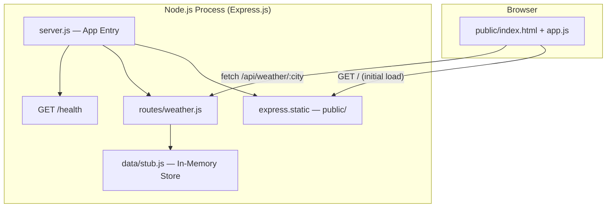
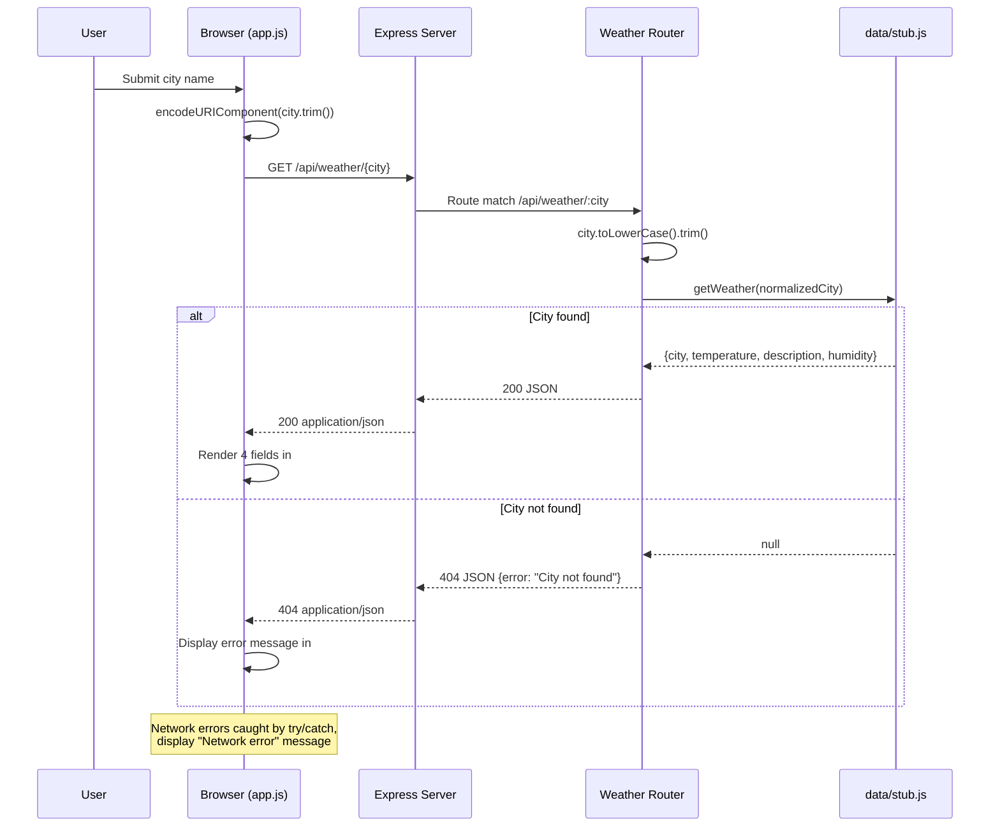

# Architecture Document

## Feature: Weather Lookup — Full-Stack

**Feature ID:** WA-2
**Status:** As-Built
**Date:** 2026-05-14

---

## System Overview

The Weather App is a monolithic full-stack application built on Node.js 22 and Express.js 4.x. It serves both a REST API and a static HTML/CSS/JS frontend from a single process. The architecture prioritizes simplicity: no database, no external API calls, no authentication, and no build tooling. All weather data is served from an in-memory stub module.

**Architecture style:** Single-process monolith with same-origin static serving
**Component count:** 5 source modules + 1 test module

---

## Service Architecture



---

## Services and Responsibilities

| Module              | Responsibility                                                                                                                                | Notes                                        |
| ------------------- | --------------------------------------------------------------------------------------------------------------------------------------------- | -------------------------------------------- |
| `server.js`         | Application entry point; mounts middleware in order: health, API, static. Exports `app` for testing; starts listener when run directly.       | `app.listen(0)` in tests for port isolation  |
| `routes/weather.js` | Express Router handling `GET /api/weather/:city`. Normalizes city input (lowercase + trim), delegates to data layer, returns JSON 200 or 404. | Single route, single responsibility          |
| `data/stub.js`      | Pure data access module. Exports `getWeather(city)` which performs a dictionary lookup against `WEATHER_MAP`. Returns object or `null`.       | O(1) lookup, 3 cities (london, miami, tokyo) |
| `public/index.html` | Frontend shell: form with `#search-form`, input `#city-input`, results container `#result`.                                                   | No framework, no bundler                     |
| `public/app.js`     | Frontend logic: form submit handler, `fetch` to API, DOM rendering of weather fields or error messages.                                       | Uses `encodeURIComponent` for URL safety     |
| `public/style.css`  | Basic layout styles. Max-width container, flexbox form, button styling.                                                                       | Minimal, functional only                     |

---

## Data Flow



---

## Security Architecture

| Concern              | Status             | Rationale                                                                    |
| -------------------- | ------------------ | ---------------------------------------------------------------------------- |
| Authentication       | Not required       | Public mock data, no user accounts                                           |
| Authorization        | Not required       | No protected resources                                                       |
| CORS                 | Not configured     | Same-origin only (frontend served by same Express instance)                  |
| Input validation     | Minimal            | City param normalized (lowercase, trim); `encodeURIComponent` on client side |
| PII / Sensitive data | None               | All data is public mock weather information                                  |
| Rate limiting        | None               | Out of scope for stub application                                            |
| HTTPS                | Deployment concern | Not enforced at application level                                            |

**Attack surface:** Extremely low. The only user input is the `:city` URL path parameter, which is used solely as a dictionary key lookup. No database queries, no shell commands, no file system access based on user input.

---

## Infrastructure

### Deployment Topology

```
Single Node.js process
  - Listens on port 3000 (configurable via code change)
  - Serves API + static assets
  - No reverse proxy required for development
  - No database connection
  - No external service dependencies
  - No environment variables consumed
```

### Observability

| Capability      | Implementation                                    |
| --------------- | ------------------------------------------------- |
| Health check    | `GET /health` returns `{"status": "ok"}` with 200 |
| Logging         | `console.log` on startup only                     |
| Metrics         | None                                              |
| Tracing         | None                                              |
| Error reporting | None (errors returned as JSON to client)          |

### Scaling Characteristics

- **Stateless:** No session state, no in-process cache that would cause inconsistency across instances
- **Read-only data:** `WEATHER_MAP` is immutable after module load
- **Horizontally scalable:** Any number of instances can run behind a load balancer (data is identical across all)
- **Memory footprint:** Negligible (3 stub entries)

---

## Technology Decisions

| Decision               | Choice                             | Alternatives Considered             | Rationale                                                                     |
| ---------------------- | ---------------------------------- | ----------------------------------- | ----------------------------------------------------------------------------- |
| Runtime                | Node.js 22                         | Deno, Bun                           | LTS stability, broad ecosystem, team familiarity                              |
| Framework              | Express.js 4.x                     | Fastify, Koa, Hapi                  | Mature, minimal, well-documented; sufficient for stub app                     |
| Module system          | CommonJS (`require`)               | ESM (`import`)                      | Simpler toolchain for project without bundler; Express 4.x conventional style |
| Data layer             | In-memory JS object                | SQLite, JSON file, environment vars | Zero dependencies, instant lookup, appropriate for 3-city stub                |
| Frontend approach      | Plain HTML/CSS/JS                  | React, Vue, Svelte                  | No build step required; minimal complexity for simple form + display          |
| Testing                | `node:test` + native `http` client | Jest, Mocha, Vitest                 | Zero-dependency test runner; ships with Node.js 22                            |
| Linting                | ESLint v9 (flat config)            | Biome, Standard                     | Industry standard; flat config is forward-looking                             |
| Static serving         | `express.static` middleware        | Separate nginx, CDN                 | Same-process simplicity; no deployment complexity for dev/demo                |
| Port isolation (tests) | `app.listen(0)`                    | Fixed port, Docker                  | OS assigns ephemeral port; avoids port conflicts in CI                        |

---

## ADR Candidates

Decisions that warrant formal Architecture Decision Records if the project evolves:

| #   | Decision                                                        | Trigger for ADR                                                                 |
| --- | --------------------------------------------------------------- | ------------------------------------------------------------------------------- |
| 1   | **In-memory stub vs. external weather API**                     | When real data integration is considered (latency, caching, API key management) |
| 2   | **CommonJS vs. ESM**                                            | If the project adds a bundler, TypeScript, or needs top-level await             |
| 3   | **No input length/character validation on city param**          | If the app is exposed to the public internet (DoS via long URLs)                |
| 4   | **Same-origin static serving vs. separate frontend deployment** | If frontend needs CDN, caching headers, or independent scaling                  |
| 5   | **No structured logging or request correlation**                | If production deployment requires observability (APM, log aggregation)          |

---

## Open Questions

| #   | Question                                                                                                              | Impact                 | Priority |
| --- | --------------------------------------------------------------------------------------------------------------------- | ---------------------- | -------- |
| 1   | Should the server port be configurable via `PORT` environment variable?                                               | Deployment flexibility | Low      |
| 2   | Should the stub data source be replaceable (strategy pattern) to allow future API integration without router changes? | Extensibility          | Medium   |
| 3   | Is there a maximum expected response time SLA for the weather endpoint? (Currently sub-1ms due to in-memory lookup)   | Performance monitoring | Low      |
| 4   | Should `GET /api/weather/` (missing city) return a structured 404 rather than Express default?                        | API consistency        | Low      |

---

## Appendix: Route Registration Order

The middleware mount order in `server.js` is intentional:

1. `GET /health` — health check (highest priority, no prefix collision)
2. `app.use("/api", ...)` — API routes (matched before static)
3. `express.static(public/)` — frontend assets (catch-all for unmatched paths)

This ensures API routes are never shadowed by static file resolution.
